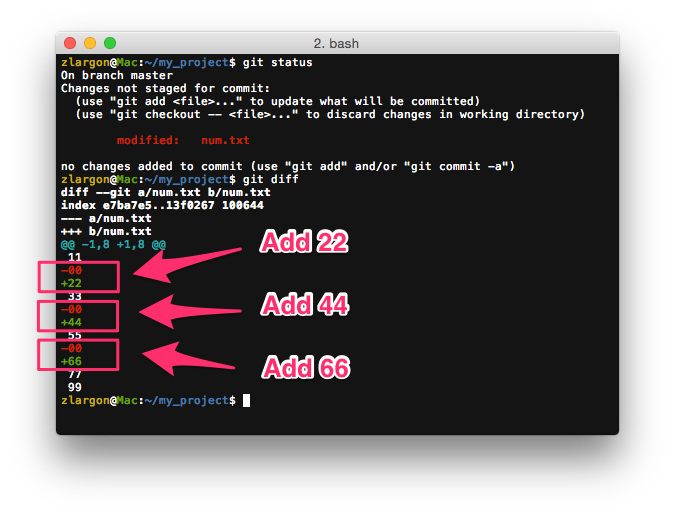
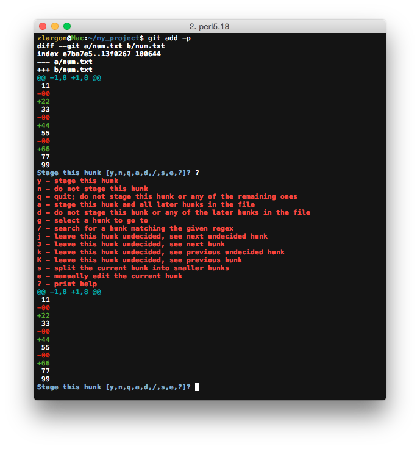
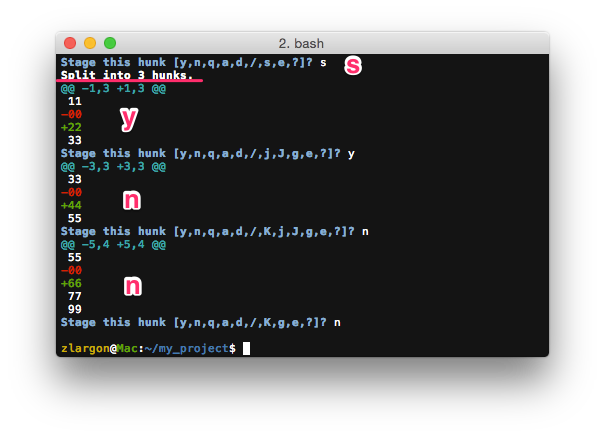
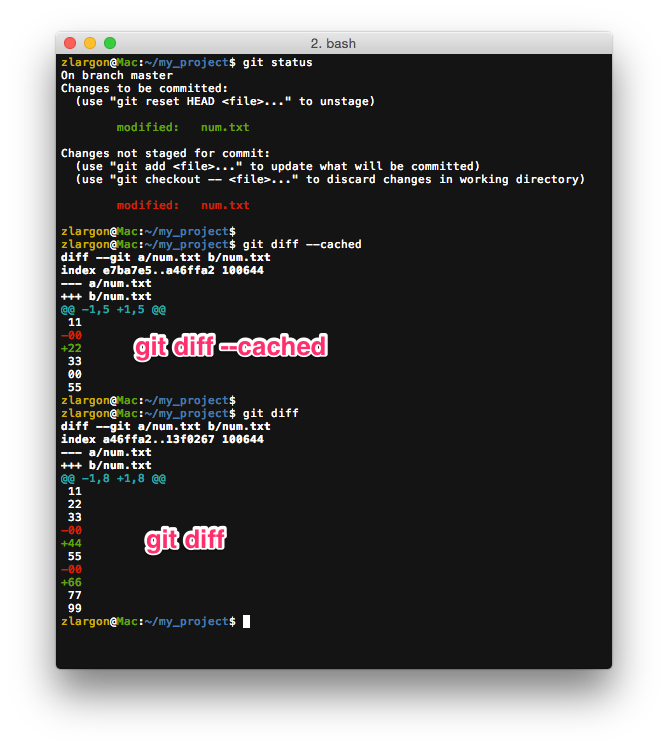
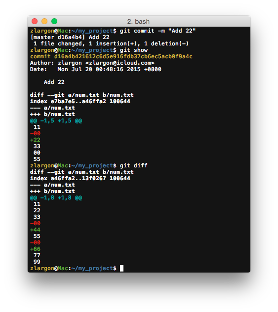
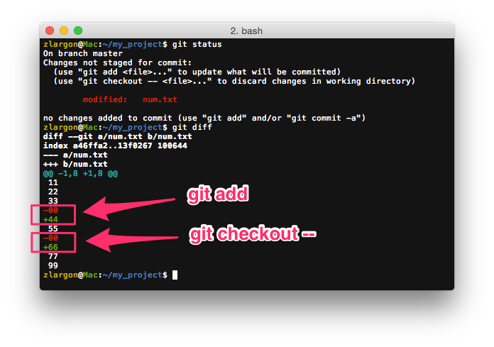
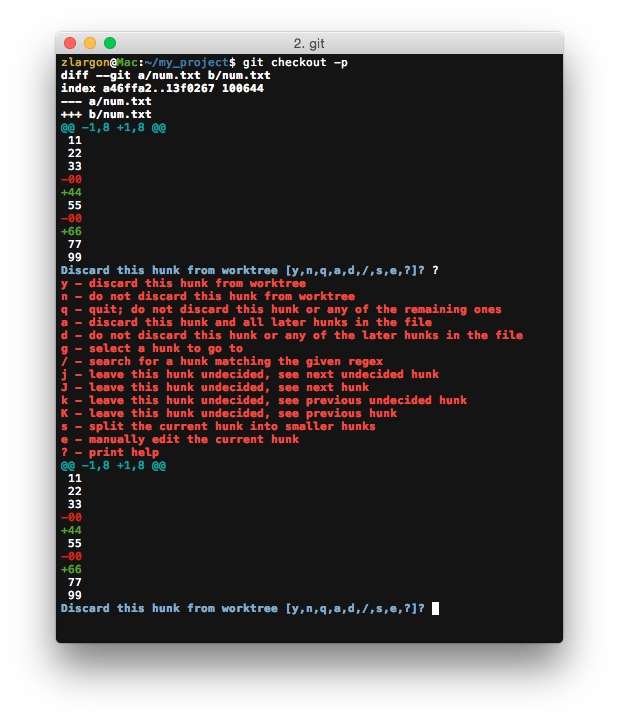
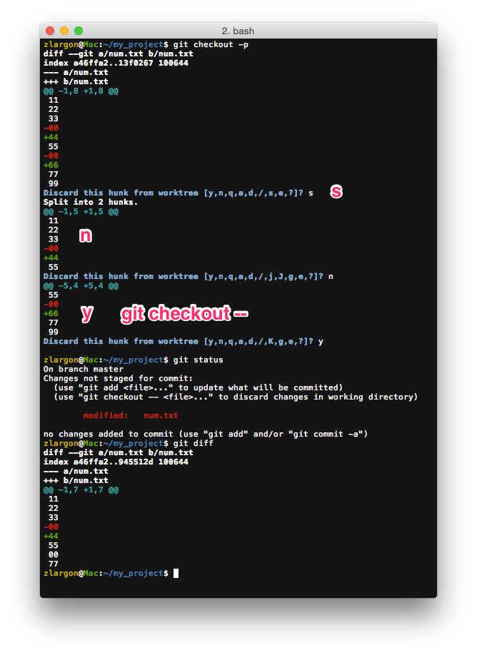
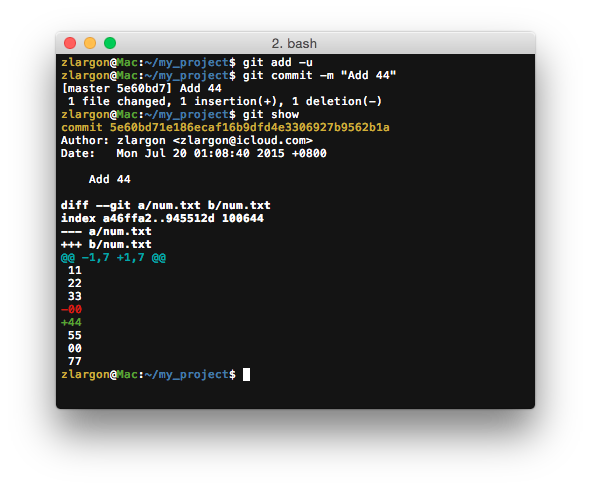

# Add / Checkout 檔案部分內容

我們知道可以用 `git add <file>` 來新增整個檔案，但是如果我們只想要新增檔案部分的內容的話

就可以加上 `-p` 的參數，同 `--patch` 來新增部分的內容

我們的目標是，把這次的改動分成三次來提交，分別是 "Add 22", "Add 44" 跟 "Add 66"

## 使用 `git add -p` 提交檔案部分的內容

    $ git add -p
    $ git add --patch   # 同上

Git 一次會出現一個區塊（hunk），問你要做什麼動作，並且列出選項

<code style="font-weight: bold">Stage this hunk [y,n,q,a,d,/,s,e,?]?</code>

輸入 `?` 或是其他不在列子裡面的選項，就會顯示說明

<pre style="font-weight: bold">
y - stage this hunk
n - do not stage this hunk
q - quit; do not stage this hunk or any of the remaining ones
a - stage this hunk and all later hunks in the file
d - do not stage this hunk or any of the later hunks in the file
g - select a hunk to go to
/ - search for a hunk matching the given regex
j - leave this hunk undecided, see next undecided hunk
J - leave this hunk undecided, see next hunk
k - leave this hunk undecided, see previous undecided hunk
K - leave this hunk undecided, see previous hunk
s - split the current hunk into smaller hunks
e - manually edit the current hunk
? - print help
</pre>

通常只會用到 y, n, s

* y 就是 yes，要 add 這個 hunk
* n 就是 no，不要 add 這個 hunk
* s 把目前的 hunk 再切成更小的 hunk

由於我們這次個改動的位置都太近了，所以用 s 把他再切成更小的 hunk

他把這次的 hunk 再切成三個小 hunk

第一部分我們要 22，輸入 y

其他部分輸入 n

接著我們用 `git status / diff` 來查看

這樣我們就可以只提交 22 的部分

## 使用 `git checkout -p` 回復檔案部分的內容

這時候我們想把 "66" 修改的部分取消，那就只要在 `git checkout` 加上參數 `-p` 或是 `--patch`

    $ git checkout -p
    $ git checkout --patch      # 同上

就跟 `git add -p` 一樣，Git 一次會出現一個區塊（hunk），問你要做什麼動作，並且列出選項

<code style="font-weight: bold">Discard this hunk from worktree [y,n,q,a,d,/,s,e,?]?</code>

輸入 `?` 或是其他不在列子裡面的選項，就會顯示說明

先用 s，把 hunk 切成兩個小 hunk，再把 "66" 的部分 checkout

最後將 "44" 提交出去

 

## 本章回顧

* 使用 `git add -p` 提交檔案部分的內容

* 使用 `git checkout -p` 回復檔案部分的內容

   
