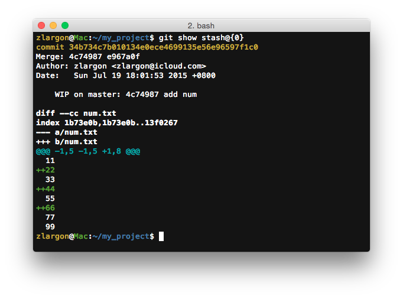
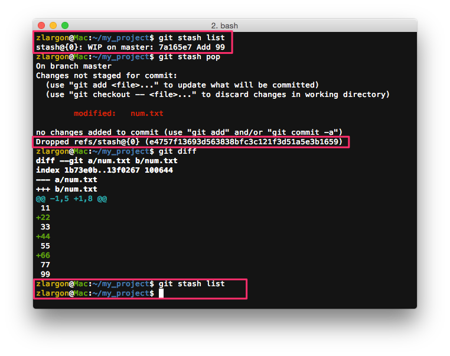
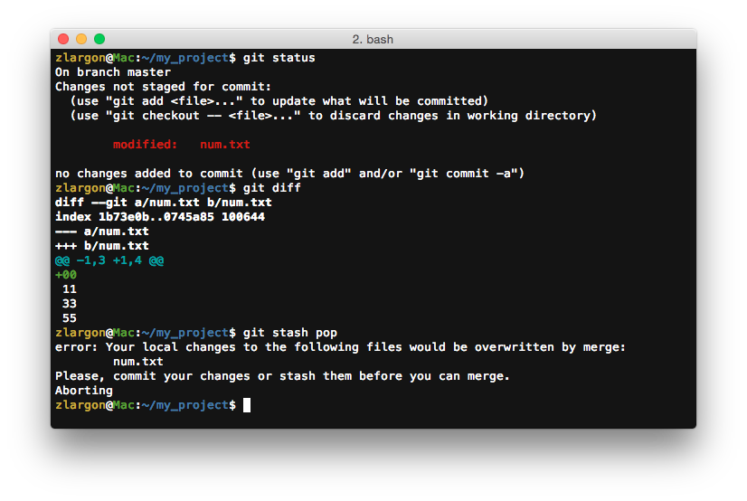
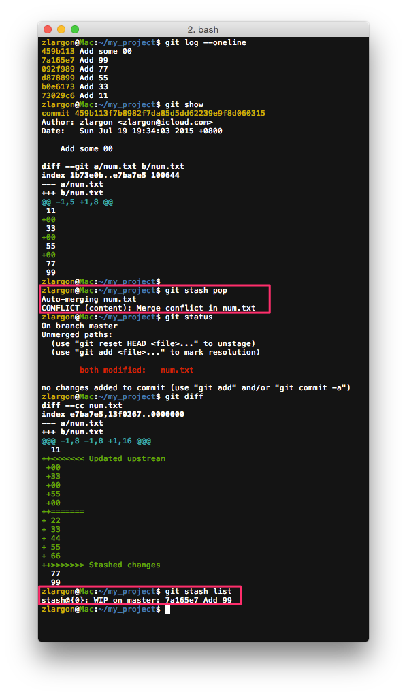
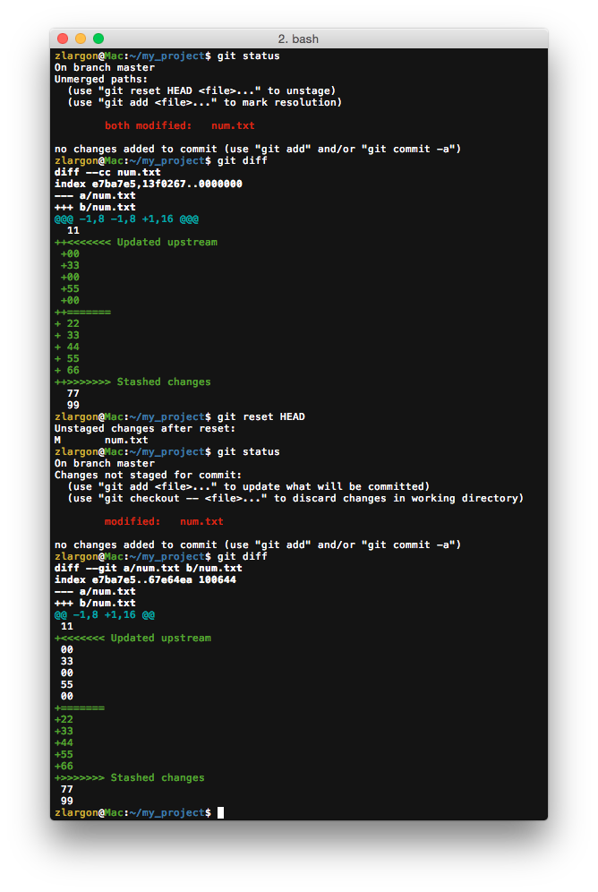
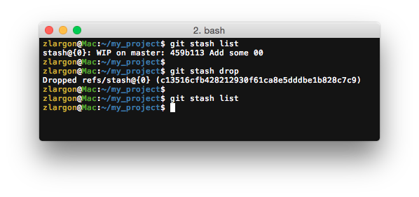

# 檔案暫存

有時候我們開發到一半的時候，突然有同事跟你說他剛剛上一個 patch，想請你幫忙驗看看

或是你開發新功能到一半的時候，老闆突然跟你說，有發現一個 bug 要立即解決

或是你突然有一個 idea，想要做一個簡單的測試

這時候我們可以將開發到一半的檔案，全部備份到另外一個分支

    $ git checkout -b backup            # 新增 backup 分支，並且切換過去
    $ git add -A
    $ git commit -m "this is backup"    # 提交所有檔案進來
    $ git checkout master               # 回到 master 分支做其他事情

這時候在 `master` 做其他工作，完成後用再把 `backup` 分支挑回來 `master` 繼續開發

    $ git cherry-pick backup            # 把 backup 的 patch 挑回 master
    $ git reset HEAD^                   # 讓 backup 的所儲存的內容，全部回到檔案提交前的狀態
    $ git branch -D backup              # 刪除 backup 分支

不過如果檔案改動沒有很大，但是還是要這樣開新 branch 感覺有點麻煩

Git 有提供一個方法可以快速暫存檔案，然後再叫回來

<br>

## 使用 `git stash` 暫存被修改的檔案

``` :num.txt
11
33
55
77
99
```

這是原本 `num.txt` 的檔案內容，接下來我們新增 22, 44, 66

然後我們用 `git stash` 把他暫存起來

    $ git stash             # 暫存目前被修改的檔案
    $ git stash list        # 列出所有 stash 紀錄


<pre style="border: 1px solid grey">
Saved working directory and index state WIP on master: 7a165e7 Add 99
HEAD is now at 7a165e7 Add 99
</pre>

他表示這些是在 `7a165e7` 開發到一半，被 stash 起來的

這裡的 `WIP` 的意思是 `Working In Progress`

而 `HEAD` 也被移到 patch `7a165e7`，也就是 `master` 的最後一個 patch

<br>

## 使用 `git stash list` 來查看所有被我們 stash 的內容

    $ git stash list

| Short Name | Description |
| --- | --- |
| `stash@{0}` | WIP on master: 7a165e7 Add 99 |

<br>

我們也可以用 `git show <short name>` 來查看他的改動內容

    $ git show stash@{0}



<br>

## 使用 `git stash pop` 把暫存的檔案叫回來

使用 `git stash pop` 把檔案叫回來的同時，也被從 stash list 被移除

可以在後面加上 short name，來指定要 pop 出來的 stash 編號

    $ git stash pop                 # pop 第一個 stash（stash@{0}）
    $ git stash pop stash@{n}       # 指定要 pop 出來的 stash 編號



使用 `git stash pop` 之前，要先把 `git status` 清空



注意，如果後來又提交了新的 patch，再做 `stash pop` 有可能會發生 ___conflict___



發生 ___conflict___ 的時候，stash 不會被清掉

所以可以 `git reset --hard HEAD` 還原之後，再重做一次 `git stash pop`

<br>

`Update Stream` 是你後來提交的部分，`Stashed changes` 就是 stash 所修改的部分

可以先用 `git reset HEAD` 取消檔案 <code style="color: red">both modified</code> 的狀態再來解




## 使用 `git stash drop` 丟棄暫存的檔案

`git stash drop` 會丟棄 stash list 裡面的第一個 stash，也就是 stash@{0}

可以在後面加上 short name，指定要丟地的 stash 編號

    $ git stash drop                # 丟棄第一個 stash（stash@{0}）
    $ git stash drop stash@{n}      # 丟棄編號 n 的 stash




## 使用 `git stash clear` 清空 stash list

    $ git stash clear

<br>

## 注意事項

`git stash` 雖然很方便，但是千萬不要過度使用

因為如果到時候 stash list 檔案太多的話，會整個亂掉，很難找出哪一個才是我們要的 stash

如果是重要的功能的話，建議還是另外開一個分支會比較安全

stash 比較適合輕量、檔案改動不大、暫時的狀況

平時盡量保持 stash list 為清空的狀態

<br>

## 本章回顧

* 使用 `git stash` 暫存被修改的檔案

* 使用 `git stash list` 來查看所有被我們 stash 的內容

* 使用 `git stash pop` 把暫存的檔案叫回來

* 使用 `git stash drop` 丟棄暫存的檔案

* 使用 `git stash clear` 一次清空 stash list 裡面所有的 stash

<br><br><br>
