# 子模組

通常我們在開發專案的時候，會在 Github 上找一些第三方開發的 library 或是 framework 來用

一般來說，要加入這些第三方的程式，最快的方法就是在我們的專案開一個資料夾，然後全部 copy 一份丟進去

往後如果這些第三方程式有更新的時候，我們就要把重新 copy 一次，把原來放置第三方程式的資料夾整個覆蓋掉

不過 Git 提供了一個方式，讓我們可以把第三方的程式與我們的程式完全拆開

此後第三方程式就可以直接更新

 

## 使用 `git submodule add <repo url> <project path>` 新增子模組

舉例來說，如果我們想要把 JQuery 的 source code 放到我們的專案中

https://jquery.com/

https://github.com/jquery/jquery

    $ git submodule add git@github.com:jquery/jquery.git jquery

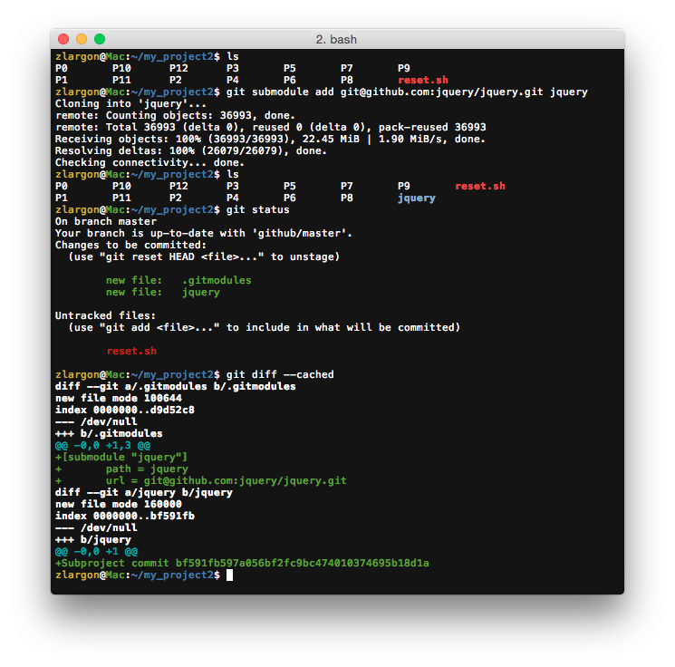

Git 會新增兩個檔案，一個是 .gitmodules，裡面會紀錄所有 submodule 的路徑和 url

另外一個則是特殊的檔案，紀錄 submodule 的 commit id

這兩個檔案之後必須要提交

 

Submodule 本身也是一個 Git Project

當我們進到 jquery 底下的時候，他底下也有一個 `.git`，可以用 `git log` 來查看 jquery 的提交紀錄

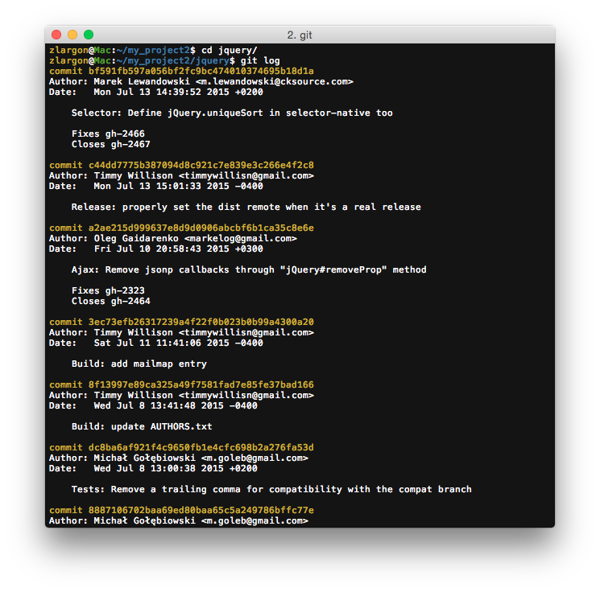

接著我們把 patch 上傳到 Github

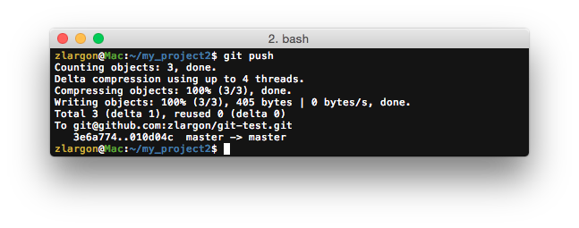

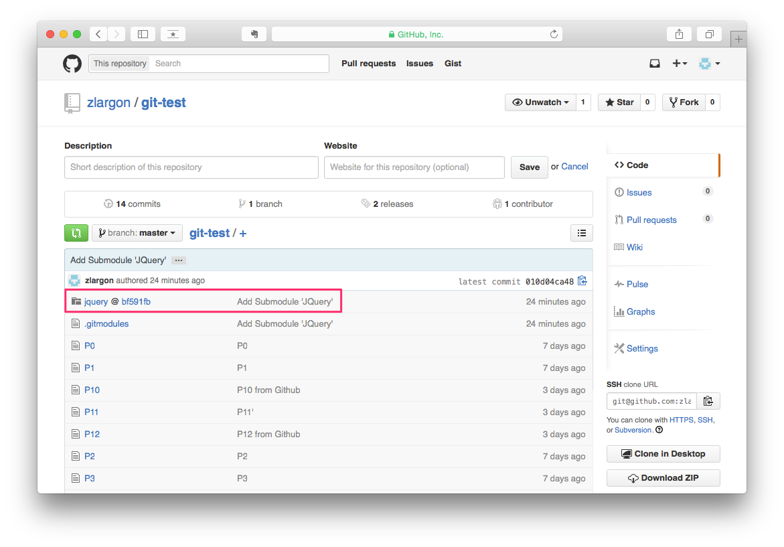

到 Github 頁面，會看到一個特殊檔案 "[`jquery`](https://github.com/jquery/jquery)@[`bf591fb`](https://github.com/jquery/jquery/tree/bf591fb597a056bf2fc9bc474010374695b18d1a)"

點連結，會直接跳到 Jquery 的 Github 頁面

 

## 使用 `git clone --recursive <repo URL>` 下載包含子模組的專案

我們現在用 git clone 下載，git-test project

    $ git clone git@github.com:zlargon/git-test.git

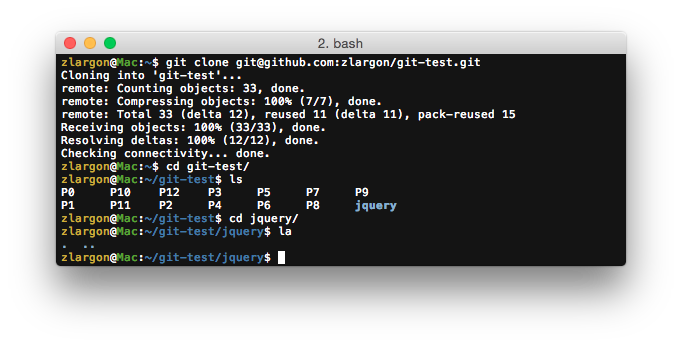

我們會發現 jquery 的資料夾是空的

Submodule 必須要另外執行兩個步驟，才會被 clone 下來

    $ git submodule init
    $ git submodule update

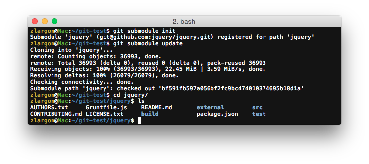

除此之外，可以在 `git clone` 的時候，加上參數 `--recursive`

他會自動幫我們把全部的 submodule clone 下來

    $ git clone --recursive git@github.com:zlargon/git-test.git

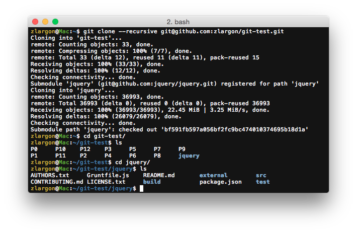

## 設定忽略 Submodule 內部的改動

當 jquery 內部有改動的時候，外部的 `git status` 會出現 jquery 被修改的提示

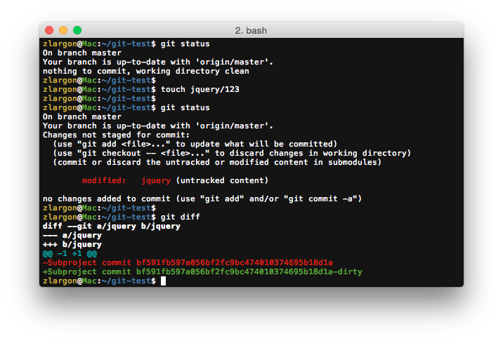

如果希望不要出現這些提示的話，可以在 `.gitmodules` 加上設定 `ignore = dirty`

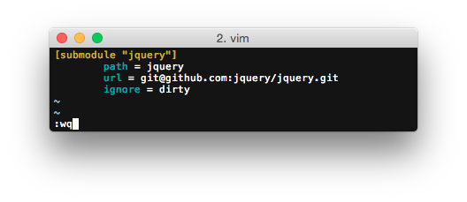

修改完記得要提交

 

## 升級 / 切換 Submodule 版本

到 submodule 的資料夾下面 checkout 你想要的 patch

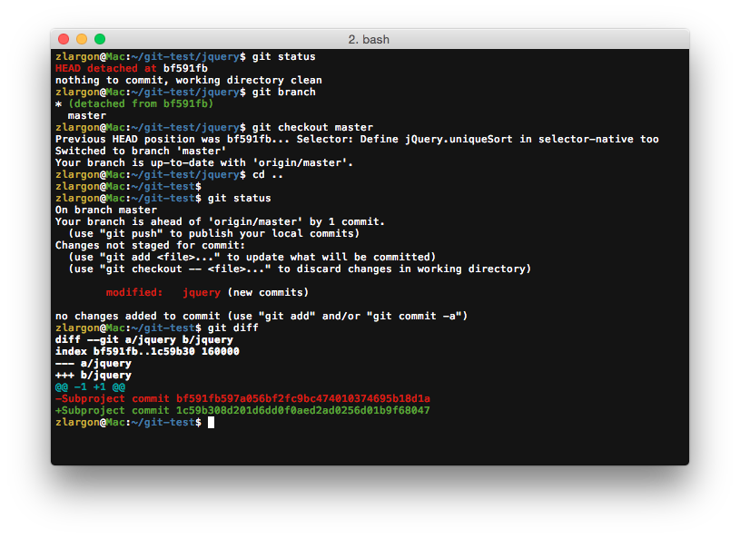

切換完畢後，回到上層做 `git status` 會看到 `jquery (new commits)`

這時候只要 git add，並且提交出去就可以了

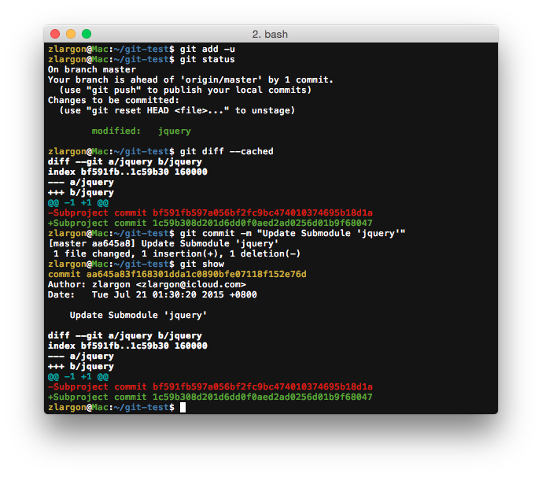

## 刪除 Submodule

Git 目前還沒有任何指令可以下指令把 submodule 刪除，不曉得為什麼 @@"

希望以後會有類似 `git submodule rm` 之類的指令

#### 1. 刪除 submodule 的資料夾

    $ rm -rf <submodule path>

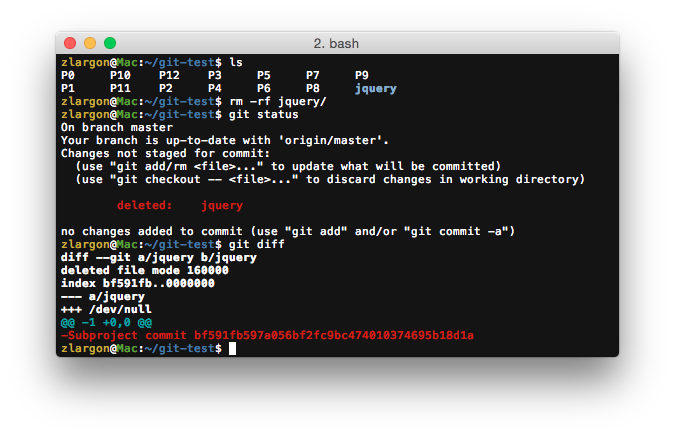

#### 2. 刪除 `.gitmodules` 裡面 submodule 設定

<pre style="border: 1px solid grey">
[submodule "jquery"]
    path = jquery
    url = git@github.com:jquery/jquery.git
</pre>

 

#### 3. 提交 patch

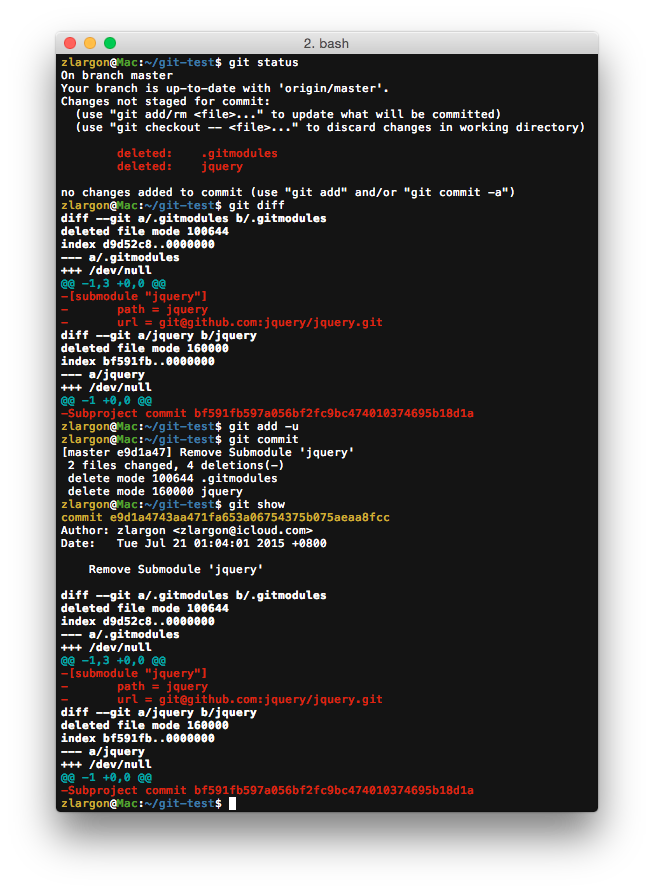

#### 4. 刪除 `.git/config` 裡面的 submodule 設定

<pre style="border: 1px solid grey">
[submodule "jquery"]
    url = git@github.com:jquery/jquery.git
</pre>

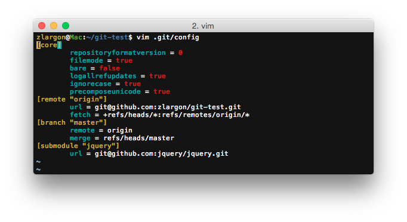

#### 5. 刪除資料夾 `.git/modules/<module name>`

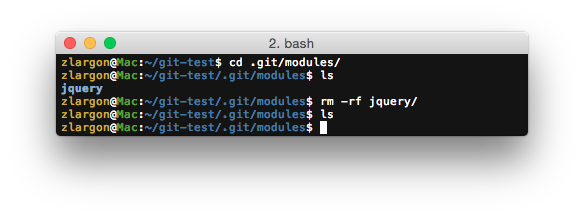

   
