# 版本標籤

通常我們要 release 的時候，會有一個對外的版本號，例如：1.0.1 之類的

這時候我們就可以為這個版本加上一個標籤

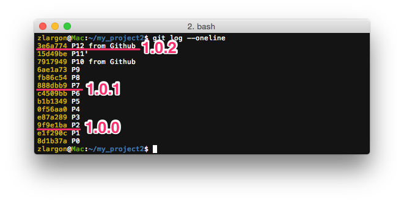

例如說，我們現在要為 `9f9e1ba` 新增標籤 __`1.0.0`__

為 `888dbb9` 新增標籤 __`1.0.1`__

為最新的 patch 新增標籤 __`1.0.2`__

Tag 有分兩種，一種是「lightweight tags」這種可以視為某個 patch 的「別名」

另外一種是「annotated tags」除了有輕量 tag 的功能之外，還可以寫 tag message

他會紀錄發布者的名稱、日期等等資訊，比較適合正式 release 使用

 

## 使用 `git tag <tag name> <commit id>` 新增 lightweight tag

    $ git tag 1.0.0 9f9e1ba     # P2 = 9f9e1ba
    $ git tag                   # 查看所有的 tags

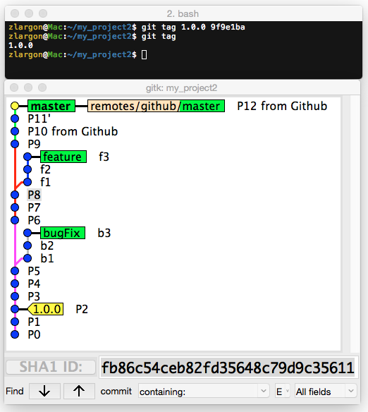

可以使用 `git show <tag name>` 來查看

`gitk` 會用黃色的標籤來表示 tag 

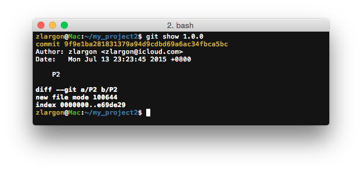

輕量標籤，就只是某個 patch 的別名而已

如果不加參數 `<commit id>`，那麼 git 會 tag 目前的 patch（HEAD）

 

## 使用 `git tag -a <tag name> <commit id>` 新增 annotated tag

參數 `-a` 等同於 `--annotate`

如果後面沒加 `<commit id>` 就會 tag 目前的 patch（HEAD）

    $ git tag -a 1.0.1 888dbb9              # 按下 enter 後，會進入文字編輯模式，要求輸入 tag message

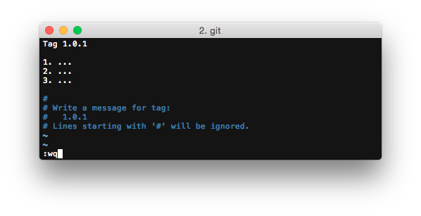

我們用 `git show` 來看 tag 1.0.1

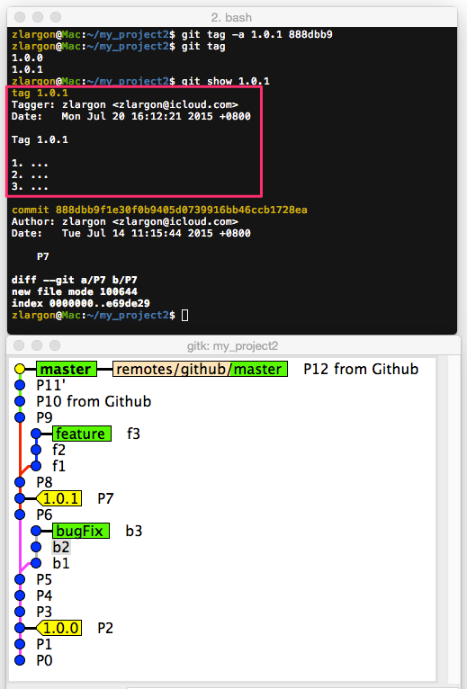

相較於 lightweight tag，他還多了 tag message

 

## 使用 `git tag -a <tag name> <commit id> -m <message>` 新增 annotated tag 以及 message

新增 annotated tag 的時候，後面可以加上多個 `-m <message>` 直接輸入 tag message，跳過文字編輯模式

就跟 `git commit -m <msg1> -m <msg2> -m <msg3>` 的用法一樣，可以一次新增多個

    $ git tag -a 1.0.2 -m "Tag 1.0.2" -m "msg1" -m "msg2"   # 不加 <commit id>，就會 tag 目前的 patch

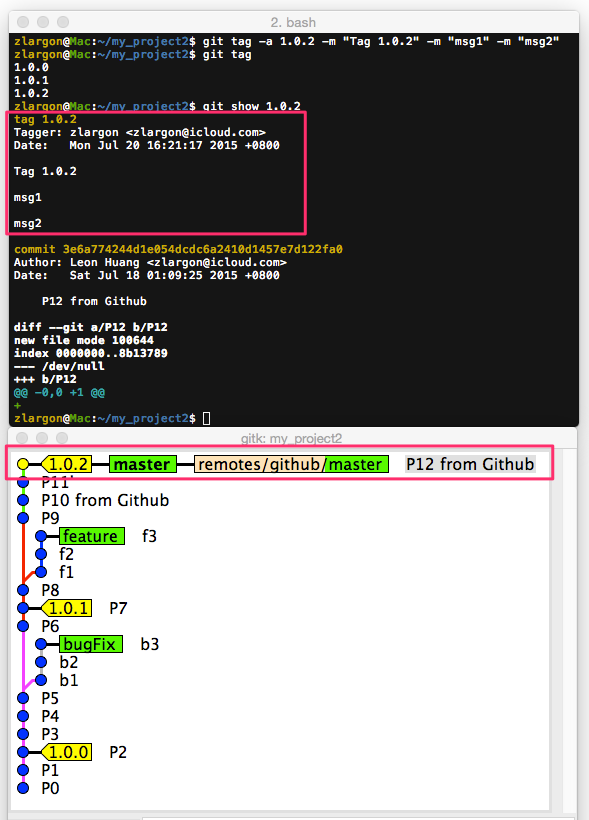

> 注意，這些標籤都還只是本機端的標籤而已 
> 稍後我們會再把他上傳到遠端

 

## 使用 `git push <remote name> <tag name>` 指定上傳的標籤

用法就跟 ["上傳分支"](../remote/push.md) 到 server 上是一樣的，只是把 `<branch name>` 換成 `<tag name>`

    $ git push github 1.0.0

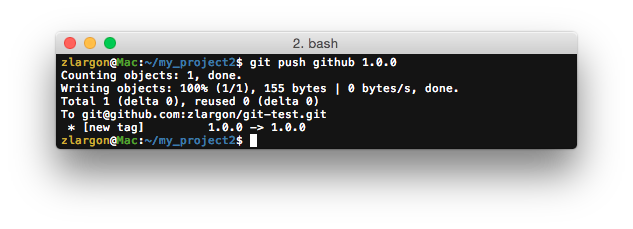

上傳成功後，可以從 Github 的 release 頁面看到我們的 tag

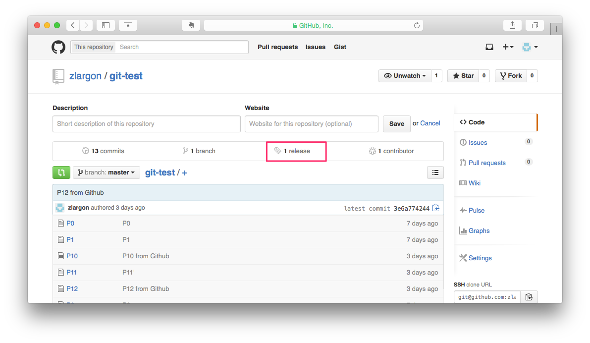

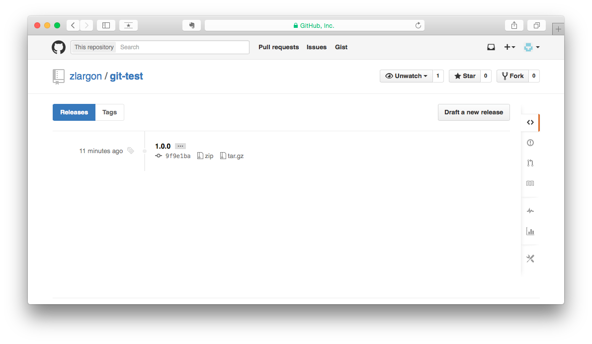

## 使用 `git push <remote name> --tags` 一次上傳所有的標籤

    $ git push github --tags

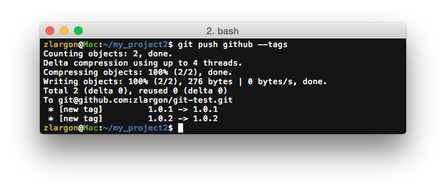

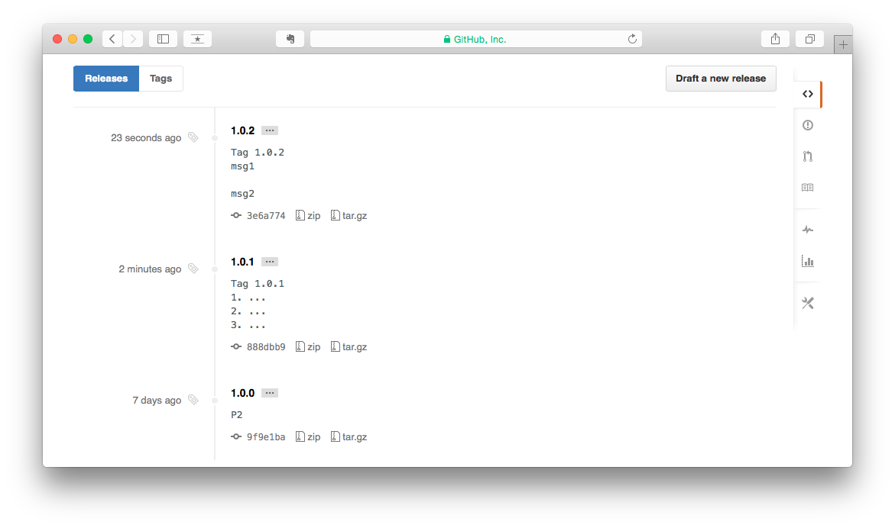

## 使用 `git tag -d <tag name>` 刪除本機端的標籤

    $ git tag -d 1.0.0

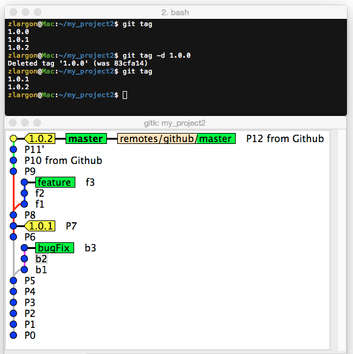

注意，這只會刪除本機端的標籤

所以 Github 上的標籤還是會存在

 

## 使用 `git push <remote name> :<tag name>` 刪除遠端的標籤

跟 ["刪除遠端分支"](../remote/delete_branch.md) 的做法都是一樣的

只是把 `<branch name>` 改成 `<tag name>`

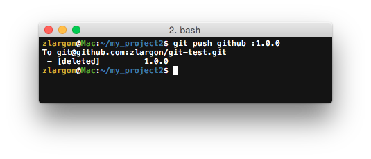

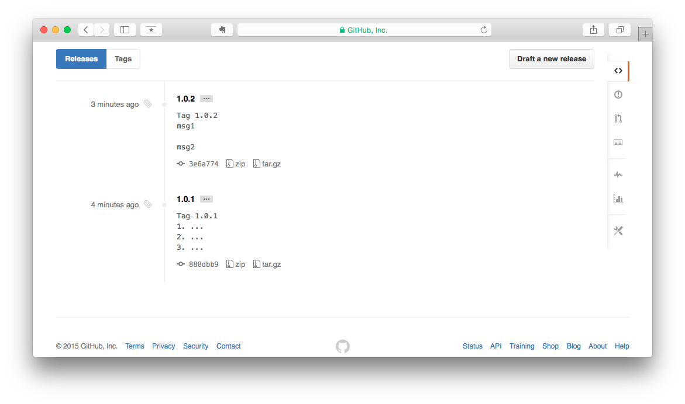

## 使用 `git tag -a <tag name> <tag name>^{} -f` 更新 annotated tag 的訊息

例如說我們要修改 1.0.1 的內容

    $ git tag -a 1.0.1  1.0.1^{} -f         # 進入 vim 文字編輯模式

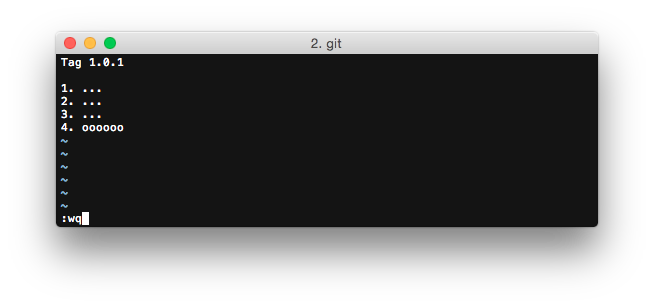

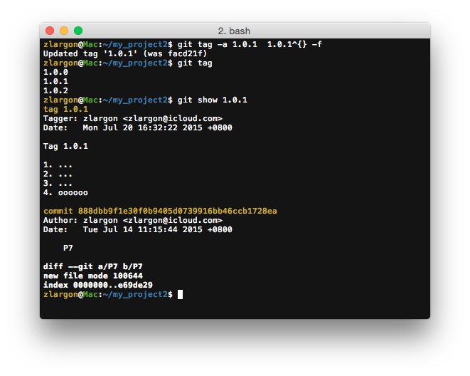

## 使用 `git push -f <remote name> <tag name>` 強制更新 remote 的 tag

我們剛才更新了 1.0.1 的訊息，現在要重新上傳到 server

但是會失敗，原因是 server 上已經有 `1.0.1` 的 tag 了

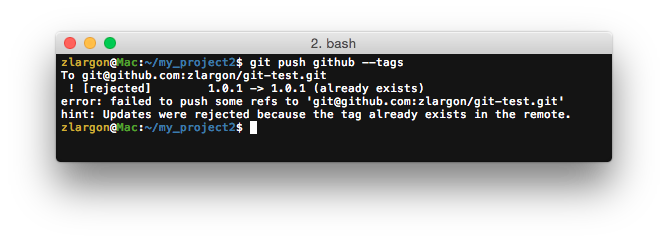

如果想要強制修改 tag 的內容，則可以加參數 `-f` 等同於 `--force`

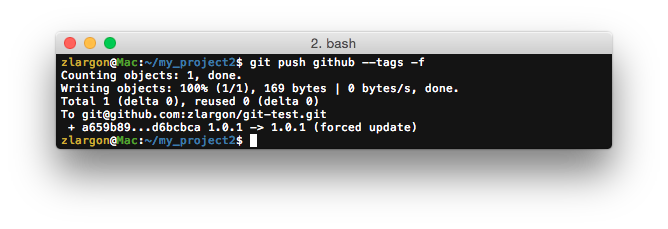

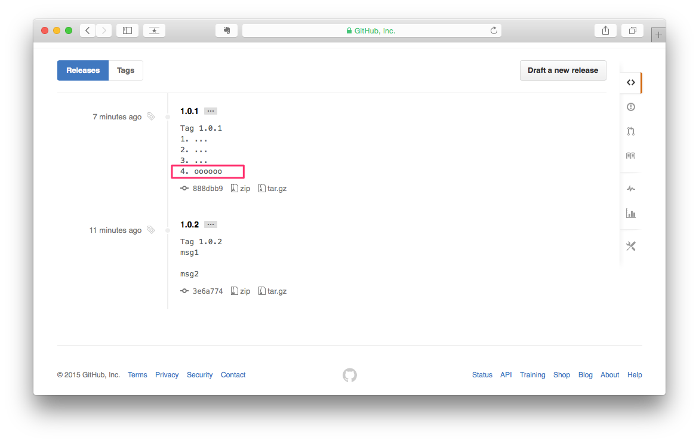

## 本章回顧

* 使用 `git tag <tag name> <commit id>` 新增 lightweight tag

    > 省略 `<commit id>` 則會 tag 目前的 patch

* 使用 `git tag -a <tag name> <commit id>` 新增 annotated tag

* 使用 `git tag -a <tag name> <commit id> -m <message>` 新增 annotated tag 以及 message

* 使用 `git push <remote name> <tag name>` 指定上傳的標籤

* 使用 `git push <remote name> --tags` 一次上傳所有的標籤

* 使用 `git tag -d <tag name>` 刪除本機端的標籤

* 使用 `git push <remote name> :<tag name>` 刪除遠端的標籤

* 使用 `git tag -a <tag name> <tag name>^{} -f` 更新 annotated tag 的訊息

* 使用 `git push -f <remote name> <tag name>` 強制更新 remote 的 tag

   
