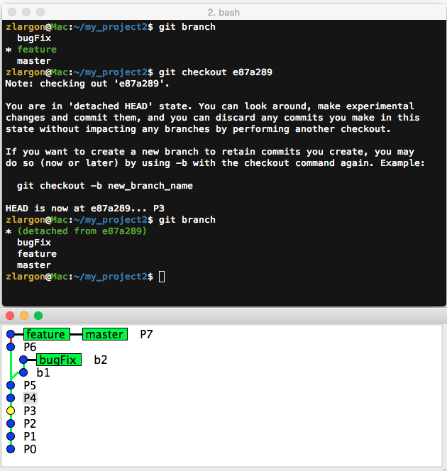
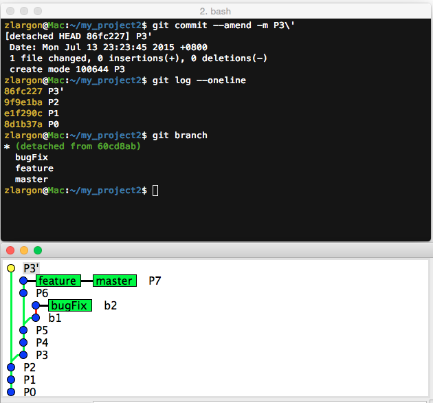
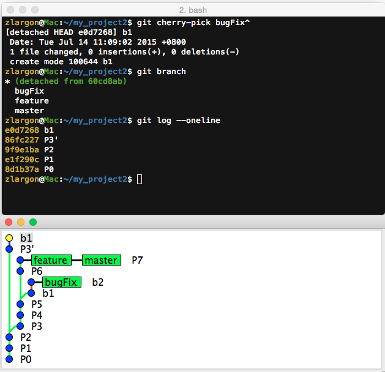
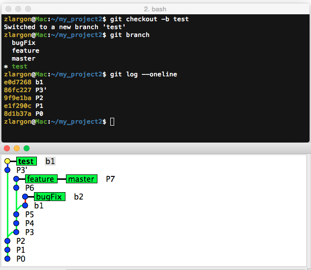
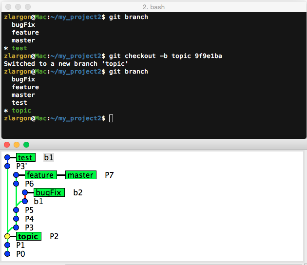

# Commit Tree

在 Git 的世界裡，我們可以把每個 patch 都看成是一個小節點

這些 patch 一個一個的串連起來，最後組成了 ___Commit Tree___

```
                                     o---o---o feature
                                    /
    o---o---o---o---o---o---o---o---o---o---o  master
  root       \             /
              o---o---o---o  bugFix
                       \
                        o---o---o  testing
```

不論我們在哪一個節點上面，都可以藉由 `parent` 一路往回走，最終都會回到 `root`

`root` 也就是我們的 first commit

因此每一條從 patch 回到 root 的路徑，其實都是一個的分支

每個 commit id 都是獨一無二的，絕對不會重複，因為每一條路徑都是唯一的

每個 commit id 都可以視為是一個版本分支

<br>

然而分支其實就只是為 patch 貼上一個 `branch name` 的標籤而已

這也是為什麼對 git 來說，建立分支是這麼輕鬆的事情

而當你把某個分支刪除，就像是把標籤撕掉，絲毫不費力

原本分支底下的 patch 不會因而消失，他們都會一直存在於 Git 的 ___Commit Tree___

都可以從 `reflog` 裡把對應的 `commit id` 找回來

<br>

## Patch 的各種表示法

到目前為止，我們學過很多方法可以來表示 patch

* ___Commit Id___
* ___HEAD 代表目前所在的 patch___
* ___Branch Name___
* ___在 HEAD 或 Branch Name 後面加上 `^` 或 `~n` 來表示相對位置___

<br>

## 使用 `git checkout <commit id>` 移動 HEAD 的位置

`HEAD` 代表我們目前所在 patch 的位置

大部份的時間 `HEAD` 都會和某個 branch 重疊在一起（例如 `master` 分支）

我們在 ["Reset Patch"](../patch/reset.md) 有學到使用 `git reset --hard <commit id>` 來 reset 到指定的 patch

所以當我們在做 reset 的時候，其實是改變了 `master` 分支的位置

事實上，`HEAD` 可以脫離 `master` 並且遊走 ___Commit Tree___ 中的任何一個 patch，甚至還可以提交 patch

<br>

例如說，我們現在想要直接移動到 P3 的位置

    $ git checkout e87a289      # P3 = e87a289



從 `gitk` 可以看到，黃點現在在 P3 的位置

而 git 也會提醒我們，現在的 `HEAD` 是分離狀態，我們可以在這個狀態下繼續提交 patch

可以用指令 `git checkout -b <new branch name>` 把這個 patch 指定為某個分支

<br>

我們現在修改 P3 的 commit message，改成 P3' 看會發生什麼事情

    git commit --amend -m P3\'



我們修改的 P3 變成了一個新的 patch（commit id 不同）

<br>

我們也可以 cherry-pick 某個 patch 進來

例如我們想要挑 b1 進來

    $ git cherry-pick 60cd8ab       # b1 = 60cd8ab
    $ git cherry-pick bugFix^       # 使用 bugFix 的相對位置來表示



最後再用 `git checkout -b <new branch name>` 來產生新的分支

    $ git checkout -b test_head




<br>

## 使用 `git checkout -b <new branch name> <commit id>` 在指定的 patch 上建立新的 branch 並且切換過去

這個指令等同於是以下兩個指令合體

    $ git checkout <commit id>
    $ git checkout -b <new branch name>

例如我們現在想要在 P2 建立一個叫做 topic 的分支，並且切換過去

    $ git checkout -b topic 9f9e1ba         # P2 = 9f9e1ba



<br>

## 本章回顧

* ___Commit Tree___ 的概念

* Patch 的各種表示法

* 使用 `git checkout <commit id>` 移動 `HEAD` 的位置

* 使用 `git checkout -b <new branch name> <commit id>` 在指定的 patch 上建立新的 branch 並且切換過去

<br><br><br>
