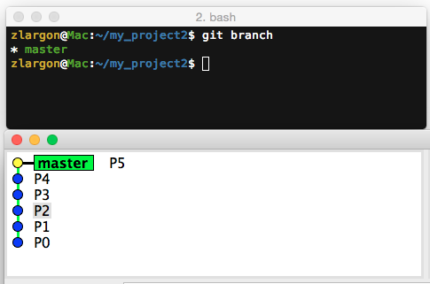
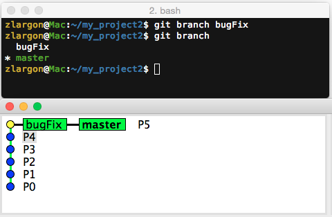
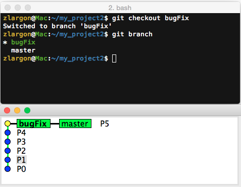
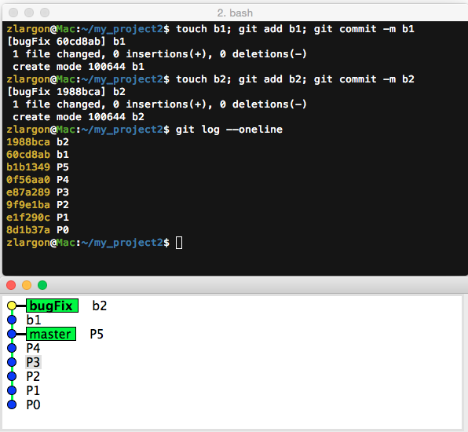
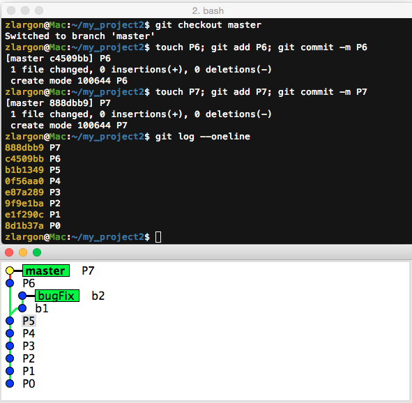
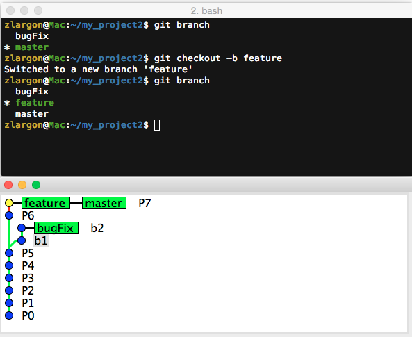
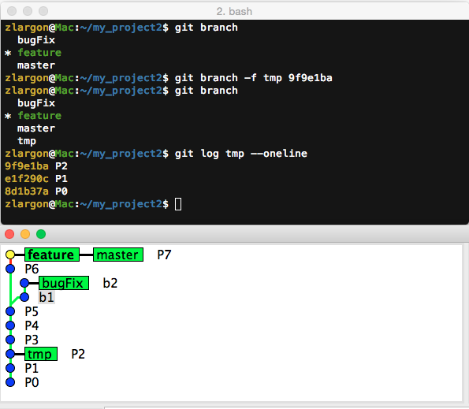
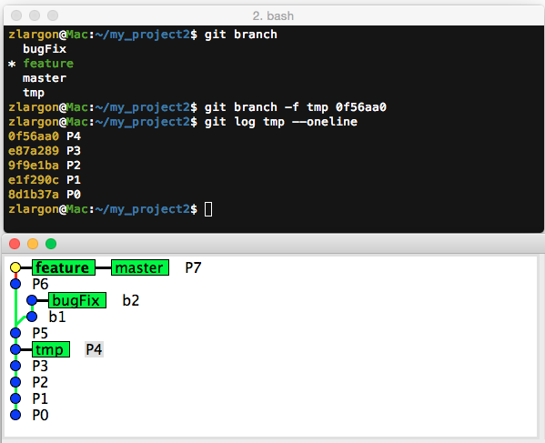
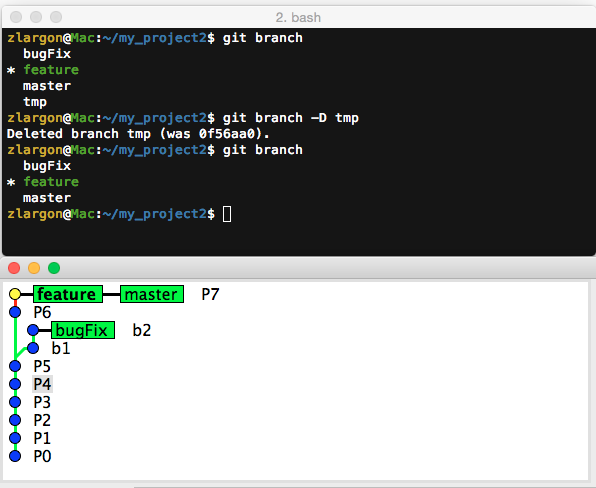
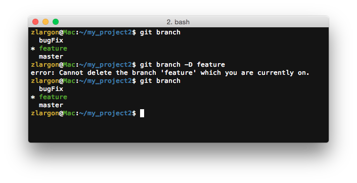

# 建立 / 刪除分支

黃色點我們目前 patch 的位置，也就是 `HEAD`

而我們目前在 master 上

## 使用 `git branch <new branch name>` 建立新的分支

    $ git branch bugFix         # 建立名為 "bugFix" 的分支
    $ git branch                # 查看所有的分支

`git branch <new branch name>` 會根據目前所有的位置來建立分支

因此現在 `master` 和 `bugFix` 內容是完全一樣的

`gitk` 中綠色框框的 `master` 為粗體，表示我們目前在 `master` 分支上

 

## 使用 `git checkout <branch name>` 切換分支

`gitk` 中綠色框框的 `bugFix` 為粗體，表示我們目前在 `bugFix` 分支上

> `gitk` 這裡要按 shift + F5 來 reload

 

我們現在在 `bugFix` 分支提交新的 patch b1, b2

 

我們再切回到 `master` 分支提交 patch P6, P7

這時候從 `gitk` 上看，分支的感覺就出來了

 

## 使用 `git checkout -b <new branch name>` 建立新的 branch 並且切換過去

這個指令等同於是以下兩個指令合體

    $ git branch <new branch name>
    $ git checkout <new branch name>

`-b` 就是 branch 的意思

 

## 使用 `git branch -f <branch name> <commit id>` 在指定的 patch 上建立 branch（若 branch 已經存在，就切過去）

我們現在希望在 P2 上，建立一個 `tmp branch`

並且用 `git log <branch name>` 來查看此 branch 下有哪些 patch

    $ git branch -f tmp 9f9e1ba     # P2 = 9f9e1ba
    $ git log tmp --oneline

 

`-f` 就是 force，有強制的意思

我們也可以透過這個指令，強制把 `tmp branch` 切到 P4

    $ git branch -f tmp 0f56aa0     # P4 = 0f56aa0
    $ git log tmp --oneline

 

## 使用 `git branch -D <branch name>` 刪除分支

刪除 `tmp` 分支

    $ git branch -D tmp

`-D` 的意思表示 delete 刪除，用大寫 D 的原因是，git 怕我們不小心誤刪分支

> 不過我覺得這樣的設計好像沒什麼太大的意義 XDD

> 在某些 git 版本開始，已經可以用小寫 `-d` 直接刪除分支

 

我們不能刪除目前所在的分支，git 會顯示錯誤的訊息

    $ git branch -D feature         # 失敗

我們必須切到其它分支上，才能把 `feature` 分支刪除

 

## 本章回顧

* 使用 `git branch <new branch name>` 建立新的分支

* 使用 `git checkout <branch name>` 切換分支

* 使用 `git checkout -b <new branch name>` 建立新的 branch 並且切換過去

* 使用 `git branch -f <branch name> <commit id>` 在指定的 patch 上建立 branch 
    （若 branch 已經存在，就切過去）

* 使用 `git branch -D <branch name>` 刪除分支

   
