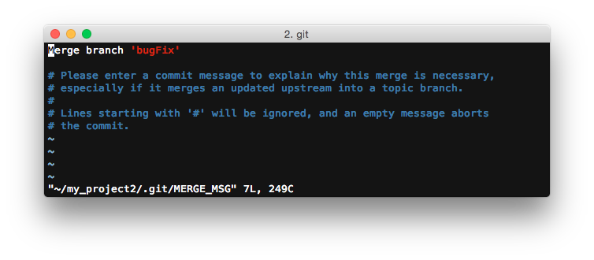
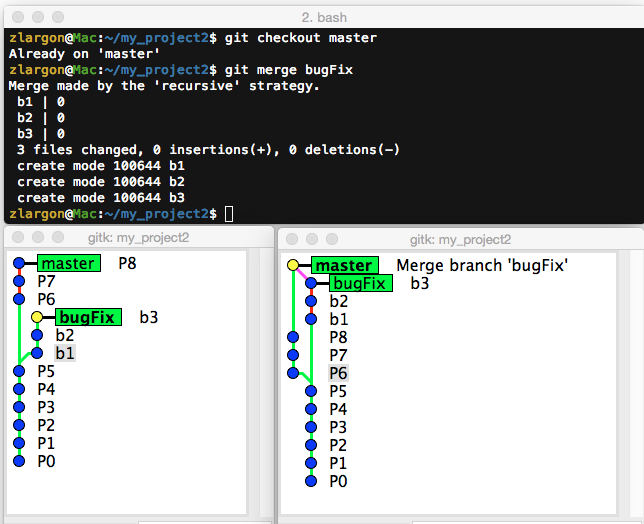
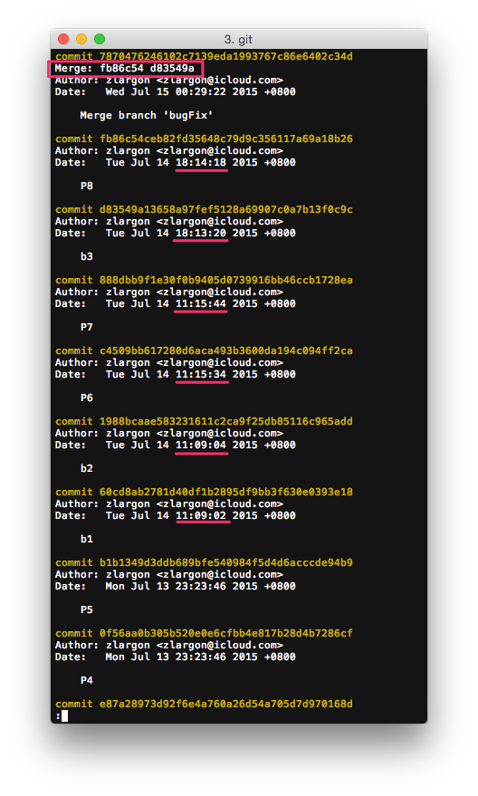
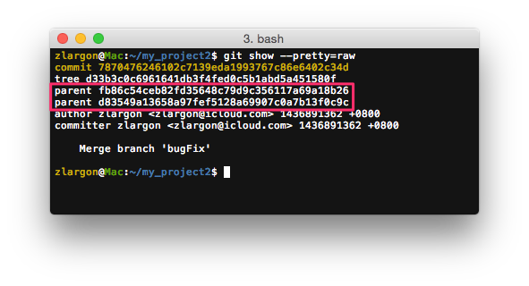
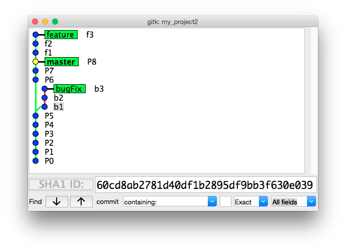
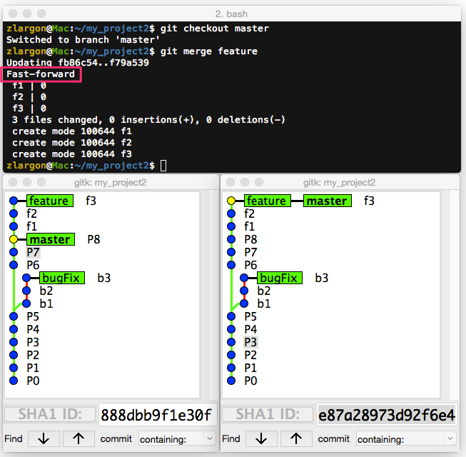
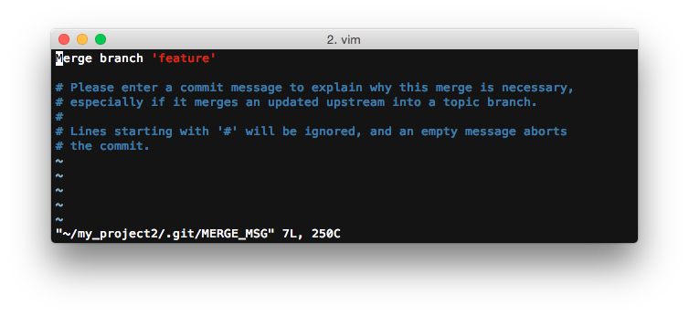
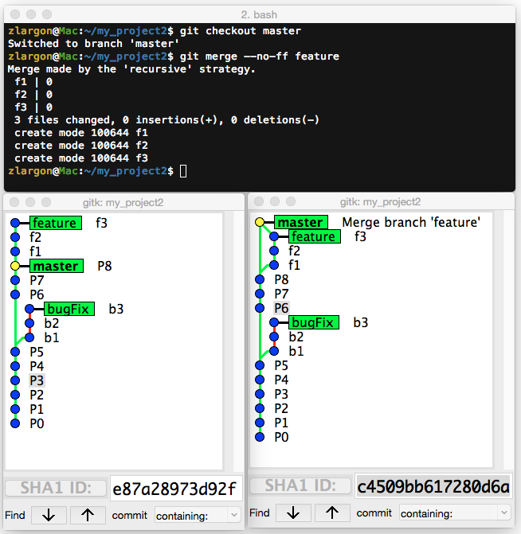
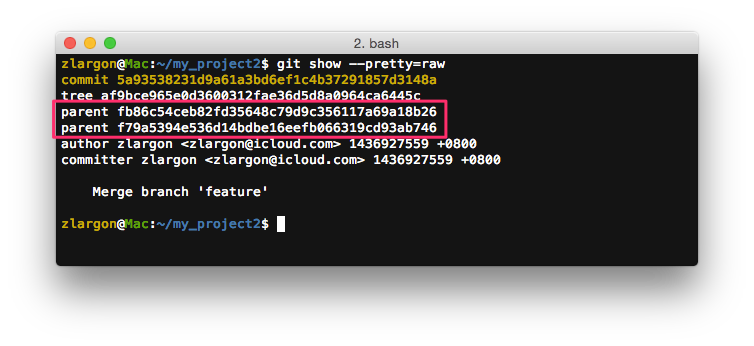

# Merge 合併分支

Git 除了可以用 `cherry-pick` 和 `rebase` 的方式來合併分支之外

還可以用 `merge` 指令來合併分支

 

## 使用 `git merge <branch name>` 來合併分支

例如我們的 `master` 要去合併 `bugFix` 分支

    $ git checkout master
    $ git merge bugFix      # 按下 enter 之後，會進入 vim 文字編輯模式，要求你提交 merge patch

合併完成後，他會多出一個 merge patch

接著我們用 `git log` 來查看

我們可以看到 merge patch 有多一個 Merge 的欄位，他紀錄的是 P8 跟 b3 的 commit id

也就是原始兩個 branch 的頭

另外我們可以看到 `git log` 把 `master` 的 P6, P7, P8 跟 `bugFix` 的 b1, b2, b3 順序打散了

並且會被重新按照 <u>提交時間</u> 來排序，每個 patch 都會保持原本的 commit id

 

我們用 `git show --pretty=raw` 來查看這個 merge patch，可以看到他有兩個 parents，也就是 P8 跟 b3

 

## Git Merge 的特性

* 合併完成後會有 Merge Patch，用來記錄原本兩個分支的 commit id

* 從 git log 看不出原本兩個分支的順序，會被混在一起並用提交時間來排序

* 不會修改原始的 commit id

 

## Fast-Forward

有一種情況下，不會出現 Merge Patch

那就是其中一個分支為另一個分支的子集

以這張圖來說，`master` 完全被包含於 `feature` 分支

所以 `master` 是 `feature` 的子集

    $ git checkout master
    $ git merge feature

因為 `feature` 跟 `master` 根本就在同一條分支上

所以也沒有並要用 Merge Patch 來記錄兩個分支的 commit id

因此 git 就會直接把 `master` 移到 `feature` 的位置

 

## 使用 `git merge --no-ff <branch name>` 強制產生 Merge Patch

Fast-Forward 是 `git merge` 預設的行為，如果不想要 Fast-Forward 就要加上參數 `--no-ff`

意思就是 No Fast-Forward

以剛才合併 `featrue` 的例子來說，我們加上參數 `-no-ff` 就會強制產生 Merge Patch

    $ git checkout master
    $ git merge --no-ff feature     # 按下 enter 之後，會進入 vim 文字編輯模式，要求你提交 merge patch

使用 `git show --pretty=raw` 可以看出，Merge Patch 有兩個 parents，分別是 P8 跟 f3

這樣的好處是，我們可以清楚的從 `gitk` 看出 f1, f2, f3 原本是隸屬於 `feature`，後來才被 merge 到 `master`

 

## Merge 與 Rebase 比較

| Merge | Rebase |
| --- | --- |
| 容易理解 | 不容易理解 |
| 會產生 Merge Patch，保存原始的 commit id | 重新 cherry-pick，重新產生 commit id |
| 當發生 ___conflict___ 的時候，全部在 Merge Patch 一次解完 | Rebase 的過程中，每次 cherry-pick 都可能會發生 ___conflict___ |
| commit tree 會有兩個 parents，不容易 trace code | commit 路徑單純，容易 trace code，或回到指定版本 |
| git log 無法呈現合併前分支順序性 | git log 可以呈現正確的提交順序  |
| 過多的 Merge Patch 會看起來很亂，沒有意義 | 分支乾淨一致 |

* merge 或 rebase 皆可用 `git reset --hard ORIG_HEAD` 回到分支合併前的情況

 

我個人建議是盡量避免使用 `merge`，除非兩隻 branch 的差異過大，逼不得已的時候才會用 `merge`

應盡量確保分支的簡單性，讓每個 patch 容易拆解或重組

所以結論是... `cherry-pick` 才是王道啊 XDDD

 

## 本章回顧

* 使用 `git merge <branch name>` 來合併分支

* 使用 `git merge --no-ff <branch name>` 強制產生 Merge Patch

   
