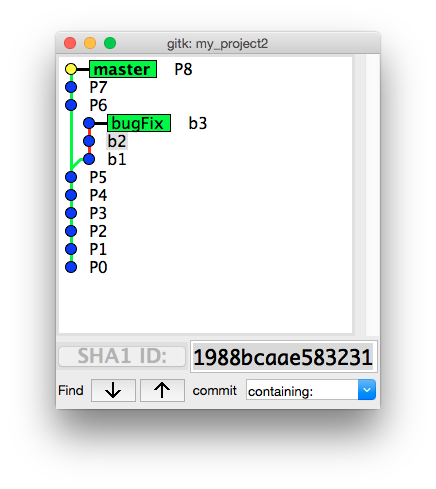
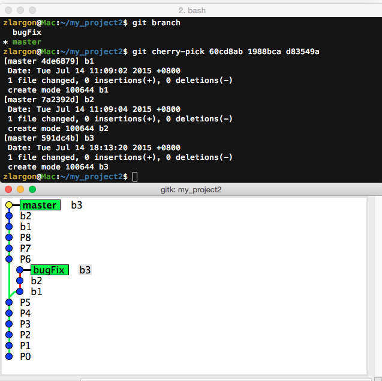
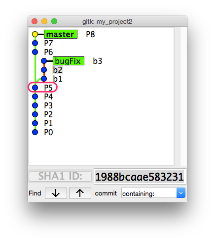
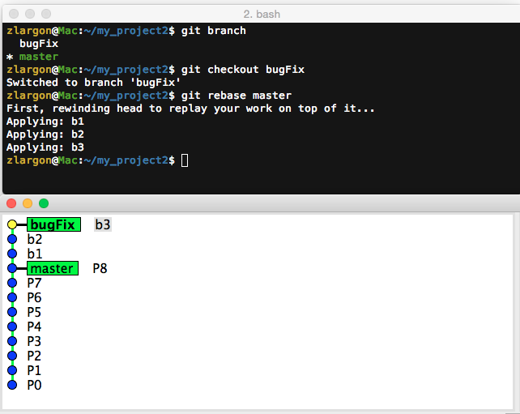
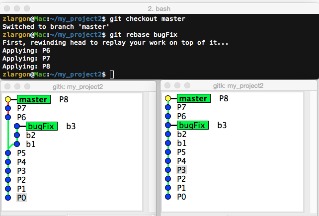
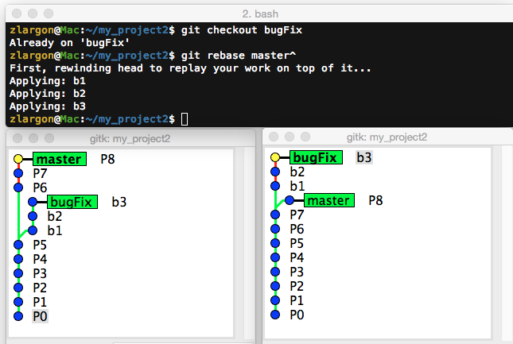

# Rebase 合併分支

當我們想要將 `bugFix` 分支的 b1, b2, b3 合併到 `master` 分支

最簡單的做法，就是用 `cherry-pick` 一個一個挑

 

## 使用 `git cherry-pick <commit 1> <commit 2> ...` 一次接多個 patch

`git cherry-pick` 後面可以一次接多個 commit id

    $ git checkout master
    $ git cherry-pick 60cd8ab 1988bca d83549a   # b1 = 60cd8ab
                                                # b2 = 1988bca
                                                # b3 = d83549a

如果分支很長的時候，用 `cherry-pick` 一個一個挑感覺還是滿累的

那有沒有其他做法呢？

 

## 使用 `git rebase <new base>` 重新定義分支的基準點

如果我們今天想要把 `bugFix` 接到 `master` 的後面

那麼就要先切到 `bugFix` 分支，然後以 `master` 作為為新的基準點進行 rebase

    $ git checkout bugFix
    $ git rebase master

因此 git 會根據 `bugFix` 一路往上去找與 `master` 的交會點，於是找到了 P5

接著就將 `bugFix` 之後的 patch 一個一個接到 `master` 的後面

___這裡要注意是誰 rebase 誰！___

<code style="color: blue">bugFix</code> 分支接到 <code style="color: red">master</code> 的後面

<pre>
$ git checkout <code style="color: blue">bugFix</code>
$ git rebase <code style="color: red">master</code>
</pre>

另外，以上兩行可以寫成一行 `git rebase <new base> <branch name>`

<pre>
$ git rebase <code style="color: red">master</code> <code style="color: blue">bugFix</code>
</pre>

 

如果兩個分支弄相反的話，就會變成這樣把 `master` 的 P6, P7, P8 接到 `bugFix` 的後面

 

在我們有 ___Commit Tree___ 的概念之後，其實 `git rebase master` 跟 `git rebase P8` 兩個意思是一樣的

所以，假如我們希望把 `bugFix` 接到 P7 後面的話，就可以這樣做

    $ git checkout bugFix
    $ git rebase master^        # P7 = master^

 

## rebase 的注意事項

1. ___rebase 指令不直覺，容易造成誤用（誰 rebase 誰？）___

    rebase 還有另外一個常用的指令 `git rebase --onto <new base> <after this commit> <to this commit>`

    我覺得這個指令不好理解，而且實用性低，所以我們這裡不打算教這個指令  

2. ___rebase 其實就是 cherry-pick 的高階指令___

    當一次 rebase 多個 patch 的時候，其實就是連續做 cherry-pick 的動作

    所以有可能會連續發生 ___conflict___

    當這種情況發生的時候，我寧可手動 cherry-pick

    每挑一個 patch 就跑一次測試程式，確保程式可以正常運作再挑下一個 patch  

3. ___rebase 會去修改 "被 rebase 的分支" 的內容___

    當下完 rebase 之後，才發現自己接錯了！

    這時候就必須去 reflog 去找 rebase 前的 commit id

    或者可以用 `git reset --hard ORIG_HEAD` 回到 rebase 前的 `HEAD`

    雖然都有補救方案，不過還是建議使用 rebase 前先開一個 `backup` 的分支以免發生意外

 

## 本章回顧

* 使用 `git cherry-pick <commit 1> <commit 2> ...` 一次接多個 patch

* 使用 `git rebase <new base>` 重新定義分支的基準點

* 使用 `git reset --hard ORIG_HEAD` 回到 rebase 前的 `HEAD`

   
