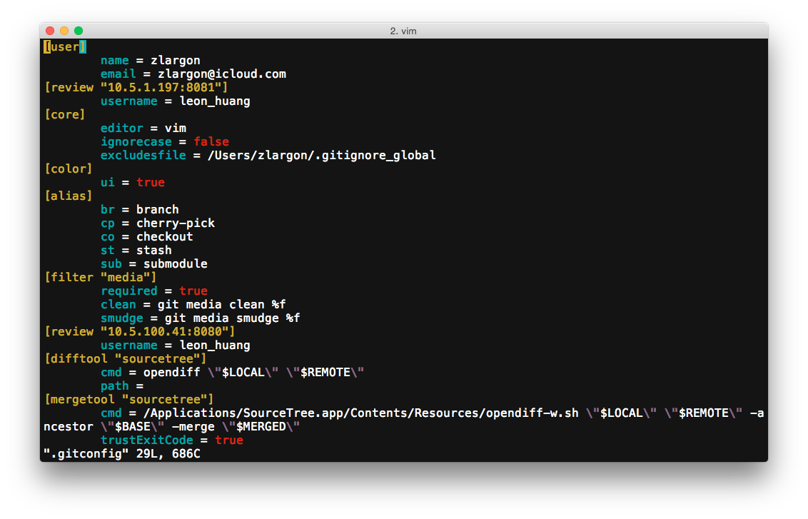
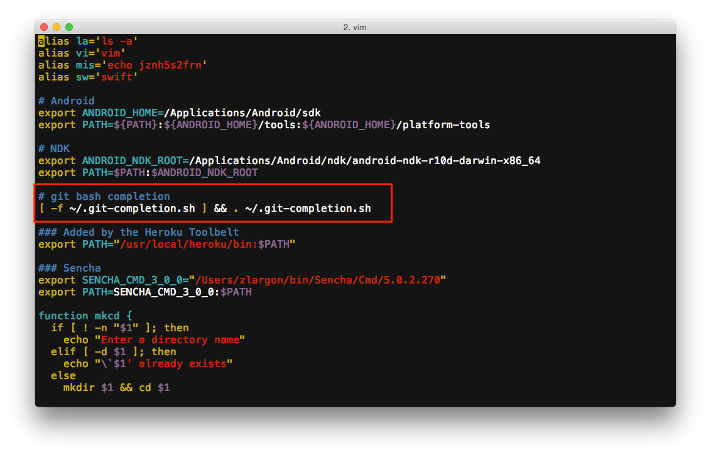

# 配置

## 設定 username, email

初次使用 git，最重要的就是設定 `username` 以及 `email`

```
$ git config --global  user.name "zlargon"
$ git config --global  user.email "zlargon@icloud.com"
```

第一次使用可以先隨意設定，但是之後若要搭配 github 的服務時，就必須使用在 github 註冊時所使用的 username, email

> ___使用 `--global` 的參數，表示對於所有的 git project 都會採用這組預設值___

<br>

接著，我們可以透過 `git config -l` 的指令，來查看我們目前 git 的設定內容

```
$ git config -l
```


> ___參數 `-l` 即為 `--list`，等同於以下的指令___

> ___`$ git config --list`___

<br>

而所有 `git config --global` 的設定內容，都會被寫入 `~/.gitconfig`



## 預設開啟彩色

```
$ git config --global  color.ui true
```

<br>

## 預設編輯器 vim

```
$ git config --global  core.editor vim
```

<br>

## 檔案名稱的大小寫不同時，是否該視為同一個檔案

在 Windows, Mac OSX 底下的 File System，會將名稱相同，但大小寫不同的檔案，視為同一個檔案

例如：`file.txt` 和 `FILE.TXT` 會被視為相同的檔案

只有在 Linux 下，才會把 `file.txt` 和 `FILE.TXT` 視為不同檔案

我們可以從 git 裡面，去強制設定，是否要忽略檔案名稱的大小寫

```
$ git config --global  core.ignorecase true    # 忽略大小寫
$ git config --global  core.ignorecase false   # 強制區分大小寫
```

> Note:

> 我之前有遇過，使用 Linux 開發的人，上傳了兩個檔案，名稱完全一樣，只有開頭大小寫不同

> 導致使用 Mac 的人下載下來的時候，被系統視為是同一的檔案

> 所以就會變得很怪，暨無法修改也無法刪除

> 從此之後，我們在 Linux 上都一律忽略大小寫

<br>

## 設定 git 指令的別名

可以把一些常用，而且較長的指令，簡化得短一點，方便自己使用

以下是我個人喜好的別名設定：

```
$ git config --global  alias.br   branch
$ git config --global  alias.co   checkout
$ git config --global  alias.cp   cherry-pick
$ git config --global  alias.st   stash
$ git config --global  alias.sub  submodule
```

<br>

## 設定自動完成 git 指令

[官方 git-completion.bash 腳本](https://github.com/git/git/blob/master/contrib/completion/git-completion.bash)

只要打指令的前幾的字，或是 branch 名稱的前幾個字，就可以用 TAB 自動完成剩下的部分

> ___若你所安裝的 git 預設已經有這個功能，則不需要安裝___

如何安裝設定：
* 下載 git-completion.bash，存到 ~/.git-completion.sh
* 在 `~/.bash_profile` 加上 `[ -f ~/.git-completion.sh ] && . ~/.git-completion.sh`
* 重開終端機

``` bash
$ curl https://raw.githubusercontent.com/git/git/master/contrib/completion/git-completion.bash > ~/.git-completion.sh
$ echo "" >> ~/.bash_profile
$ echo "# git completion" >> ~/.bash_profile
$ echo "[ -f ~/.git-completion.sh ] && . ~/.git-completion.sh" >> ~/.bash_profile
$ source ~/.bash_profile
```



<br><br><br>
