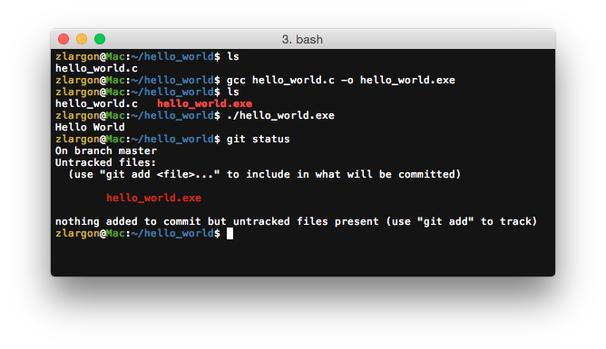
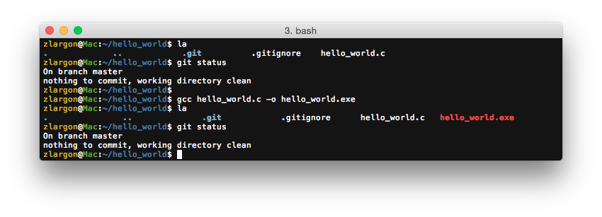
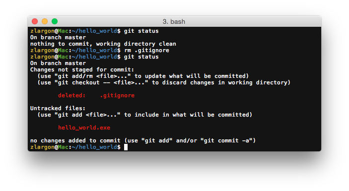
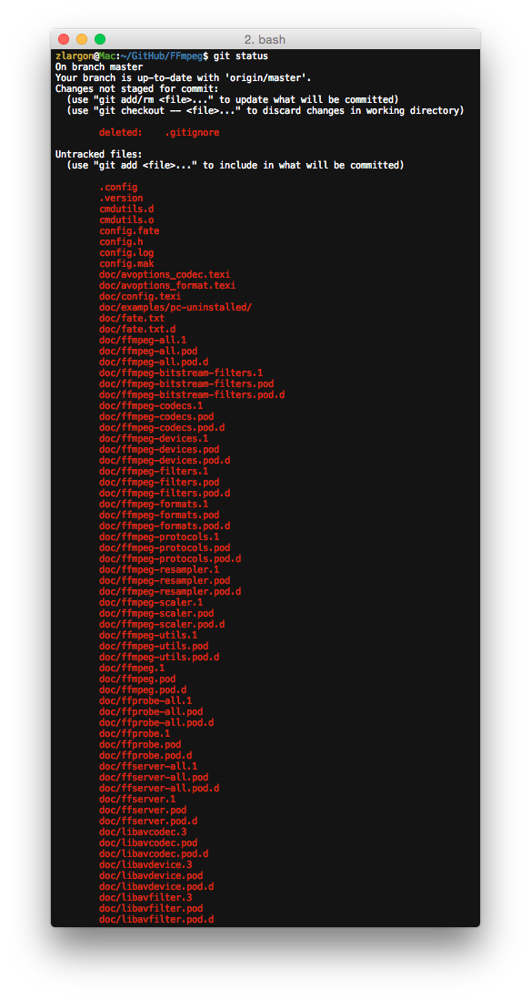
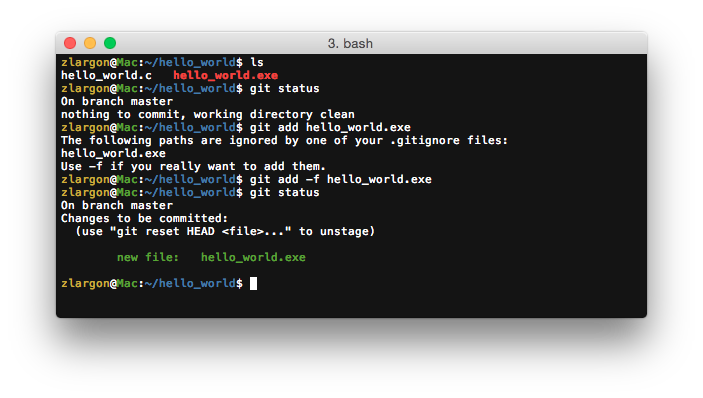

# 忽略檔案

有一些檔案是我們在開發的時候 build 出來的，他可能是 binary 的檔案

通常我們不會提交這些檔案，因為我們每次 build 出來，binary 的內容都不盡相同

我們不會直接去編輯修改這些檔案，他們從 `git diff` 上看，也只是看到 binary 不同而已

提交這些檔案對開發來說沒有意義的

舉例來說，C 程式碼可以透過 `Makefile` 或是 `gcc` 編譯出可執行擋，我們通常不會提交這些可執行擋



<br>

這些 build 出來的檔案會一直出現在 <span style="color: red">___Untracked files___</span>

而且這種檔案一多起來，每次做 `git status` 的時候，就會看起來很繁雜

因此，git 提供為了一個方式讓我們避免這種狀況

那就是在目錄下新增一個名為 `.gitignore` 的檔案

只要把你想忽略的檔案，通通寫在這裡就可以了

``` :.gitignore
*.exe       # 忽略所有 xxx.exe 的檔案
```



若我們將 `.gitignore` 刪除，那麼這些檔案就會重回到 <span style="color: red">___Untracked files___</span>



若以 [FFmepg](https://github.com/FFmpeg/FFmpeg) 為例，我們把 [`.gitignore`](https://github.com/FFmpeg/FFmpeg/blob/master/.gitignore) 刪除，就會看到一大堆的 .o 或是 .d 檔案




## .gitignore 範例

如果不清楚該把哪些檔案加到 `.gitignore` 的話，可以參考這個專案，他有大部份的專案類型所用的 `.gitignore` 範例

https://github.com/github/gitignore

<br>

## .gitignore 作用範圍

`.gitignore` 作用範圍包含整個資料夾以及其所有子資料夾

`.gitignore` 也可以存在多個資料夾中

每個資料夾都可以另外定義 `.gitignore` 的內容

<br>

## 使用 `git add -f <file>` 強制 add 被忽略的檔案

若有一些情況，我們必須要提交這些被 git 忽略的檔案，就可以使用這個 `-f` 參數，強制加入檔案

`-f` 同等於 `--force`，表示強制的意思


