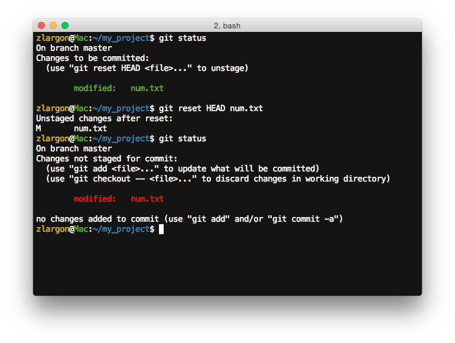
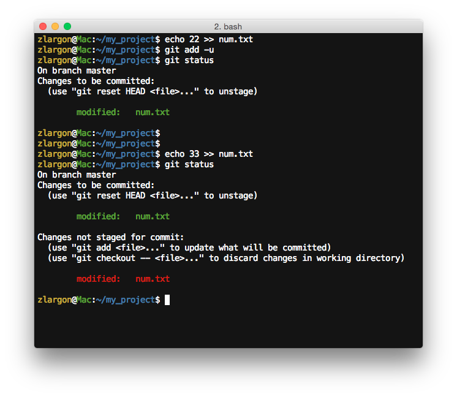

# 檔案還原

在之前幾節裡面，都是用 `git add / rm` 來使狀態變成 ___Changes to be committed___

在我們了解 ["檔案狀態"](status.md) 間的轉換之後

現在我們來示範一下檔案還原的部分

 

## 使用 `git checkout -- <file>` 來還原 "檔案內容"

首先我們先來修改檔案 `num.txt`，在後面新增一行字串 "22"，然後檢視其狀態與改變的內容

    $ git status
    $ git diff

這時候 `num.txt` 的狀態是 ___Changes not staged for commit (modified)___

接著我們可以透過 `git checkout -- <file>` 來還原檔案的內容

    $ git checkout -- num.txt
    $ git status

這裡可以看到，檔案已經還原修改前的內容

不論檔案狀態是 ___modified___ 或是 ___deleted___ 都可以用 `git checkout -- <file>` 來還原檔案的內容

 

## 使用 `git reset HEAD <file>` 來還原 "檔案狀態"

簡單來說，這是一個把綠色變回紅色的指令

根據 `HEAD`（目前的 patch，也就是最後一次提交的 patch）來還原 `file` 的 "檔案狀態"

他只會還原檔案 "狀態"，而不會還原檔案的 "內容"

若後面不加 `file` 來指定檔案的話，就表示要還原全部的檔案

    $ git reset HEAD <file>     # 還原 "指定" 的檔案狀態
    $ git reset HEAD            # 還原 "全部" 的檔案狀態

 

我們現在一樣在檔案 `num.txt` 後面新增一行字串 "22"，並且使用 `git add` 來告知 git 我們將要提交這個檔案

    $ git status
    $ git add
    $ git status

這時候 `num.txt` 的狀態，從 ___Changes not staged for commit (modified)___ 變成 ___Changes to be committed (modified)___

我們可以使用 `git reset HEAD <file>` 使他回到原本的狀態

    $ git status
    $ git reset HEAD num.txt
    $ git status

 

## 一個檔案可同時為 _Changes not staged for commit_ 及 _Changes to be committed_

首先我們先新增一行 "22"，然後 `git add` 到 ___Changes to be committed___，然後再對 `num.txt` 新增一行 "33"

這時候我們用 `git status` 可以看到 `num.txt` 同時屬於兩種狀態

這時候我們再用 `git diff` 來查看改變的內容

從 `git diff --cached` 可以看到新增 "22" 的部分

從 `git diff` 可以看到新增 "33" 的部分

___git 可以只 commit 一份檔案中部分的內容，不一定要以整份檔案為單位來提交___

 

## 使用 `git reset --hard HEAD` 一次還原所有的檔案內容

`git reset HEAD` 可以用來還原 ___Changes to be committed___ 所有的檔案狀態

但是如果要還原檔案內容的話，必須對所有檔案再做一次 `git checkout -- <file>`

而 `git reset --hard HEAD` 可以一次將 ___Changes not staged for commit___ 和 ___Changes to be committed___ 的區域清空

    $ git status
    $ git reset --hard HEAD
    $ git status

我們可以看到，所有的在非 ___Untracked files___ 的內容，都被清空了

由於 git 不會去追蹤 ___Untracked files___ 的內容，因此這裡的檔案只能手動刪除

不過還是可以透過以下方式把他們刪除

    $ git add -A                # 把所有檔案加到 Changes to be committed
    $ git reset --hard HEAD     # 一次還原所有檔案的內容

我個人平時還滿常會這樣用的

 

 ## 本章回顧

 * 使用 `git checkout -- <file>` 來還原 "檔案內容"

 * 使用 `git reset HEAD <file>` 來還原 "檔案狀態"

 * 使用 `git reset --hard HEAD` 來清空 ___Changes not staged for commit___ 和 ___Changes to be committed___ 區塊
