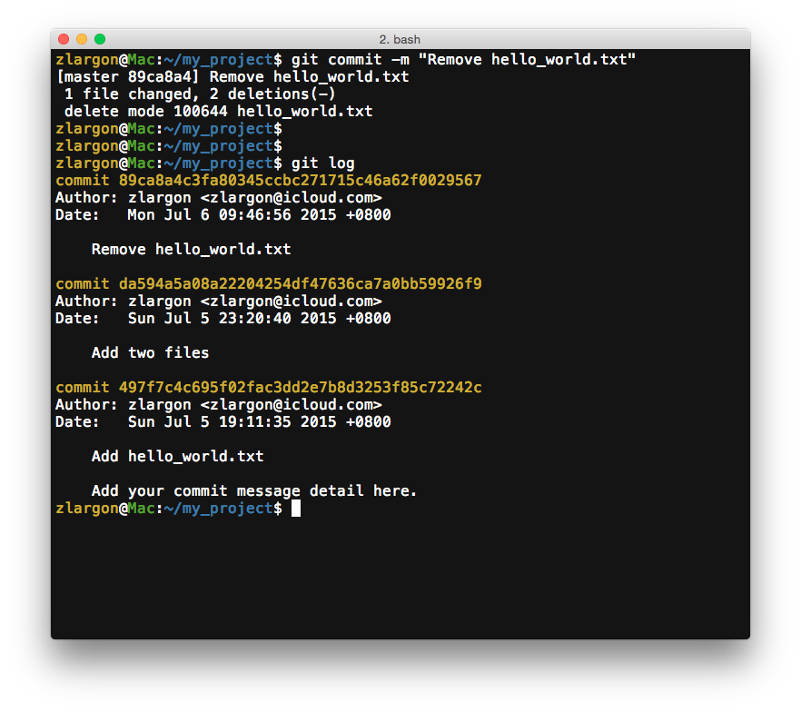

# 刪除檔案

我們現在把 `hello_world.txt` 的檔案刪除，然後再用 `git status` 來檢視檔案的狀態


## 使用 `git rm <file>` 來告知 git，哪些是我們將要刪除的檔案

`hello_world.txt` 的檔案狀態是 ___Changes not staged for commit (deleted)___

由於 `hello_world.txt` 已經被刪除，所以在這裡不能用 `git add` 來 "新增" 檔案

這裡要用 `git rm` 來 "刪除" 檔案（`rm` 其實就是 `remove` 的意思）

> 事實上，在某些新版的 git 是可以使用 `git add` 來 "新增" 將要被除的檔案

<br>

在觀念上，`git rm` 跟 `git add` 其實是完全一致的

|| step 1 | step 2 |
| --- | --- | --- |
| __Add File__ | 新增一個檔案 | 使用 `git add` 告知 git，哪些是我們將要 "新增" 的檔案 |
| __Remove File__ | 移除一個檔案（可略過） | 使用 `git rm` 告知 git，哪些是我們將要 "移除" 的檔案 |

```
$ git rm hello_world.txt
$ git status
```

我們已經告知 git 將要把 `hello_world.txt` 刪除，接著再用 `git status` 來查看檔案狀態


`hello_world.txt` 的狀態改變為綠色的 ___Changes to be committed (deleted)___

<br>

## 使用 `git add -u` 加入所有被更動的檔案（包含 _modified_ 及 _deleted_）

雖然我們不能用 `git add <file>` 來加入已被刪除的檔案

不過可以使用參數 `-u` 或是 `--update` 一次加入所有被更動的檔案，其包含的 ___modified___ 及 ___deleted___ 檔案

由於這裡只有一個 __deleted__ 的檔案，所以 `git add -u` 效果跟 `git rm hello_world.txt` 會是一模一樣的

```
$ git add -u        # 一次加入所有被更動的檔案，包含 modified 及 deleted
$ git add --update  # 同上
```

<br>

提交 patch，並用 `git log` 來查看提交歷史紀錄

```
$ git commit -m "Remove hello_world.txt"
$ git log
```



<br>

## 本章回顧

* 使用 `git rm <file>` 來告知 git，哪些是我們將要刪除的檔案

* 使用 `git add -u` 加入所有被更動的檔案（包含 _modified_ 及 _deleted_）
