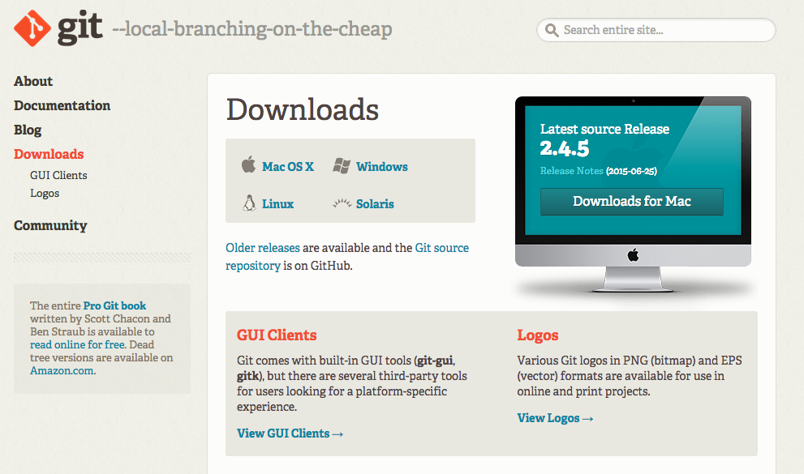

# 安裝

https://git-scm.com/downloads

## Linux / Mac OSX

安裝好之後，就可以立即在終端機使用

## Windows

`Git Bash = MinGW + Git`

`MinGW` 讓我們可以在 Windows 的環境下，使用與 UNIX-like 的方式下指令 `cd`, `ls`, `vim`, `curl`, ...

   
