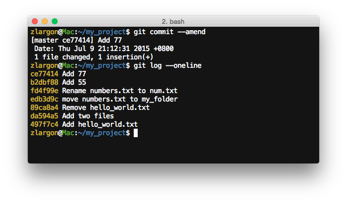

# 修改 / 訂正 Patch

有時候我們在 commit 時，會不小心 add 錯檔案，或是 commit message 寫錯、打錯字

我們不想要再 commit 一個 patch，只是想修改原本的內容而已

這時候我們該怎麼做呢？

應該已經有人想到可以這樣做了

    $ git reset HEAD^       # 恢復上一個 patch 的狀態
    $ git add <file>        # 重新 add files
    $ git commit            # 重新 commit

除了以上這種方法之外，我們在這邊另外提供兩種做法供參考

 

## 1. 使用 `git reset --soft HEAD^` 使 patch 回到上一個階段的 _Changes to be committed_

首先我們先在 `num.txt` 的最後一行新增 "55" 然後提交

    $ echo 55 >> num.txt            # 新增 55
    $ git add -u                    # add 修改的部分
    $ git commit -m "Add 66"        # 提交（這是錯誤的 message）

顯然這次的提交訊息是錯誤的，應該改成 "Add 55" 才對

在這裡我們可以使用 `git reset --soft HEAD^` 來回到上一步，但是不需要重新 `add` 檔案

    $ git reset --soft HEAD^        # 會把前一次 add 過的內容，保留在 Changes to be committed 區塊
    $ git commit -m "Add 55"

請注意，原本的 commit id 為 `0447f9b`，但是重新提交後 id 變成 `b2dbf88`

儘管第二次的內容跟第一次是一模一樣的，凡事只要做了 commit 的動作，git 就會重新產生一組新的 `commit id`

其實這個方法就只是省掉重做 `git add` 的時間而已

 

#### 比較 `git reset HEAD^` 的參數

| 指令 | 效果 |
| --- | --- |
| `git reset  HEAD^` | 回到前一個 patch，且恢復檔案的狀態 |
| `git reset --soft HEAD^` | 回到前一個 patch，但保持檔案狀態為 ___Changes to be committed___ |
| `git reset --hard HEAD^` | 回到前一個 patch，且強制清除檔案的修改內容 |

 

## 2. 使用 `git commit --amend` 修改提交訊息

我們在提交一個新增 "77" 的 patch，但是提交內容故意打錯成 "Add 88"

    $ echo 77 >> num.txt            # 新增 77
    $ git add -u                    # add 修改的部分
    $ git commit -m "Add 88"        # 提交（這是錯誤的 message）

這次我們使用 `git commit --amend` 直接修改提交訊息

    $ git commit --amend    # 使用後會進入 vim 文字編輯模式。把標題改成 "Add 77" 然後存檔離開

跟前一個方法一樣，原本的 commit id 已經被改變

因為凡事只要做了 commit 的動作，git 就會重新產生一組新的 `commit id`

而 `git commit --amend` 後面也可以加 `-m` 的參數帶入新的 commit message

    $ git commit --amend -m <title>                             # 只要提交 title
    $ git commit --amend -m <title> -m <message>                # 提交 title 以及 message
    $ git commit --amend -m <title> -m <msg1> -m <msg2> ....    # 提交多段 messages

 

## 使用 `git commit --amend` 修改提交的內容

如果我想要修改剛才的 patch，除了新增 77 之外，還要在同一個 patch 新增 99 的內容

那可以用以下的方法，把修改 99 的部分，合併到原本的 patch 裡面

    $ echo 99 >> num.txt                        # 新增 99 到最後一行
    $ git add -u                                # add 修改的部分
    $ git commit --amend -m "Add 77 and 99"

從這裡可以看到，我們已經成功把 99 合併到前一個 patch 裡面了

同時 commit id 也發生改變了

 

## `git commit --amend` 的注意事項（非常雷 x 2）

使用指令 `git commit --amend` 後，會馬上進入 vim 的文字編輯模式

___git 不論你是否有修改 commit message 或是用 `:q!` 不存檔直接離開 vim___

___都會為你重新產生新的 commit id___

有時候這並不一定是我們想要的結果，要特別留意！

> 例如說，我們從 server 上抓了最新的 code 下來，準備要新增一個功能再上傳至 server

> 但是你好死不死的手殘按到 `git commit --amend` 先改到了最新的 patch（P0）

> 這時候儘管你按 `:q!` 退出 vim，但是 commit id 早就已經被改掉了（P0'）

> 然後我們基於 P0' 來開發新功能，並且 commit 了一個新的 patch（P1）

> 這時候我們要上傳 patch 的時候，會遇到被 git server 拒絕的情形

> 被拒絕的原因是，server 認為你提交的 patch 跟 server 的 code 並沒有兩樣

> 但其實主要原因是，server 認為你上傳了兩個的 patch，分別是 P0' 跟 P1

> server 先用 P0' 跟 P0 最比對，發現兩個 patch 根本就一模一樣，就直接拒絕了

> 當你絞盡腦汁的想要找出 P1 哪裡有問題的時候，其實是被 `git commit --amend` 背後默默捅了一刀

> 因此上傳 patch 前請確保 parent id 正確無誤

 

另外這個指令還有一個很雷的地方是

有時候我們已經開發好一個新功能，也都測過沒問題了

把全部修改的內容都 `add` 好之後，準備要用指令 `git commit` 來提交

___但是卻不知道為什麼很順手的在後面又加上了 `--amend` ...___

就在你按下 enter 的瞬間，悲劇已經發生了...

___Changes to be committed___ 的內容已經完美的跟上一個 patch 融合在一起了...

這時候該怎麼把他們分離呢？

就在我們學完 `git reflog` 跟 `git reset --soft HEAD^` 之後

只要一行指令就可以把他們完美的分離了 XD

    $ git reset --soft HEAD@{1}

 

## 本章回顧

* 使用 `git reset --soft HEAD^` 使 patch 回到上一個階段的 ___Changes to be committed___

* 使用 `git commit --amend` 修改提交訊息及內容

* 保命技 `git reset --soft HEAD@{1}`

   
