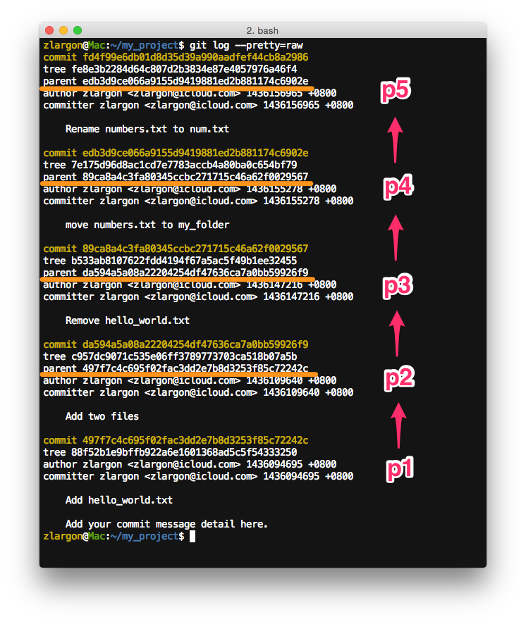

# 基本觀念

在上一章檔案管理裡面，我們都是對單一個 patch 進行操作

修改完檔案，使用 commit 來提交，並且產生一個新的 patch

 

在 git 的世界裡___「每一個 patch 其實都只會記錄其所發生 "變化"，而不是整份完整的 code」___

相對於前一個 patch（git 稱之為 `parent`）所發生的變化

然而，當 git 我們把所有的 patch 一個接著一個全部串起來之後，就可以變成一份完整的 code

我們就先前的例子來說明

## 使用 `git log --pretty=raw` 來顯示 `parent` 的資訊

    $ git log --pretty=raw

我們這裡可以看出，除了 `p1` 是初始化的 patch 沒有 `parent` 之外

其他的 patch 的 `parent` 都是一個緊接著一個

* `p2` 記錄了 `p1 → p2` 的變化
* `p3` 記錄了 `p2 → p3` 的變化
* `p4` 記錄了 `p3 → p4` 的變化
* `p5` 記錄了 `p4 → p5` 的變化

就剛才所說的___「每一個 patch 其實都只會記錄其所發生 "變化"，而不是整份完整的 code」___

___git 注重的是你 "改" 了什麼___

git 這樣的設計非常聰明，而且有非常多的好處

我們會在後面的章節一一的講清楚說明白

這裡只要有知道 patch 的概念是一個一個串起來的，這樣就行了

   
