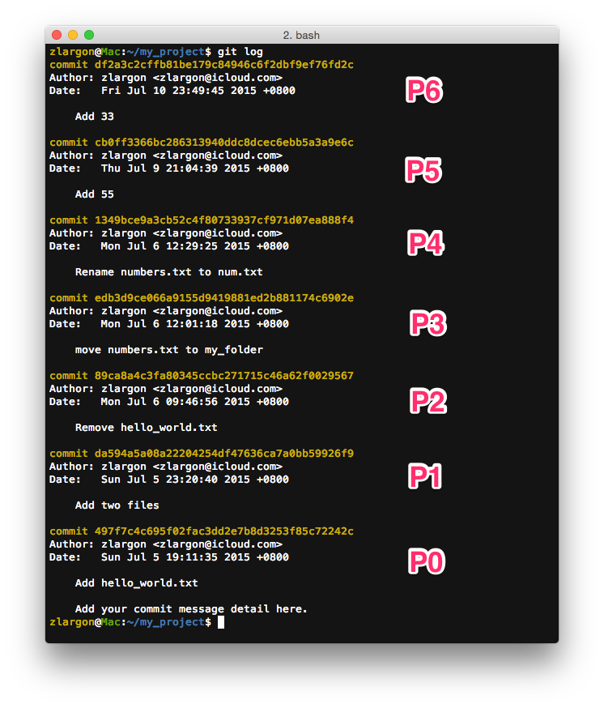
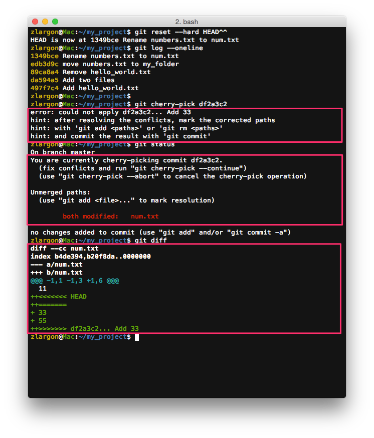
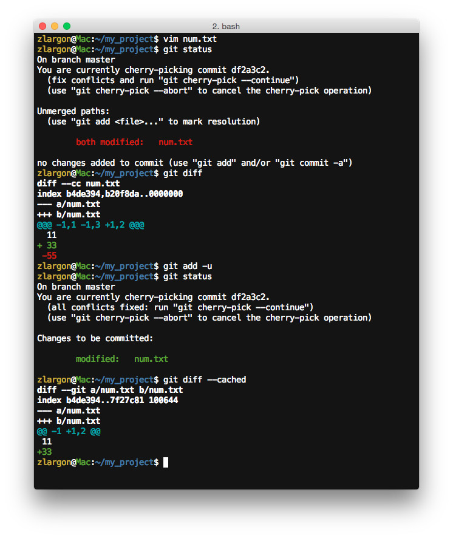
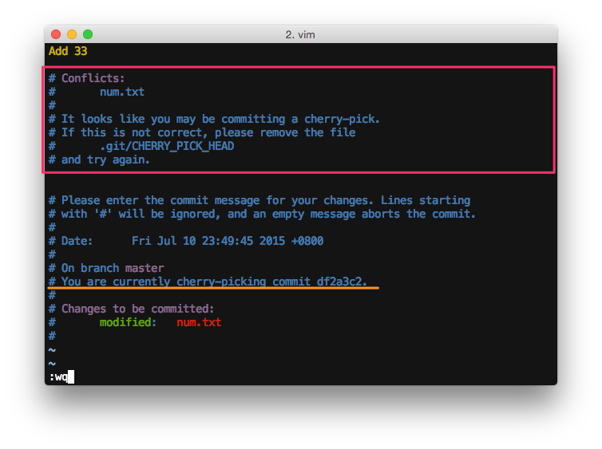
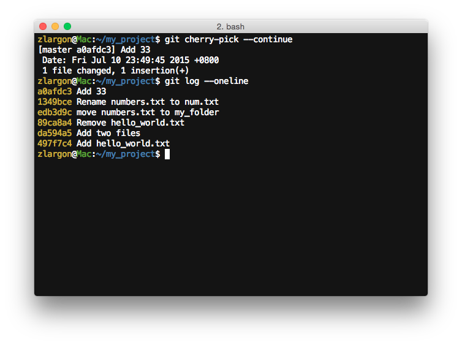
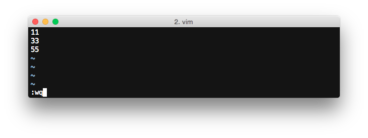
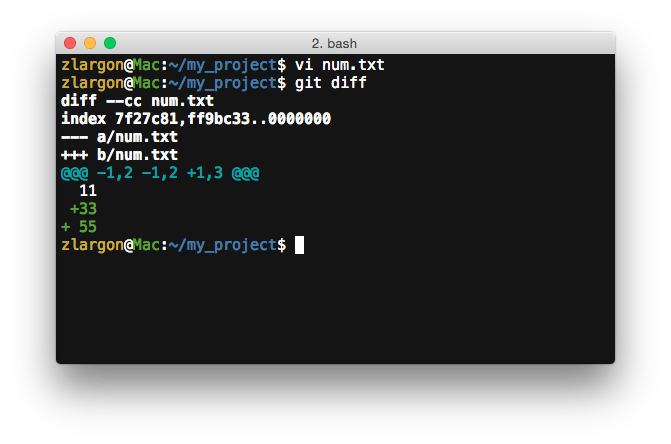
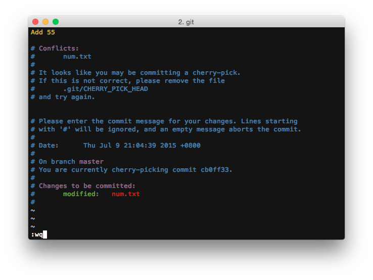
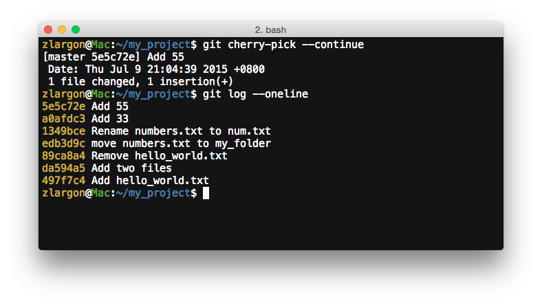

# Cherry-Pick 版本衝突

在 ["移除單一個 Patch"](remove.md) 的結尾，我們有提到有時候我們在做 `cherry-pick` 的時候會遇到版本衝突的問題

我們現在就來製造一個版本衝突的情況

現在先提交一個 patch "Add 33" 為 `num.txt` 新增 "33" 的字串


而我們故意把最後兩個 patch 的順序對調，使他發生 ___conflict___



也就是說，我們希望新的順序是這樣的

```
P0    →    ...    →    P4    →    P5    →    P6        原本的順序

P0    →    ...    →    P4    →    P6'   →    P5'       新的順序
```

我們來看看會發生什麼事情

    $ git reset --hard HEAD^^       # 回到 P4
    $ git cherry-pick df2a3c2       # cherry-pick  P6  →  發生 conflict
    $ git status                    # 查看檔案狀態
    $ git diff                      # 查看檔案內容



git 印出 cherry-pick 時，所發生的錯誤訊息：

<pre style="border: 1px solid grey">
<code>error: could not apply df2a3c2... Add 33
hint: after resolving the conflicts, mark the corrected paths
hint: with 'git add <paths>' or 'git rm <paths>'
hint: and commit the result with 'git commit'</code>
</pre>

___git 要求你解決 conflict 的問題，並且解完後使用 `git add/rm` 你的檔案，再執行指令 ~~`git commit`~~___

> 稍後我會解釋，為什麼要把他劃掉

<br>

使用 `git status` 來查看檔案狀態

<pre style="border: 1px solid grey">
<code>You are currently cherry-picking commit df2a3c2.
  (fix conflicts and run "git cherry-pick --continue")
  (use "git cherry-pick --abort" to cancel the cherry-pick operation)

Unmerged paths:
  (use "git add <file>..." to mark resolution)</code>

    <code style="color: red">both modified:   num.txt</code>
</pre>

* ___fix conflicts and run "git cherry-pick --continue"___
* ___use "git cherry-pick --abort" to cancel the cherry-pick operation___

    > 解完衝突請執行 `git cherry-pick --continue`<br>
    > 若要放棄請執行 `git cherry-pick --abort`

git 會將所有發生 ___conflict___ 的檔案，放在 ___Unmerged paths___ 區塊

`num.txt` 的狀態為 _<span style="color: red">both modified</span>_ 的意思是，兩個 patch 都有同時修改到這個檔案

接著我們使用 vim 來開啟檔案 `num.txt` 來解 ___conflict___ 吧！


<pre style="border: 0px solid grey">
<span style="font-weight: bold"><<<<<<< patch_1</span>
<div style="border: 1px solid black; font-style: italic">
  這裡是 patch_1 對此檔案所修改的內容

</div><span style="font-weight: bold">=======</span>
<div style="border: 1px solid black; font-style: italic">
  這裡是 patch_2 對此檔案所修改的內容

</div><span style="font-weight: bold">>>>>>>> patch_2</span>
</pre>

從 ___`<<<<<<< patch_1`___ 到 ___`>>>>>>> patch_2`___ 是一段發生衝突的區塊

檔案裡可能會有 __"很多段"__ 這樣的標記

用來告訴我們發生衝突的兩個 patch 分別為這個檔案修改了什麼內容

<br>

因此對 `num.txt` 來說，P4 沒有修改東西，但是 P6 除了 "33" 之外，還多了 "55"

<pre style="border: 0px solid grey">
<span style="font-weight: bold"><<<<<<< HEAD (P4)</span>
<div style="border: 1px solid black; font-style: italic">

</div><span style="font-weight: bold">=======</span>
<div style="border: 1px solid black; font-style: italic">  33
  55
</div><span style="font-weight: bold">>>>>>>> Cherry-pick P6</span>
</pre>

我們在這個 patch 要做的事情只有新增 "33"，我們並不想要提交 "55" 的部分

因此我們就把 "55" 這一行刪掉，以及 `<<<`, `===`, `>>>` 的符號也一併刪掉，只保留 "11" 跟 "33"


存檔離開後，並用 `git diff` 觀察狀態


<pre style="border: 1px solid grey">
  11
<span style="color: green">+</span>□<span style="color: green">33</span>
□<span style="color: red">-55</span>
</pre>

如果我們仔細的觀察 `git diff`，會發現每一行前面的正負號看起來怪怪的

正負號有的在前，有的在後，這是為什麼呢？

前面的正負號表示，我們___解完 conflict 後的 patch___ 與 patch_1 的差別；而這裡的 patch_1 就是 P4（HEAD）

後面的正負號表示，我們___解完 conflict 後的 patch___ 與 patch_2 的差別；而這裡的 patch_2 就是 P6

| 前（P4） | 後（P6） | 修改的內容 | 說明 |
| :---: | :---: | :---: | --- |
| |  | `11` | ___解完 conflict 後的 patch___ 與 P4 相比，沒有變化<br>___解完 conflict 後的 patch___ 與 P6 相比，沒有變化 |
| <code style="color: green">+</code> | | <code style="color: green">33</code> | ___解完 conflict 後的 patch___ 與 P4 相比，多了這行<br>___解完 conflict 後的 patch___ 與 P6 相比，沒有變化 |
| | <code style="color: red">-</code> | <code style="color: red">55</code> | ___解完 conflict 後的 patch___ 與 P4 相比，沒有變化<br>___解完 conflict 後的 patch___ 與 P6 相比，少了這行 |

<br>

如果我們這時候再用 vim 去修改 `num.txt`，把第一行的 "11" 刪除，並且新增一行 "77" 在最後面，我們來看看會發生什麼變化（稍等會把這個 patch 改回來）


`git diff` 的結果


| 前（P4） | 後（P6） | 修改的內容 | 說明 |
| :---: | :---: | :---: | --- |
| <code style="color: red">-</code> | <code style="color: red">-</code> | <code style="color: red">11</code> | ___解完 conflict 後的 patch___ 與 P4 相比，少了這行<br>___解完 conflict 後的 patch___ 與 P6 相比，少了這行 |
| <code style="color: green">+</code> | | <code style="color: green">33</code> | ___解完 conflict 後的 patch___ 與 P4 相比，多了這行<br>___解完 conflict 後的 patch___ 與 P6 相比，沒有變化 |
| | <code style="color: red">-</code> | <code style="color: red">55</code> | ___解完 conflict 後的 patch___ 與 P4 相比，沒有變化<br>___解完 conflict 後的 patch___ 與 P6 相比，少了這行 |
| <code style="color: green">+</code> | <code style="color: green">+</code> | <code style="color: green">77</code> | ___解完 conflict 後的 patch___ 與 P4 相比，多了這行<br>___解完 conflict 後的 patch___ 與 P6 相比，多了這行 |

這樣應該更清楚 `git diff` 的正負號要怎麼看了吧～

我們現在把內容改回來，並且用 `git add` 加入

    $ git status
    $ git diff
    $ git add -u            # 加入解完 conflict 的部分
    $ git status
    $ git diff --cached     # 查看這次修改的部分



等待一切都準備就緒之後，就可以用 `git cherry-pick --continue` 來告訴 git，我們已經解完了，可以繼續了

    $ git cherry-pick --continue        # 按下 enter 後會進入 vim 文字編輯模式

> 雖然這裡也可以使用指令 `git commit` 來告知 git 我們已經解完了，不過我不建議用這個指令

> 因為除了 `cherry-pick` 之外，`rebase` 也有 `--continue` 的指令

> 但是 `git rebase --continue` 不等同於 `git commit`

> 因此我建議盡量使用 `git cherry-pick --continue` 比較不會造成混淆

> 另外一點是，如果使用 `git commit` 的時候，不小心在後面順手加上參數 `--amend` 的話，就會很悲劇...




存檔離開後，我們使用 `git log` 來查看結果



```
P0    →    ...    →    P4    →    P5    →    P6        原本的情況

P0    →    ...    →    P4    →    P6'                  現在的情況
```

我們已經成功把 P6 挑進來了

現在我們只要再把 P5 挑進來，就可以完成互換 P5, P6 了

    $ git cherry-pick cb0ff33       # cherry-pick  P5  →  再度發生 conflict
    $ git status                    # 查看檔案狀態
    $ git diff                      # 查看檔案內容


由於 P5 原本的 parent 是 P4，並沒有 "33"；而新的 P6 多了 "33"，因而發生了 ___conflict___

根據剛才解 ___conflict___ 的經驗，只要把 "33" 跟 "55" 都 `add` 進去就可以了



存檔離開，並用 `git diff` 來查看狀態



| 前（P6'） | 後（P5） | 修改的內容 | 說明 |
| :---: | :---: | :---: | --- |
| |  | `11` | ___解完 conflict 後的 patch___ 與 P6' 和 P5 都沒有改變 |
| | <code style="color: green">+</code> | <code style="color: green">33</code> | ___解完 conflict 後的 patch___ 與 P5 相比，多了這行 |
| <code style="color: green">+</code> | | <code style="color: green">55</code> | ___解完 conflict 後的 patch___ 與 P6' 相比，多了這行 |

<br>

我們把解完的部分 `add` 起來

並且下指令 `git cherry-pick --continue` 告知 git 我們已經解完 ___conflict___ 了


進入 vim 文字編輯模式 `:wq` 存檔離開



使用 `git log` 查看，我們已經改好了，大功告成！



```
P0    →    ...    →    P4    →    P5     →    P6            原本的順序

P0    →    ...    →    P4    →    P6'    →    P5'           現在的順序
```

<br>

## 使用 `git cherry-pick --abort` 取消，並且回到 cherry-pick 前的狀態

如果你在解 ___conflict___ 的時候不太順利，或是不小心改錯了，想要全部重來

都可以用 `git cherry-pick --abort` 直接取消

<br>

## 如何降低發生 _Conflict_ 的機會

解 ___Conflict___ 真的是一件很累人的事情，萬一沒解好還會後遺症一大堆

所以最好的辦法就是，盡量避免發生衝突的機會

在一開始講解 patch 的基本觀念時，有說到每個 patch 其實就是其相對於 parent 的變化量

因此，我們只要確保變化量越少，就越不容易發生 ___conflict___ ，也越容易被 git 拆解、合併

<br>

一般來說，發生衝突都是發生在多人共同開發的時候

我們自己寫的 code 通常不會跟自己發生衝突吧 XDD

除非像我這樣沒事亂搬 patch 的位置才有可能發生

<br>

舉例來說，Developer A 在一個 patch 裡面同時新增了 3 個 featrue，解了 5 個 bug

而 Developer B 也在同時新增了 3 個 feature，解了 4 個 bug，改了 3 個檔案的名稱

A 跟 B 可能同時去修改到同一個檔案，或同一個 function

或是 A 跟 B 剛好都發現了同一個 bug，同時都解了這個 bug 但是改法不同

然後更過分的是 B，還順便修改了檔案名稱和路徑！

這時候 A 跟 B 的 patch 會非常容易發生 ___conflict___

<br>

因此比較好的做法是，Developer A 跟 B 都把各自的 patch 拆開

Developer A：`featrue_patch * 3 + bug_fix_patch * 5`

Developer B：`featrue_patch * 3 + bug_fix_patch * 4 + move_file_patch * 3`

當所有的 patch 都拆成這小 patch 之後，要去挑 patch 就會變得很容易

每個 patch 的變化都減少了，即時發生了衝突也會很好解

因此請務必養成良好的上 code 習慣，每改好一個小功能就立即提交一個 patch

patch 多沒有關係，但 patch 改的內容要越細越好

我們之後還會陸續講到關於 ___Coding Style___ 以及上 patch 的「好習慣」

<br>

> 之前遇過最難解的 ___conflict___ 無非就是 iOS 的 `story board` 了

> `story board` 裡面一推由 Xcode 自動產生的 id，還真的是不太好解...

> 解 ___confilct___ 的時間，都可以重拉一個新的了... Orz

> 因此建議還是同一個時間，只要有一個人去改 `story board` 就好了

<br>

## 本章回顧

* 看懂 ___conflict___ 檔案中 `<<<`, `===`, `>>>` 標記的意思

* 學會如何修改 ___conflict___ 的檔案

* 看懂 `git diff` `both modified` 檔案的時候，其每一行前面的正負號所表達的意思

* 使用 `git cherry-pick --continue` 告知 git 已經解完衝突

* 使用 `git cherry-pick --abort` 取消，並且回到 cherry-pick 前的狀態

* 如何降低發生 ___conflict___ 的機會

<br><br><br>
