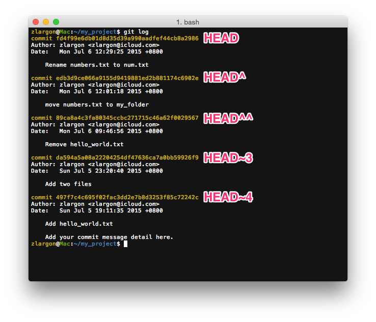

# 關鍵字 HEAD

`HEAD` 為 git 特殊的關鍵字，意指目前所在 patch 的位置；顧名思義，就是「頭」

我的頭在哪裡，就是我所在的位置

我們可以把 `HEAD` 當作基準點，表示其他相對位置的 patch

* `HEAD^` 或 `HEAD~1` 可以用來表示上一個 patch

* `HEAD^^` 或 `HEAD~2` 可以用來表示上兩個 patch

* `HEAD^^^` 或 `HEAD~3` 可以用來表示上三個 patch

* 依此類推...

 

因此，我們之前有教過使用 `git show <commit id>` 來查看之前的 patch 的修改內容

我們也可以改成用 `HEAD` 來查看

例如我要看前兩個的 patch 所修改的內容，就可以用 `git show HEAD^^`

   
