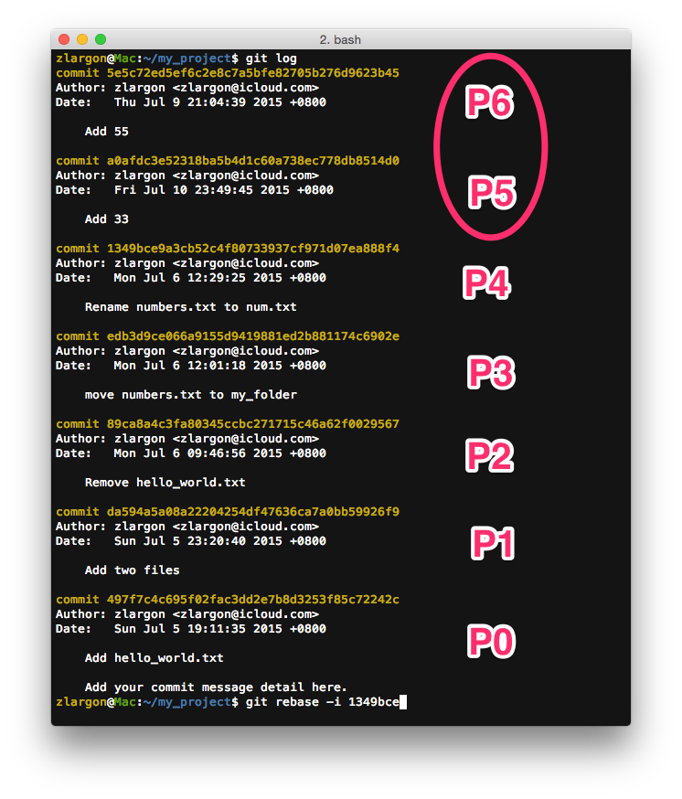
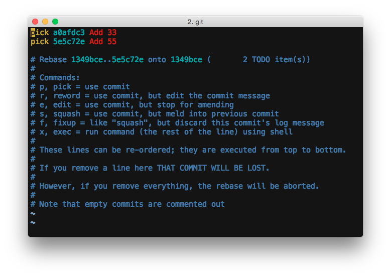
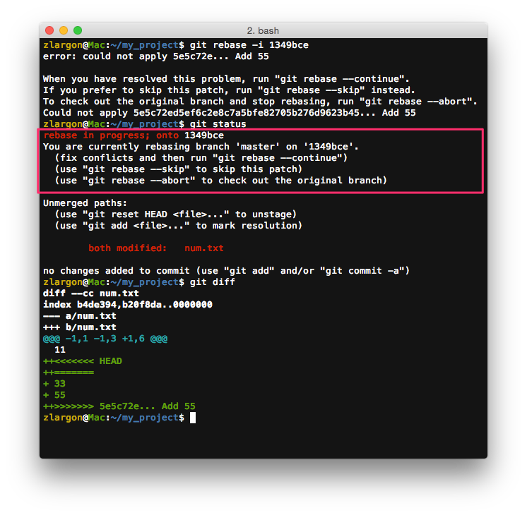
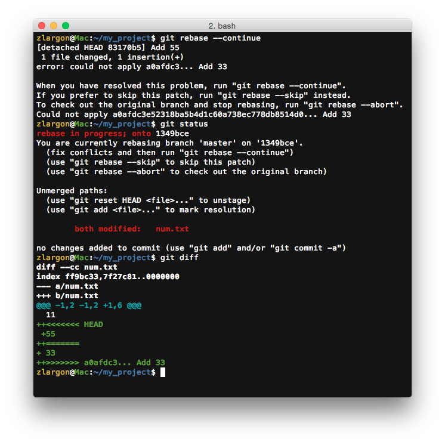
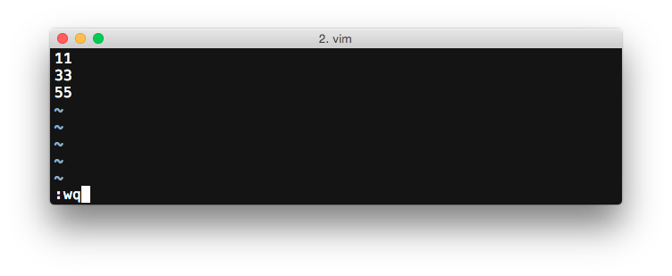
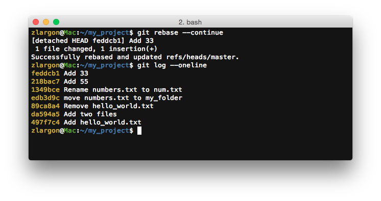

# Rebase 版本衝突

我們在上一章已經教了如何解 `cherr-pick` 的版本衝突

而 Rebase 互動模式其實就只是透過 `Rebase TODO` 依序完成多個 `cherry-pick` 的動作

因此，既然 `cherry-pick` 會發生版本衝突，那麼 `rebase` 必定也會發生版本衝突

<br>

現在我們就把剛才最後的兩個 patch 用 Rebase 互動模式再調換回來吧！

改成先 "Add 55"，再 "Add 33"

```
P0    →    ...    →    P4     →    P5     →    P6        現在的順序

                     1349bce     a0afdc3     5e5c72e

P0    →    ...    →    P4     →    P6'    →    P5'       我們將要改成的順序
```



    $ git rebase -i 1349bce   # 告訴 git 我們要改動的範圍是從 P4 之後的 patch (P5) 到 HEAD (P6)
                              # 並且進入 vim 文字編輯模式來編輯 Rebase TODO



我們把兩個 patch 的順序對調，並且存檔離開


git 在 `cherry-pick` P6 的時候發生了衝突



* ___fix conflicts and then run "git rebase --continue"___
* ___use "git rebase --skip" to skip this patch___
* ___use "git rebase --abort" to check out the original branch___

    > 請在解完 conflict 後，下指令 `git rebase --continue`<br>
    > 使用 `git rebase --skip` 略過這個 patch<br>
    > 使用 `git rebase --abort` 全部取消，並且回到 rebase 前的狀態

<br>

這時候 rebase 的動作會先停下來，並且要求我們解決衝突

我們保留 "55" 刪除 "33"

把 `num.txt` add 起來，下指令 `git rebase --continue` 告知 git 已經解完 ___conflict___，請繼續


    $ git rebase --continue     # 按下 enter 後，會立刻進入 vim 文字編輯模式
                                # 就跟 cherry-pick 的時候一樣


解完 P6 的 ___conflict___ 之後，git 會根據 `Rebase TODO` 繼續做下一件事情

接著會去做 `cherry-pick` P5，又再度發生了 ___conflict___



我們把 "33" 跟 "55" 都保留下來

這裡還要特別注意行序，我們想要順序是 11 → 33 → 55，而不是 11 → 55 → 33



把 `num.txt` add 起來，下指令 `git rebase --continue` 告知 git 已經解完 ___conflict___，請繼續


進入 vim 文字編輯模式，存檔離開

使用 `git log` 查看結果



我們已經成功將 P5 跟 P6 的位置調換過來了

<br>

## 使用 `git rebase --skip` 跳過目前正在執行 `Rebase TODO` 的動作，並執行下一個動作

___use "git rebase --skip" to skip this patch___

Git 對 `--skip` 的說明為 "略過這個 patch"

這對於 Rebase 互動模式來說，可以解釋為跳過目前正在執行 `Rebase TODO` 的動作

因為 `Rebase TODO` 的每個動作都會對應到一個 patch

git 跳過目前正在執行的動作後，會繼續執行下一個動作

<br>

## 使用 `git rebase --abort` 全部取消，並且回到 rebase 前的狀態

Rebase 互動模式讓我們快速的完成多個 `cherry-pick` 的指令

如果中途輸入 `git rebase --abort` 的話，就會全部取消，回到 rebase 前的狀態

包括中間好不容易解掉的 ___conflict___ 也要全部重來

如果想要保留之前解好的 ___conflict___ 並維持現狀的話，其實可以一直 `--skip` 到 `Rebase TODO` 全部跑完...

不過當遇到會連續發生 ___conflict___ 的狀況時，還是建議用 `cherry-pick` 一個一個挑會比較保險 ^^"

<br>

## 本章回顧

* 使用 `git rebase --continue` 告知 git 已經解完衝突

* 使用 `git rebase --skip` 跳過目前正在執行 `Rebase TODO` 的動作，並執行下一個動作

* 使用 `git rebase --abort` 全部取消，並且回到 rebase 前的狀態

<br><br><br>
