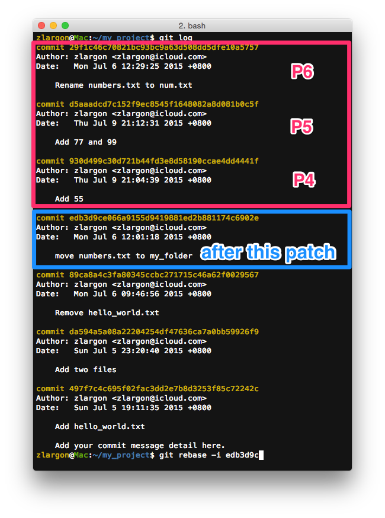
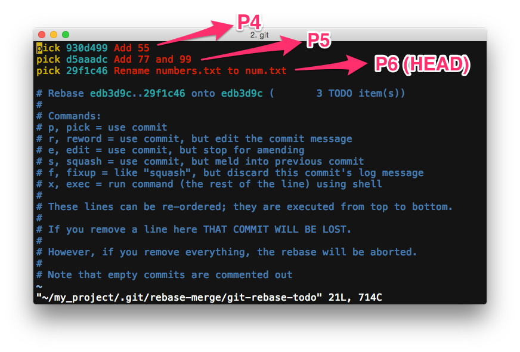
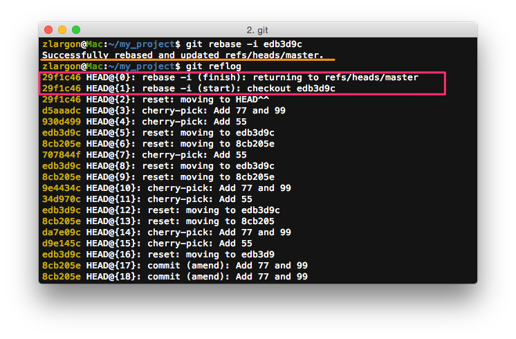

# Rebase 互動模式

`git cherry-pick <commit id>` 指令在操作少量的 patch 的時候非常實用，概念也很直覺

但是如果要一次操作多量的 patch 的時候，就要下非常多次指令，這樣就會很容易出錯

因此 git 提供一個基於 `cherry-pick` 之上，更高階的 git 指令 `rebase`

這個 `git rebase` 通常用來分支的問題（我們在之後的章節才會講到 git 的分支）

不過 `git rebase` 有提供一個叫做「互動模式」的功能，可以讓我們很方便的處理多個 patch

讓我們可以輕鬆的抽掉單一個 patch 或變更 patch 的順序

<br>

## 使用 `git rebase -i <after this commit>` 啟動「互動模式」

    $ git rebase -i <after this commit>               # 啟動 rebase 互動模式
    $ git rebase --interactive <after this commit>    # 同上

`<after this commit>` 是用來告訴 git，我們要修改的範圍到是 ___"從哪個 patch 之後到 `HEAD`"___

以先前的例子來說，假設我們想要更動的範圍是 P4 ～ `HEAD`

那麼這裡的 `<after this commit>` 就會是 P3

```
P0    →    P1    →    P2   →    [P3]    →    P4    →    P5    →    P6

                          (after this commit)                     (HEAD)
```

表示我要修改的範圍是從 P4 ～ `HEAD` (P6)



    $ git rebase -i edb3d9c

按下 enter 後，就會進入 vim 的文字編輯模式，用來編輯 `Rebase TODO`

文件的上方是 TODO 的項目，下方是使用說明



<br>

## Rebase TODO 使用說明

* ___Commands:___
* ___p, pick = use commit___
* ___r, reword = use commit, but edit the commit message___
* ___e, edit = use commit, but stop for amending___
* ___s, squash = use commit, but meld into previous commit___
* ___f, fixup = like "squash", but discard this commit's log message___
* ___x, exec = run command (the rest of the line) using shell___

    > ___pick（預設值）___<br>`cherry-pick` 這個 patch<br>

    > ___reword___<br>`cherry-pick` 這個 patch，並會在執行到這個步驟的時候，會停下來讓你修改提交訊息

    > ___edit___<br>`cherry-pick` 這個 patch，並會在執行到這個步驟的時候，會停下來讓你修改提內容<br>
    > 可以在這個時候 `git add/rm` 檔案

    > ___squash___<br>`cherry-pick` 這個 patch，但是會和前一個 patch 合併在一起

    > ___fixup___<br>`cherry-pick` 這個 patch，會和前一個 patch 合併在一起，但是會捨既這個 patch 的提交訊息

    > ___exec___<br>`cherry-pick` 這個 patch，並且執行一個 shell script

<br>

* ___These lines can be re-ordered; they are executed from top to bottom.___
* ___If you remove a line here THAT COMMIT WILL BE LOST.___
* ___However, if you remove everything, the rebase will be aborted.___
* ___Note that empty commits are commented out___

    > 你可以隨意的重新排序<br>
    > 他會由上而下的執行 `Rebase TODO`<br>
    > 如果你把某一行刪掉或是註解掉，那個 patch 將會不見<br>
    > 如果把 `TODO` 都清空或註解掉，那麼這次的 rebase 將會被放棄

<br>

## 編輯 Rebase TODO

git 會由上而下依序執行 `Rebase TODO` 裡的指令

而他一開始就會給一份預設的 `Rebase TODO`，我們只要對他貼貼剪剪就可以了

| 指令 | Commit Id | Commit Title | 對應的 git 操作 |
| :---: | :---: | :--- | :--- |
| ___`pick`___ | __`930d499（P4）`__ | Add 55 | `git cherry-pick 930d499` |
| ___`pick`___ | __`d5aaadc（P5）`__ | Add 77 and 99 | `git cherry-pick d5aaadc` |
| ___`pick`___ | __`29f1c46（P6）`__ | Rename numbers.txt to num.txt | `git cherry-pick 29f1c46` |

如果直接存檔離開的話，patch 將不會發生任何變化，但 `git reflog` 會多兩筆 `rebase -i (start)` 和 `rebase -i (finish)` 的紀錄



如果不想要有 `git reflog` 的紀錄的話，就要將把 `TODO` 的內容清空或是註解掉

> 我個人是覺得多兩行 reflog 應該沒什麼關係 @@"

<br>

我們現在修改 `Rebase TODO`，讓他把 P6 移到最前面，並且把 P5 刪掉

| 指令 | Commit Id | Commit Title | 對應的 git 操作 |
| :---: | :---: | :--- | :--- |
| ___`pick`___ | __`29f1c46（P6）`__ | Rename numbers.txt to num.txt | `git cherry-pick 29f1c46` |
| ___`pick`___ | __`930d499（P4）`__ | Add 55 | `git cherry-pick 930d499` |
| ~~___`pick`___~~ | ~~__`d5aaadc（P5）`__~~ | ~~Add 77 and 99~~ | 註解或整行刪除，表示要捨棄這個 patch |


改完之後存檔離開，並且用 `git log` 來查看結果


所有的 patch 確實是按照我們想要的成功改好了！
