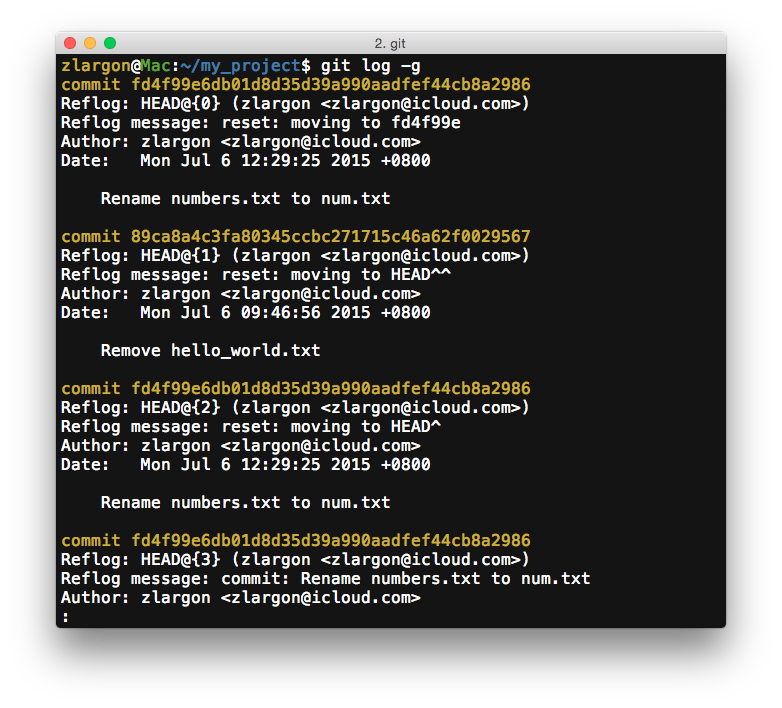

## 找回消失的 Patch

在 git 的世界裡，凡事 `HEAD` 發生改變都會被記錄下來

哪些時候 `HEAD` 會發生改變呢？

* __`git commit`__

    提交一份新的 patch，`HEAD` 會轉移到新的 patch

* __`git reset --hard <commit_id>`__

    切換 patch 的時候

* ___`git cherry-pick/revert ...`___

    挑入/挑出 patch 的時候

* __`git checkout <branch>`__

    切換分支的時候

* __`git merge/rebase ...`__

    合併分支的時候

> 上述一些還沒提到的指令，我們在後面都會陸續為大家介紹

 

## 使用 `git reflog` 來查看 `HEAD` 的修改紀錄

    $ git reflog

`git reflog` 列出了 `HEAD` 改變的歷史紀錄

| Commit Id | Short Name | Command | Description |
| :---: | :---: | :---: | :--- |
| <code style="color: #e6b422">fd4f99e</code> | `HEAD@{0}` | `reset` | moving to fd4f99e |
| <code style="color: #e6b422">89ca8a4</code> | `HEAD@{1}` | `reset` | moving to HEAD^^ |
| <code style="color: #e6b422">fd4f99e</code> | `HEAD@{2}` | `reset` | moving to HEAD^ |
| <code style="color: #e6b422">fd4f99e</code> | `HEAD@{3}` | `commit` | Rename numbers.txt to num.txt |
| <code style="color: #e6b422">edb3d9c</code> | `HEAD@{4}` | `reset` | moving to HEAD^ |
| ... | ... | ... | ... |

 

我們可以從這裡看出我們當時在切換 `HEAD` 時下了什麼指令，以及做了什麼操作的簡易說明

我們可以使用 `git show` 來查看任一個 patch 的內容

可以用 `commit id` 或是 `short name` 來查詢

    $ git show <commit id>
    $ git show <short name>

這份紀錄至少會保存一個月，所以你完全不用擔心 reset 掉的 patch 會不見

都可以從這裡找得到

 

## 使用 `git log -g` 查看 reflog 的詳細內容

 

## 本章回顧

* 使用 `git reflog` 來查看 `HEAD` 的修改紀錄

* 使用 `git log -g` 查看 reflog 的詳細內容

   
