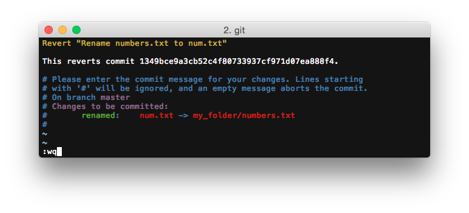
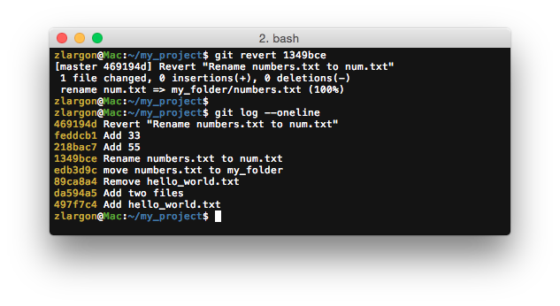

# Revert Patch

在 ["移除單一個 Patch"](remove.md) 的時候，我們有學到如何移除一個 patch 或是調換 patch 的順序

必須使用 `git reset --hard` 回到特定的點上面，然後再用 `git cherry-pick` 把每個 patch 一個一個挑回來

或是我們也可以用 Rebase 互動模式這樣的高階的指令來達到相同的目的

<br>

但是很多時候，當我們發現之前某個 patch 有問題想要把它拿掉時，往往他的後面已經又上了 N 個 patch 了

如果我們只是為了要把這個 patch 拿掉，卻要重新 `cherry-pick` 後面 N 個 patch

感覺改動會非常大，發生錯誤的風險也很高，不是很符合經濟效益

那有沒有什麼方法是，可以不太動之前的 patch，又可以讓我們把特定的 patch 拿掉的方法呢？

<br>

## 使用 `git revert <commit id>` 還原指定的 patch

這是我們目前的 patch 的情形，而我們想要把 P4 這個有 bug 的 patch 拿掉，這時候我們可以下指令 `git revert P4`

```
P0    →    ...    →    P4    →    P5    →    P6
                      (BUG)                (HEAD)
```

`revert` 的概念是在最後面再上一個 P4' 的 patch

把原本 P4 所做的事情，反向的再做一次

例如原本 P4 新增了一檔案，那個 P4' 就會刪除這個檔案

例如原本 P4 新增了一個 function，那個 P4' 就會刪除這個 function

因此 P4' 可以把 P4 所做的事情剛好抵消掉

就像數學 `100 + (-100)` 的概念

```
P0    →    ...    →    P4    →    P5    →    P6    →   P4'
                     (+BUG)                (HEAD)     (-BUG)
```

<br>

以先前的例子來說，如果我們要 revert P4

這個 patch 我們將 `my_folder/numbers.txt` 檔案改成 `num.txt`

revert 之後，他會把檔案再改回 `my_folder/numbers.txt`


    $ git revert 1349bce        # 按下 enter 就會進入 vim 文字編輯模式



git 會自動幫你把 commit title 跟 message 寫好

你可以在後面補充內容，或是直接存檔離開就ＯＫ了



> 由於 revert 之後，git 等於是幫你再 commit 一個 patch

> 所以這個新的 patch 也可以被 revert 掉

<br>

## Revert 版本衝突

`revert` 就跟 `cherry-pick` 和 `rebase` 一樣，都會遇到版本衝突的問題

例如，如果我已經把 P4 revert 掉了，現在我們又再對他做一次 revert，那會發生什麼事呢？


由於我們已經把 `num.txt` 檔案改回 `my_folder/numbers.txt`

而且我們在接下來的兩個 patch（P5, P6）又為檔案新增了 "33" 跟 "55"

因此就發生 ___conflict___ 了

* ___fix conflicts and run "git revert --continue"___
* ___use "git revert --abort" to cancel the revert operation___

    > 解完 ___conflict___ 之後，請下指令 `git revert --continue` 告知 git 已經解完衝突<br>
    > 如果想要放棄這次 revert，請下指令 `git revert --abort`


如果我們使用 `git add` 把他加進去的話，那麼 "33" 跟 "55" 就會被刪除

顯然這並不是我們想要的結果，因此我們使用 `--abort` 來放棄這次的 revert

<br>

## 本章回顧

* 使用 `git revert <commit id>` 還原指定的 patch

* 使用 `git revert --continue` 告知 git 已經解完衝突

* 使用 `git revert --abort` 來要放棄這次 revert
