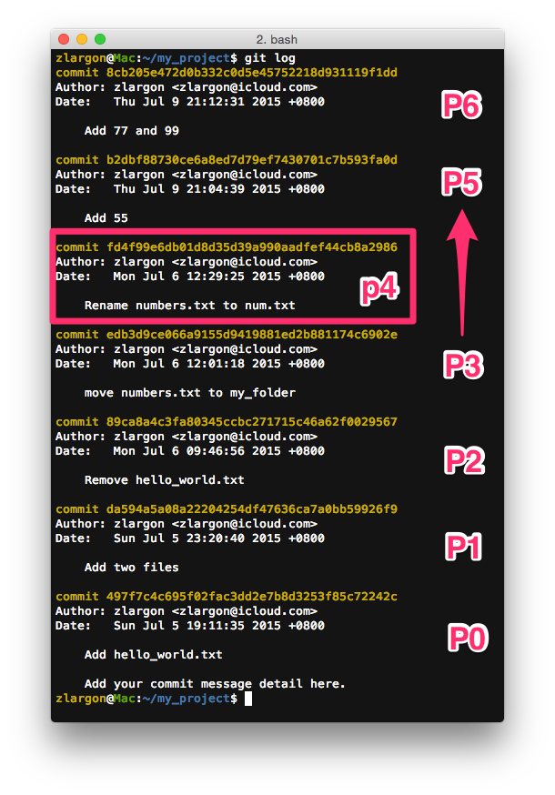

# 移除單一個 Patch

先前所教到 `git reset` 都是回到過去的某個點上

例如說，我們現在的 patch 如下；我們要從 P5 回到 P3 的點上，就會用到 `git reset`

```
P0    →    P1    →    P2    →    P3    →    P4    →    P5
                                                     (HEAD)
```

```
$ git reset --hard P3    # 回到 P3 這個點上

P0    →    P1    →    P2    →    P3
                               (HEAD)
```

回到 P3 的同時，P4 跟 P5 也會跟著被拿掉

<br>

但如果我今天只是想要把 P3 這個點單獨抽掉，要怎麼做呢？

```
我們直覺想到的畫面，可能會是這樣

P0    →    P1    →    P2    →    P4    →    P5
                                          (HEAD)
```


```
但實際上是這樣的

P0    →    P1    →    P2    →    P4'    →    P5'
                                           (HEAD)
```

為什麼說是 P4' 跟 P5' 呢？

還記得我們之前有講過 patch 的 ["基本概念"](basic.md) 嗎？

每個 patch 都有它的 parent，而 patch 只是記錄他與 parent 間的變化

patch 會一個接著一個的串連在一起的

因此當我們想要把 P3 抽掉

其實就是把 P4 接到 P2 的後面，然後就會獲得一個新的 P4'

再把原本的 P5 接到新的 P4' 後面，獲得一個新的 P5'

<br>

## 使用 `git cherry-pick <commit id>` 挑入 patch

因此我們的策略是這樣的

___我們先回到 P2，然後再把 P4 跟 P5 重新加進來___

這時候我們就會用 `cherry-pick` 的指令來挑入 patch

    $ git reset --hard  P2      # 回到 P2
    $ git cherry-pick   P4      # 挑入 P4 → P4'
    $ git cherry-pick   P5      # 挑入 P5 → P5'

現在我們來用剛才的範例實際操作一次



我們現在的目標是，把 `P4` 移除，讓 P5 直接接在 P3 後面

    $ git reset --hard  edb3d9c     # 回到 P3
    $ git cherry-pick   b2dbf88     # 挑入 P5 → P5'
    $ git cherry-pick   8cb205e     # 挑入 P6 → P6'


這裡我們已經成功把 P4 移除

而且我們看到最後的兩個 P5' 和 P6' 的 commit id 都已經改變


而原本的 P5 和 P6 會被 git 記錄在 `reflog` 裡面

<br>

#### 小結

git 之所以可以這樣任意挑 patch，要歸功於他把每個 patch 都拆成一個一個的小變化量

這樣的設計可以很容易的打散，再重組起來

用起來非常輕巧靈活

* 由於 `cherry-pick` 的指令太長了，我通常會設置別名 `cp`，這樣操作起來會比較方便（參考 ["配置"](../config.md)）

<br>

## 延伸：調換 Patch 的順序

在我們學會 `cherry-pick` 之後，其實我們就已經學會如何調換 patch 的順序了

依照剛剛的範例，我們想把 P4 的位置跟 P5、P6 調換

```
P3    →   (P4)   →   (P5    →    P6)

P3    →   (P5'   →    P6')  →   (P4')
```

其實就只要把 P4 再挑回來就ＯＫ了

    $ git cherry-pick  fd4f99e      # 挑入 P4 → P4'


<br>

## `cherry-pick` 的注意事項

大部份我們在做 `cherry-pick` 的時候，只要每個 patch 的改動幅度不要太大

git 都可以幫我們順利接好，就像剛才我們範例那樣

但是 git 也會遇到無法判斷的時候，這就是所謂的版本衝突 ___Confilct___

也就是說，兩個 patch 改動的內容實在是太相似了，以至於無法判斷該如何合併 code

這時候 git 會要求我們手動去解 ___Confilct___

<br>

解 ___Confilct___ 常常是許多初學者的夢魘，看到 ___Confilct___ 就整個人呆掉了

我們在後面的章節會再為大家介紹什麼是 ___Confilct___，如何解 ___Confilct___

以及如何降低 ___Confilct___ 發生的機會

<br>

## 本章回顧

* 使用 `git cherry-pick <commit id>` 挑入 patch
