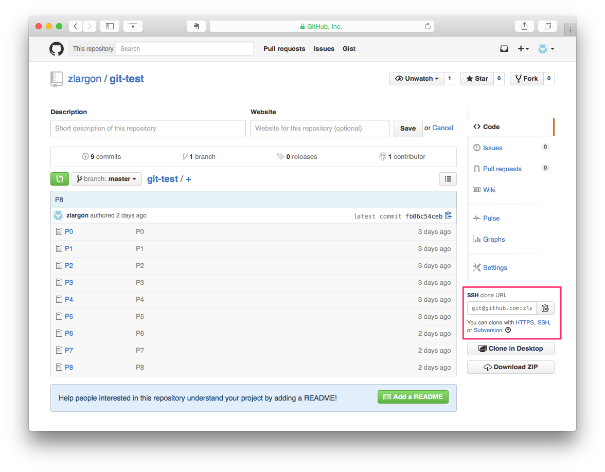
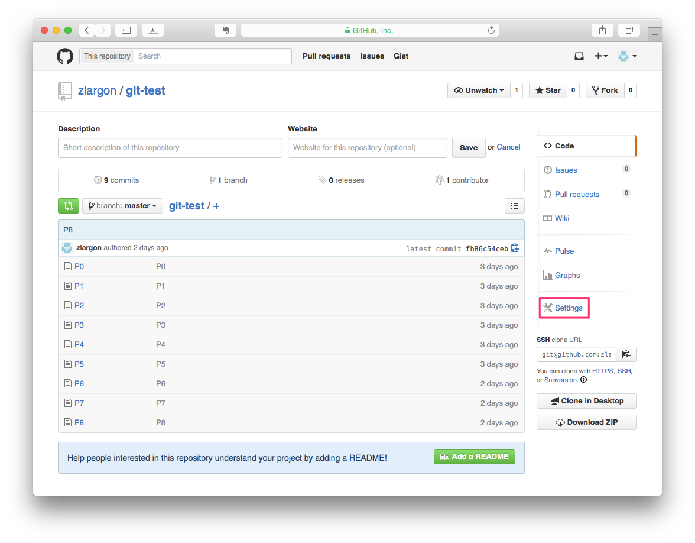
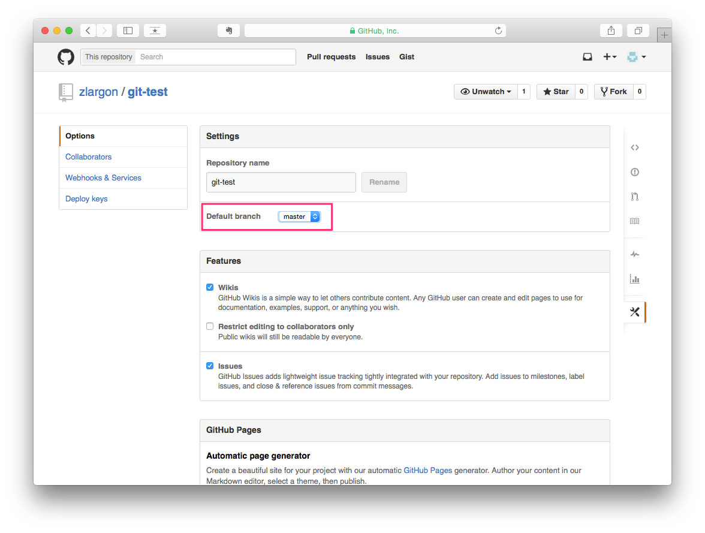
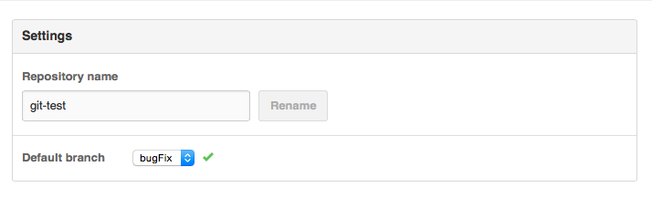
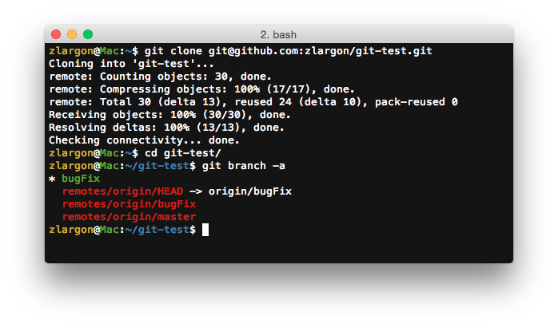
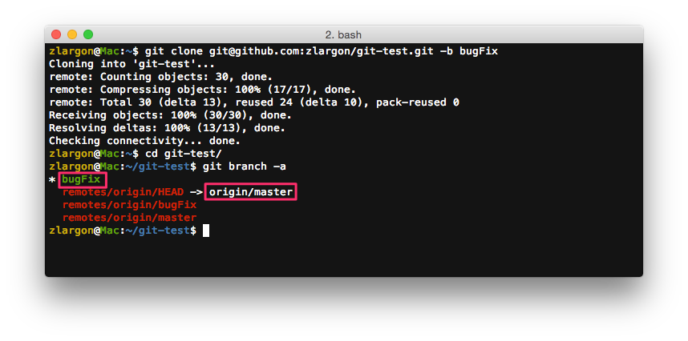
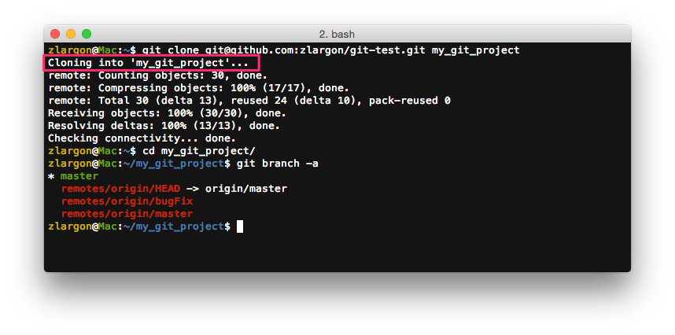
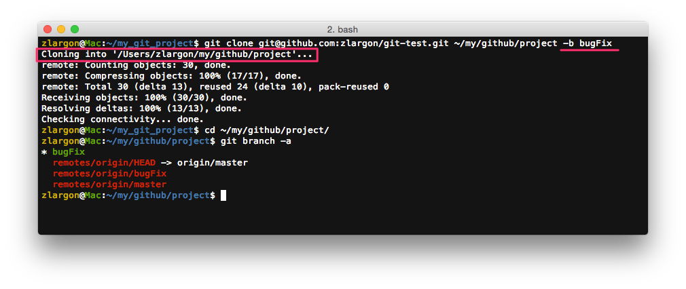
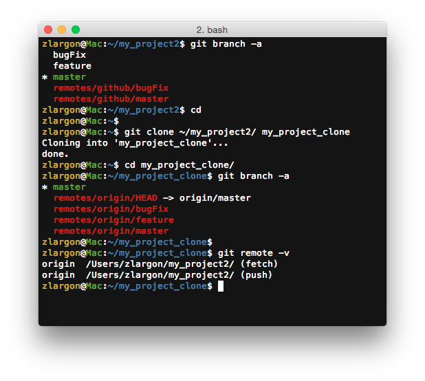

# 複製 / 下載專案

在我們成功把我們的專案上傳到 Github 之後，就可以透過 repo URL 下載專案

 

## 使用 `git clone <repo URL>` 下載專案

    $ git clone git@github.com:zlargon/git-test.git
    $ cd git-test
    $ git branch -a

使用 `git clone` 的時候，git 預設會建立一個跟 project name 同名的資料夾（git-test）

用 `git branch -a` 檢視之後，發現有 1 個 local 分支和 3 個 remote 分支

<pre style="font-weight: bold">
Local Branch：
  master

Remote Branch：
  remotes/origin/HEAD -> origin/master
  remotes/origin/bugFix
  remotes/origin/master
</pre>

Git 預設的 remote 名稱為 __`origin`__（可以用 `git remote rename` 來修改名稱）

可是我們之前並沒有看過 __`remotes/origin/HEAD`__，這支個分支是什麼的呢？

__`remotes/origin/HEAD`__ 是指專案的預設分支

而後面有一個箭頭指向 __`origin/master`__，表示專案的預設分支是 `master`

 

預設分支可以從 Github 的網頁介面去設定

若我們把它改成 `bugFix`

那麼 __`remotes/origin/HEAD`__ 就會變成指向 __`origin/bugFix`__

## 使用 `git clone <repo URL> -b <branch name>` 指定分支

若沒有指定分支的話，git 就會使用 "專案的預設分支" 去建 local branch

    $ git clone git@github.com:zlargon/git-test.git -b bugFix

## 使用 `git clone <repo URL> <folder name/path>` 下載到指定位置

如果不想要用預設檔名的話，可以自己設定資料夾名稱或是資料夾的路徑

## 使用 `git clone <local project>` 建立專案副本

除了可以下載 Github 的專案之外，也可以為本機端的 git project 建立專案副本

## 本章回顧

* 使用 `git clone <repo URL>` 下載專案

* 使用 `git clone <repo URL> -b <branch name>` 指定分支

* 使用 `git clone <repo URL> <folder name/path>` 下載到指定位置

* 使用 `git clone <local project>` 建立專案副本

   
