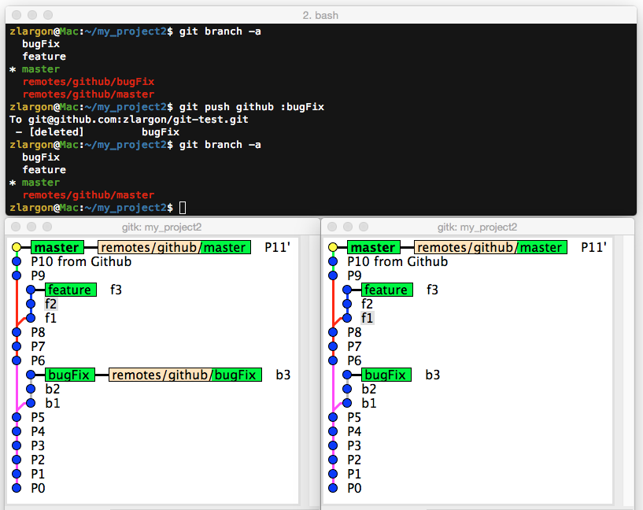
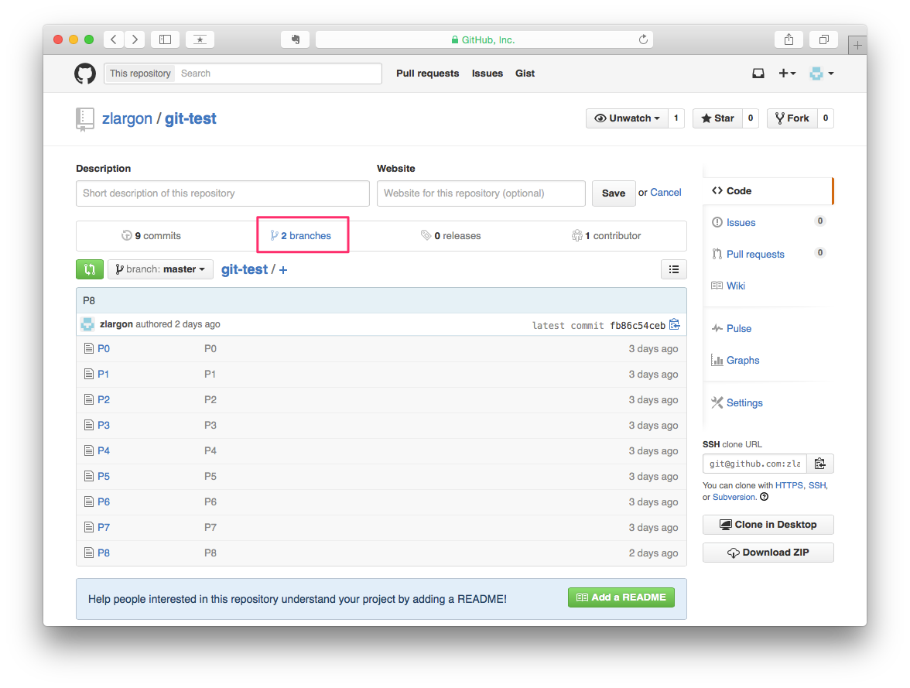
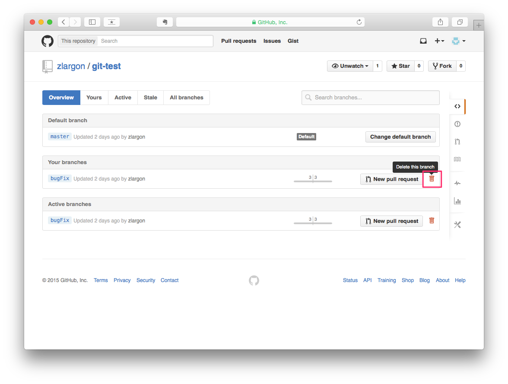
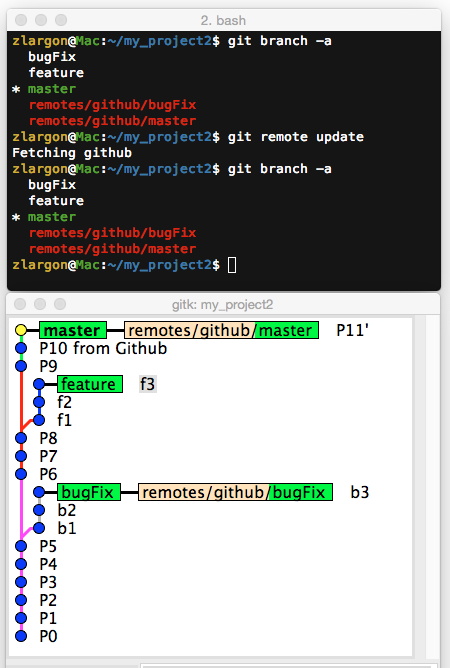
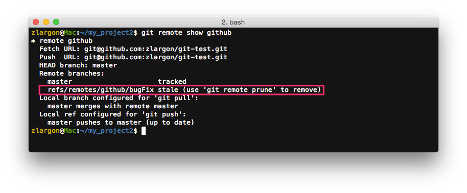
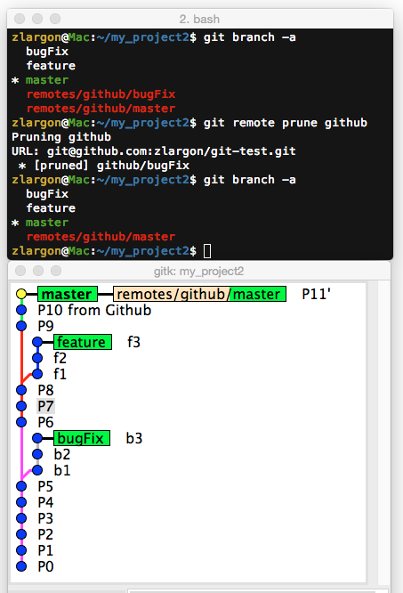
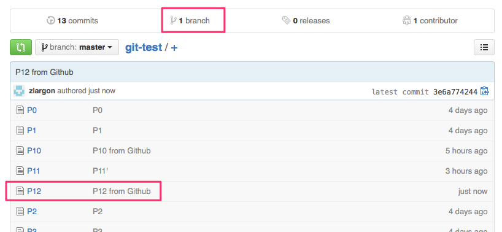
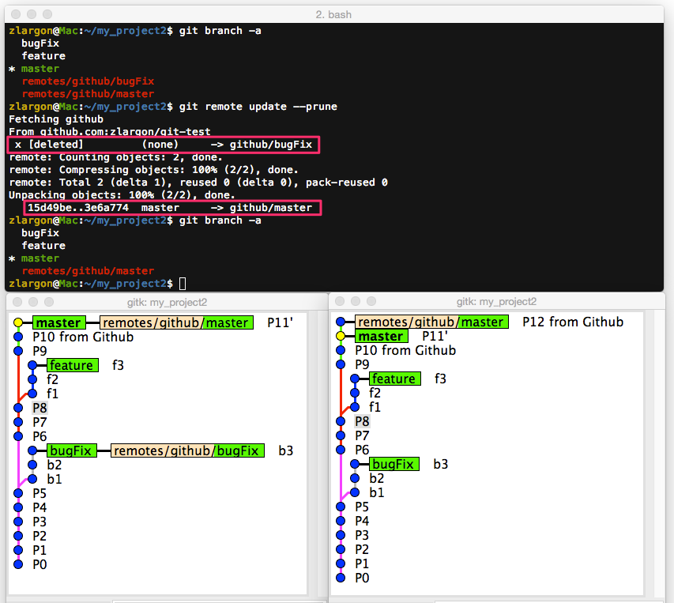

# 刪除遠端分支

在 ["上傳分支"](push.md) 教過如何使用 `git push` 添加遠端的分支

接下來我們想要把分支 `bugFix` 刪除

 

## 使用 `git push <remote name> :<branch name>` 刪除遠端分支

這裡一樣是用 `git push`，只要在分支名稱的前面多加一個 `:`（冒號）

 

## 使用 Github 網頁介面刪除分支

除此之外，也可以透過 Github 的網頁介面來操作

在我們刪除完 `bugFix` 分支之後，我們查看我們本機端的狀況，發現 __`remotes/github/bugFix`__ 並沒有消失

即使我們用了 `git remote update` 之後，結果還是一樣，本機端的分支依舊無法跟遠端同步

 

## 使用 `git remote show <remote name>` 查看更多關於 remote 的資訊

<pre style="border: 1px solid grey">
refs/remotes/github/bugFix stale (use 'git remote prune' to remove)
</pre>

這行的意思是說，遠端的 bugFix 已經過期了，請用 `git remote prune` 將它移除

 

## 使用 `git remote prune <remote name>` 刪除 remote 底下所有過時的分支

    $ git remote prune github

 

這個指令也可以用 `git fetch` 來代換

    $ git fetch -p
    $ git fetch --prune     # 同上

 

## 使用 `git remote update -p` 同步遠端分支，並且移除過時的遠端分支

Git 可能是為了避免遠端的分支被刪，所以才預設同步時保留過時的分支

但是為了要刪這個遠端的分支，要先用 `git remote show` 檢查，再用 `git remote prune` 刪除，這樣實在太麻煩了

`git remote update -p` 一次幫你全部搞定

參數 `-p` 等同於 `--prune`

 

我們把分支 `bugFix` 再 push 回去 server

從 Github 的網頁介面新增一個 P12 的檔案，並且把分支 `bugFix` 刪除

 

    $ git remote update -p     # 一次搞定

 

這個指令也可以用 `git fetch` 來代換

    $ git fetch --all -p
    $ git fetch --all --prune     # 同上

 

## 本章回顧

* 使用 `git push <remote name> :<branch name>` 刪除遠端分支

* 使用 `git remote show <remote name>` 查看更多關於 remote 的資訊

* 使用 `git remote prune <remote name>` 刪除 remote 底下所有過時的分支

    > 可用 `git fetch -p` 代換

* 使用 `git remote update -p` 同步遠端分支，並且移除過時的遠端分支

    > 同 `git fetch --all -p`

   
