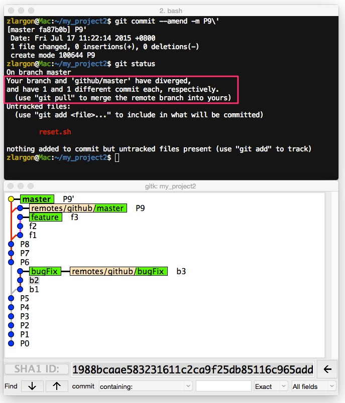
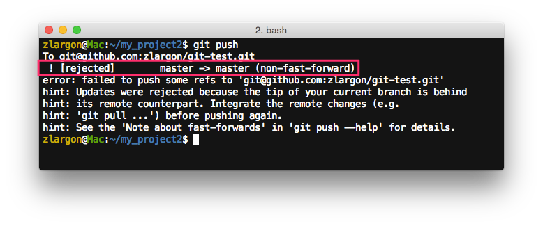
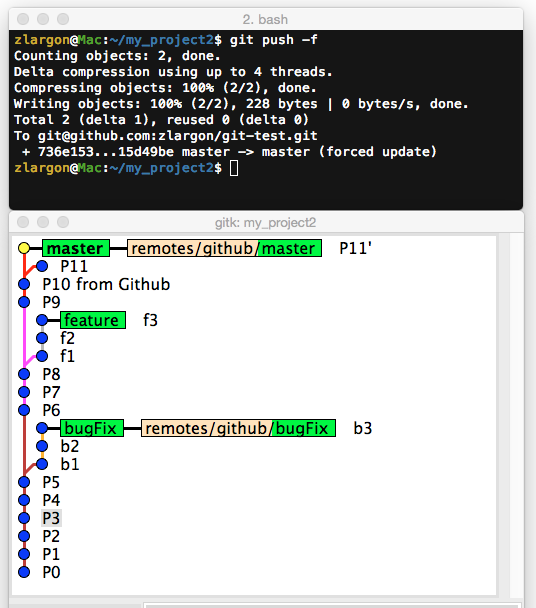

# 強制更新遠端分支

我們在 ["修改 / 訂正 Patch"](../patch/amend.md) 有提到

有時候我們在 local 端上 patch 會不小心打錯提交訊息，或是有一些小錯誤

我們不想要只為了一個錯誤，而另外再上新的 patch，所以我們會用 `git commit --amend` 來訂正他

但是如果我們已經 `push` 到 server 上的時候，要怎麼修正呢？

 

這時我們目前 `master` 分支的情況

我們先把 `master` 的 patch P9，用 `git commit --amend` 修改提交訊息成 P9'

我們從 `gitk` 也可以看到，現在 `master (P9')` 分支跟 `remotes/github/master (P9)` 已經不同步了

剛剛我們有設定 upstream，因此 git 有提供我們一些追蹤的資訊，表示 `master` 與 `github/master` 已經產生了分歧

<pre style="border: 1px solid grey">
Your branch and 'github/master' have diverged,
and have 1 and 1 different commit each, respectively.
  (use "git pull" to merge the remote branch into yours)
</pre>

> 他這裡有說到 `git pull` 我們在後面章節會解釋

 

如果我們現在把 `master` 分支 push 出去，會被 server 拒絕

原因是 `master` 落在 `github/master` 的下方

Git Server 預設的行為是，你上傳的 branch 必須在 remote branch 之上，否則就拒絕

 

## 使用 `git push -f` 強制更新遠端分支

參數 `-f` 等同於 `--force`，表示強制的意思

他可以強迫上傳，並且覆蓋掉遠端的分支

 

> 注意：

> 如果我們沒有設定 upstream 的話，後面還是要加 `<remote name>` 跟 `<branch name>`

> `$ git push -f <remote name> <branch name>`

 

## 注意事項

到目前為止，都還是單人開發的狀況

所以通常我們會以自己本機端的 code 為主，server 只算是備份的功能

但是如果我們是多人協同開發一個專案的時候，`git push -f` 就會是非常危險的指令

因為我們很可能會把別人上傳的 code 整個覆蓋掉

他知道了一定會氣得暴跳如雷

通常只有我們非常有把握的時候，才會用 `git push -f` 來強制更新分支

之後我們會教，在多人協同開發的時候，要怎麼去同步本機端跟遠端的程式碼

   
