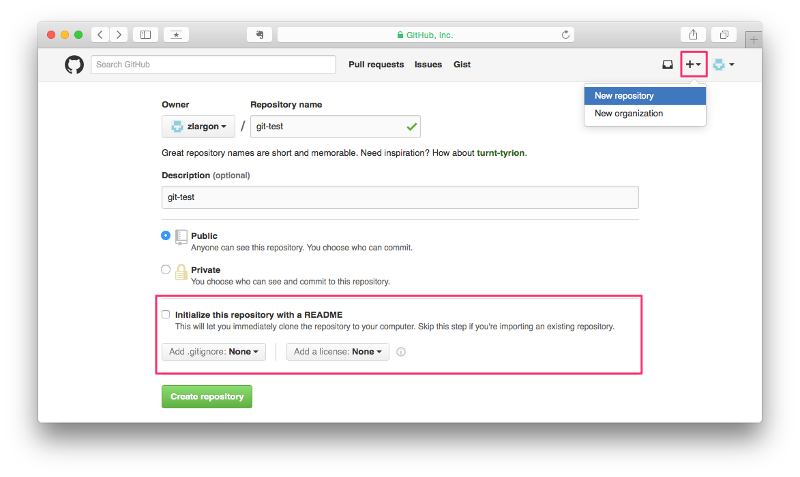
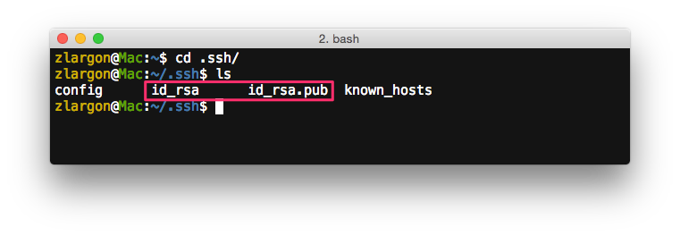
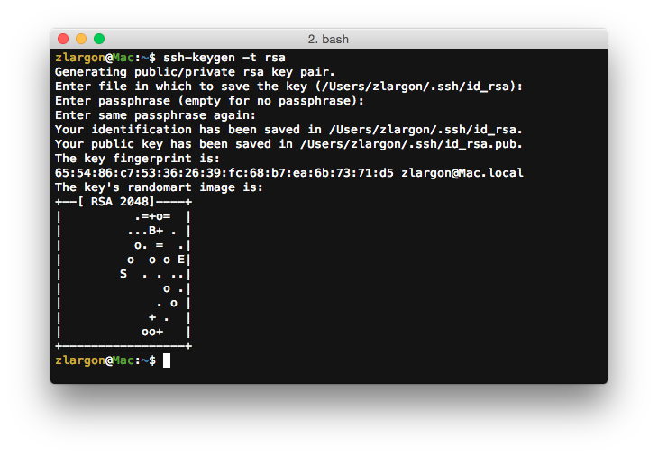
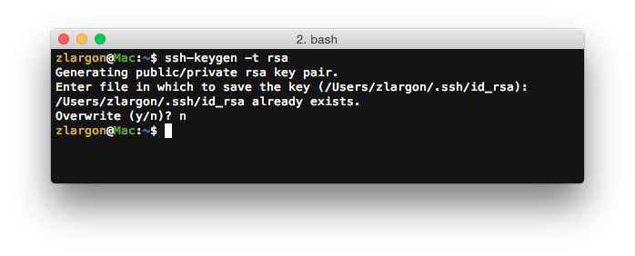
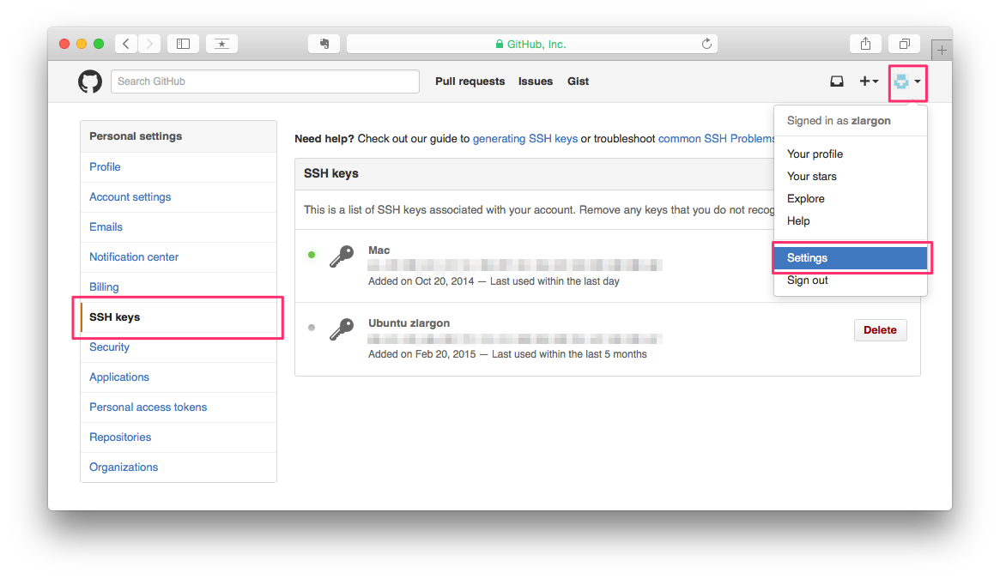
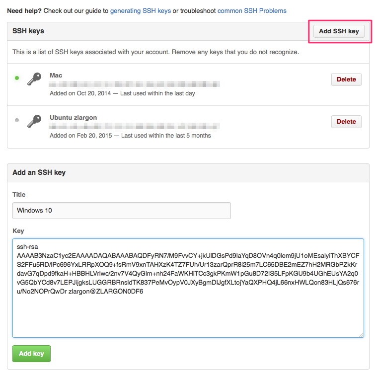
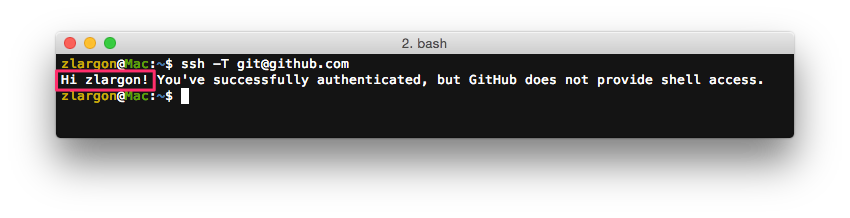

# 新增專案

我們這裡將以 Github 作為示範，大部份的平台做法都大同小異

這裡必須要先申請好 Github 的帳號

https://github.com/

 

## 在 Github 新增專案

1. 按右上角的 `+`，選擇 `New repository`

2. 輸入 Repository name

3. 這裡先不要勾選 __"Initialize this repository with a README"__

4. 按 `Create repository`

新增完成後，Github 會提供你 Repository 的 URL

Repository 的 URL，分成 ___HTTPS___ 和 ___SSH___ 兩種

___HTTPS___：`https://github.com/zlargon/git-test.git` 
___SSH___：`git@github.com:zlargon/git-test.git`

 

這兩者的差別在於，若是使用 ___HTTPS___ 的話，每次上傳 code 到 Github 的時候，都要輸入一次 username、password

而使用 ___SSH___ 的話，只要設定好一次之後，就不用再輸入帳號/密碼了

 

## 設定 _SSH_

當我們透過 ___SSH___ 跟 Github 連線的時候，會使用 [__RSA 加密演算法__](https://zh.wikipedia.org/wiki/RSA加密演算法)

__RSA__ 金鑰是一對的，一把私鑰 + 一把公鑰

我們要先在自己的電腦產生 ___RSA___ 的金鑰，並且保存在電腦裡

然後把 __"公鑰"__ 提供給 Github Server

之後使用 ___SSH___ 與 Github Server 連線的時候，他會用 __"公鑰"__ 跟我們的電腦的 __"私鑰"__ 進行加密以及身份認證

因此設定了 ___SSH___ 之後，我們連線時就不要再輸入 username 跟 password

 

#### 1. 使用 `ssh-keygen` 產生 _RSA_ 金鑰

首先我們要先檢查我們的電腦有沒有產生過 ___RSA 金鑰___

通常產生過的金鑰會被放在 `~/.ssh` 資料夾底下

* ___id_rsa___：私鑰 
* ___id_rsa.pub___：公鑰（pub = public）

如果已經有了，就不需要再重新產生了

如果沒有的話，就要使用 `ssh-keygen` 來產生

    $ ssh-keygen -t rsa

這裡只要一直按 enter 就行了

 

___如果出現 `id_rsa already exists` 的敘述，要按 "n" 取消，不然原本的 id_rsa 會被覆蓋___

<pre style="border: 1px solid grey">
/xxx/xxx/.ssh/id_rsa already exists.
Overwrite (y/n)? n
</pre>

 

#### 2. 將公鑰（id_rsa.pub）上傳到 Github Server

點選 `Settings` > `SSH Keys`

點右上角的 __"Add SSH key"__

把 `~/.ssh/id_rsa.pub` 的內容複製貼上，點選 __"Add key"__ 送出，這樣就大功告成了

 

## 測試 _SSH_

    $ ssh -T git@github.com

如果有出現以下字樣，就表示 SSH 設定成功！

初次連線 Github Server 可能會出現以下訊息，輸入 `yes` 即可

<pre style="border: 1px solid grey">
The authenticity of host 'github.com (207.97.227.239)' can't be established.
# RSA key fingerprint is 16:27:ac:a5:76:28:2d:36:63:1b:56:4d:eb:df:a6:48.
# Are you sure you want to continue connecting (yes/no)? yes
</pre>

   
