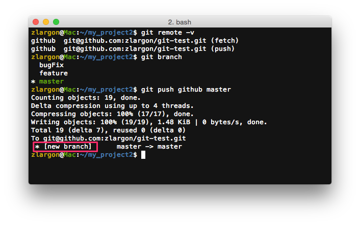
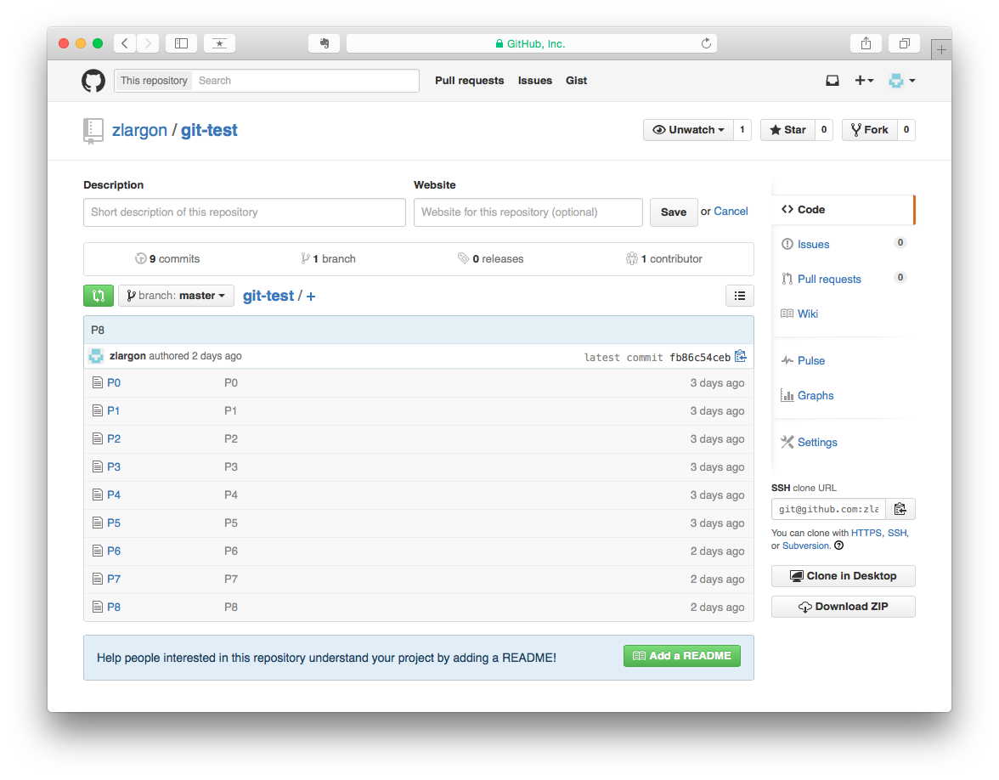
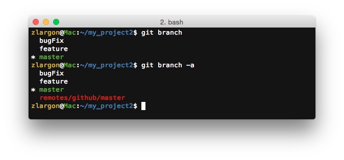
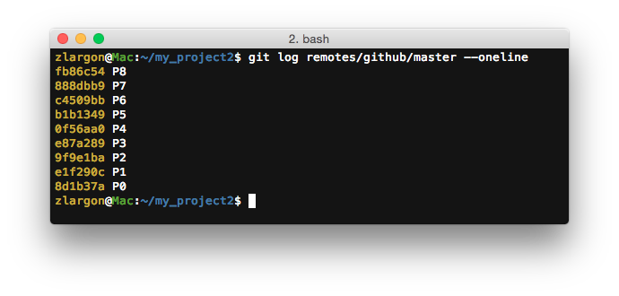
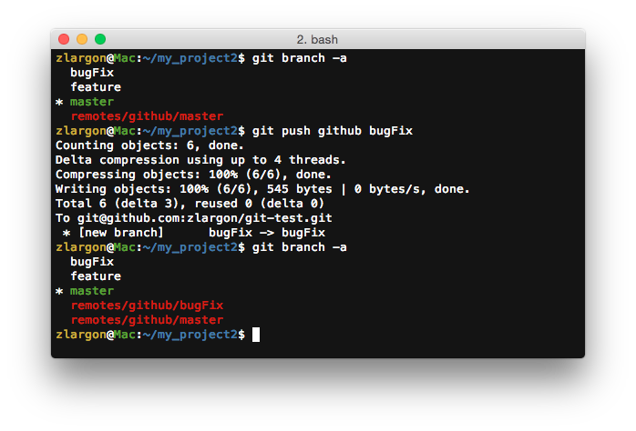
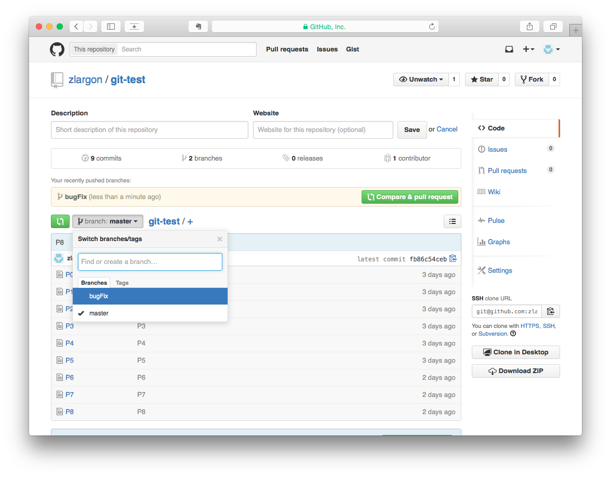
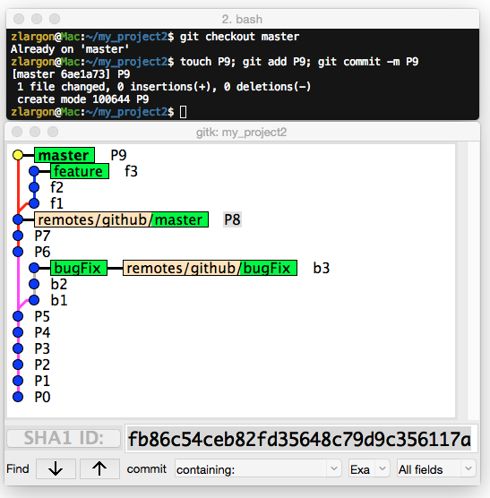
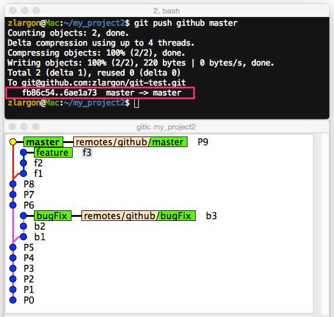
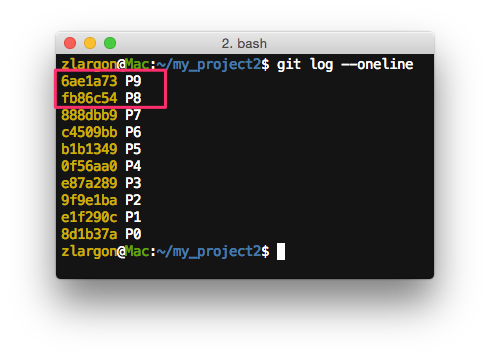

# 上傳分支

在前面我們將 Repo URL 設定好之後，接下來就是要上傳程式碼

Git 在上傳程式碼到 server 時，必須是以分支為單位

 

## 使用 `git push <remote name> <branch name>` 上傳分支

例如說我現在想把 `master` 上傳到 Github

    $ git push github master        # 不需要先 checkout 到 master branch

他會將本機端的 `master` 分支，上傳到 server 上

如果 server 上沒有 `master` 這個分支，他就會自動在 server 上添加 `master` 分支

> 注意： 
> 本機端的分支名稱必須跟 server 上的分支名稱完全相同

這時候重新整理 Github 網頁，就會出現新的 `master` 分支了

 

## 使用 `git branch -a` 查看本機端及遠端的分支

我們之前有教過使用 `git branch` 來查看分支，但是這只能看到本機端的分支

如果想要看到遠端的分支的話，就必須加上 `-a` 或是 `--all` 參數

__遠端分支名稱：__`remotes/<remote name>/<branch name>`

    $ git branch -a
    $ git branch --all

遠端分支的內容會完全跟 server 上的一致

我們可以用 `git log` 查看遠端分支的內容，但是我們不能修改他的內容

    $ git log remotes/github/master --oneline

我們接下來再把 `bugFix` 分支上傳到 server

    $ git push github bugFix        # 不需要先 checkout 到 bugFix branch

這時候重新整理 Github 網頁，就會出現新的 `bugFix` 分支了

 

## 上傳程式碼的流程

先在本機端修改 / 更新分支，然後在上傳到 server

現在我們就在 local 的 `master` 分支提交一個新的 patch P9

這時候我們可以看到 `master` 與 `remotes/github/master` 的分支目前是不同步的情況

現在我們上傳 `master` 到 Github Server，更新遠端的 repository

    $ git push gihub master

<pre style="border: 1px solid grey">
fb86c54..6ae1a73  master -> master
</pre>

這表示遠端的 `master` 分支已經從 fb86c54（P8）更新成 6ae1a73（P9）

## 本章回顧

* 使用 `git branch -a` 查看本機端及遠端的分支

* 使用 `git push <remote name> <branch name>` 上傳分支

   
