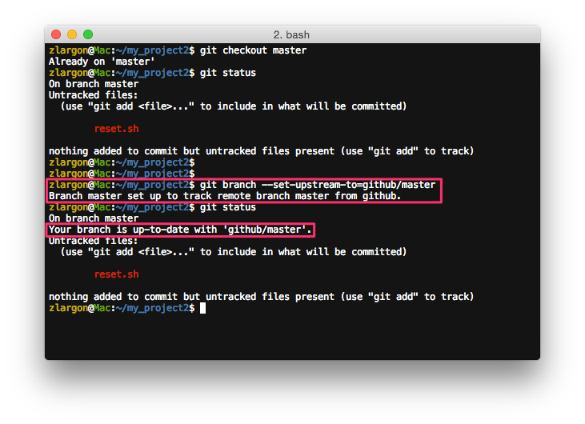
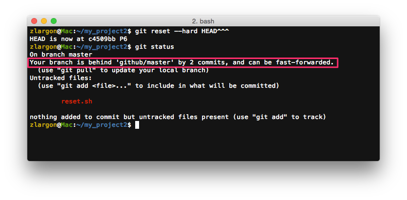
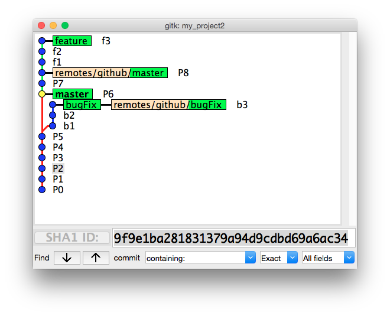

# 上傳分支

在前面我們將 Repo URL 設定好之後，接下來就是要上傳程式碼

Git 在上傳程式碼到 server 時，必須是以分支為單位

<br>

## 使用 `git push <remote name> <branch name>` 上傳分支

例如說我現在想把 `master` 上傳到 Github

    $ git push github master        # 不需要先 checkout 到 master branch

他會將本機端的 `master` 分支，上傳到 server 上

如果 server 上沒有 `master` 這個分支，他就會自動在 server 上添加 `master` 分支

> 這邊要注意一點，你在本機端的分支名稱，必須跟 Server 上的分支名稱完全相同


這時候重新整理 Github 網頁，就會出現新的 `master` 分支了


<br>

## 使用 `git branch -a` 查看本機端及遠端的分支

我們之前有教過使用 `git branch` 來查看分支，但是這只能看到本機端的分支

如果想要看到遠端的分支的話，就必須加上 `-a` 或是 `--all` 參數

__遠端分支：__`remotes/<remote name>/<branch name>`

    $ git branch -a
    $ git branch --all


遠端分支的內容會完全跟 server 上的一致

我們可以用 `git log` 查看遠端分支的內容，但是我們不能修改他的內容

    $ git log remotes/github/master --oneline


我們接下來再把 `bugFix` 分支上傳到 server

    $ git push github bugFix        # 不需要先 checkout 到 bugFix branch


這時候重新整理 Github 網頁，就會出現新的 `bugFix` 分支了


<br>

## 使用 `git push -u <remote name> <branch name>` 上傳分支，並且追蹤遠端的分支


大家應該有發現 Github 提供的指令中，`git push` 後面有加一個參數 `-u`

`-u` 等同於參數 `--set-upstream`，意思是設定本機端的 `master` 去追蹤遠端的 `github/master` 分支

```
$ git push -u github master                     # 等同於以下三行指令

$ git push github master
$ git checkout master
$ git branch --set-upstream-to=github/master    # 不需要記這個指令
```

分支 `master` 設定 `--set-upstream` 後，`git status` 會出現追蹤的情況

表示目前本機端與遠端的 `master` 分支相同



我們現在在 `master` 提交新的 patch P9

他會顯示我們目前的分支領先 `github/master` 一個 patch


如果我們倒退回前三個 patch

則會看到目前本機端的 `master` 落後於 `github/master` 2 個 patch



<br>

除此之外，設定追蹤最大的好處是

之後只需要透過 `git push` 就可以上傳分支，不必帶 `<remote name>` 跟 `<branch name>`

    $ git checkout master
    $ git push              # 不用帶 <remote name> 跟 <branch name>

只要第一次 push 的時候帶 `-u` 參數就好了！

<br>

## 使用 `git branch --unset-upstream` 取消追蹤遠端分支

    $ git checkout master
    $ git branch --unset-upstream


<br>

## 使用 `gitk --all` 來查看遠端分支



<br>

## 本章回顧

* 使用 `git branch -a` 查看本機端及遠端的分支

* 使用 `git push <remote name> <branch name>` 上傳分支

* 使用 `git push -u <remote name> <branch name>` 上傳分支，並且追蹤遠端的分支

    > 之後只需要透過 `git push` 就可以上傳分支，不必帶 `<remote name>` 跟 `<branch name>`

* 使用 `git branch --unset-upstream` 取消追蹤遠端分支

<br><br><br>
