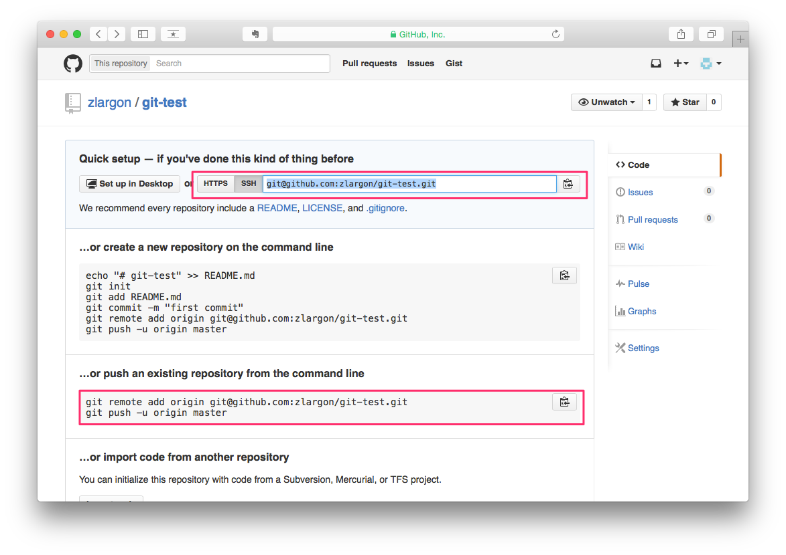
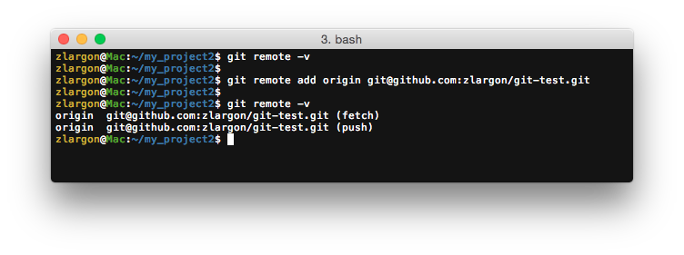
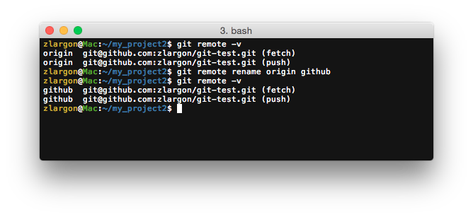
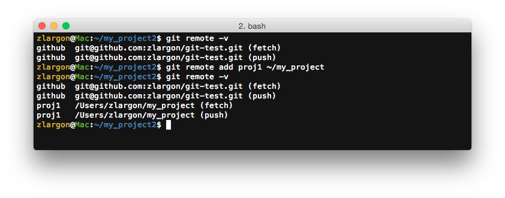

# 設定 Repo URL

## 使用 `git remote add <short name> <repo url>` 新增遠端 repository URL

在我們新增 Github 專案之後，下方有指令提示，其中有這一行：

    $ git remote add origin git@github.com:zlargon/git-test.git

意思是說，把 repo url 加到遠端的清單，並且以 `origin` 當作 short name

一般來說，Git 習慣把主要的 remote 命名為 `origin`，不過我們也可以取其他的名字

 

## 使用 `git remote -v` 查看設定好的 remote 資訊

    $ git remote -v

我們已經設定好 short name 之後，往後所看到的 __`origin`__ 就代表了 `git@github.com:zlargon/git-test.git` 這個 repo URL

 

## 使用 `git remote rename <short name> <new name>` 修改 remote name

一般我習慣會用 __`github`__ 當作 short name，因為這樣比較有實質的意義

    $ git remote rename origin github

或是用 `git remote rm <short name>` 把他刪掉，再重新加入也可以

 

## Remote 的特性

* __Git 可以設定多組 remote__

* __Repo URL 也可以是本機端其他 git project 的資料夾路徑__

   
