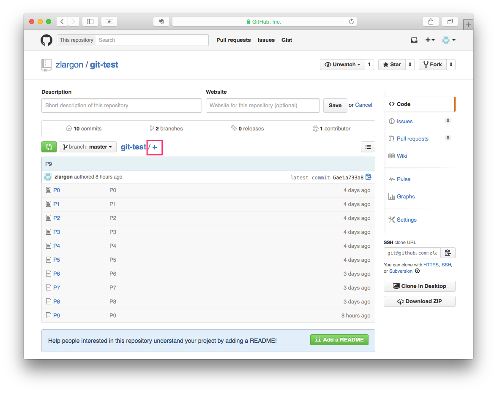
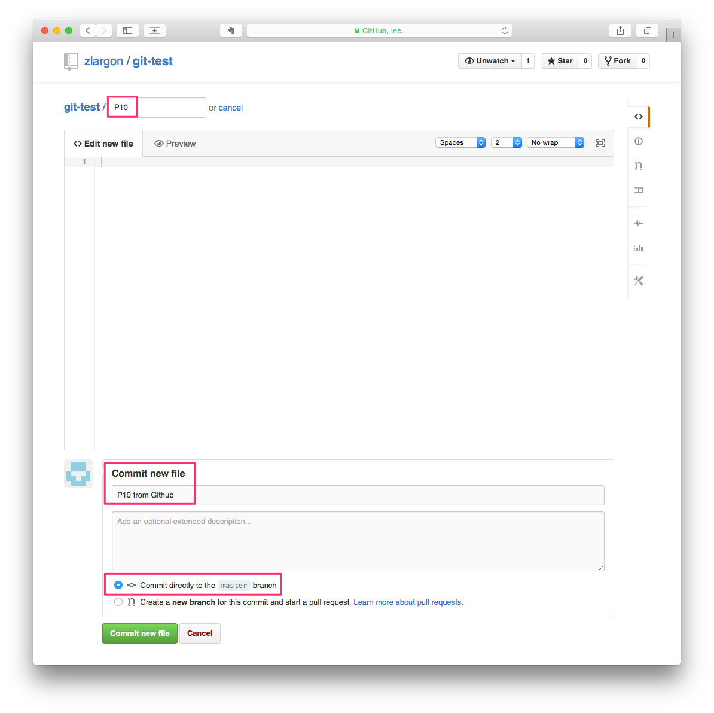
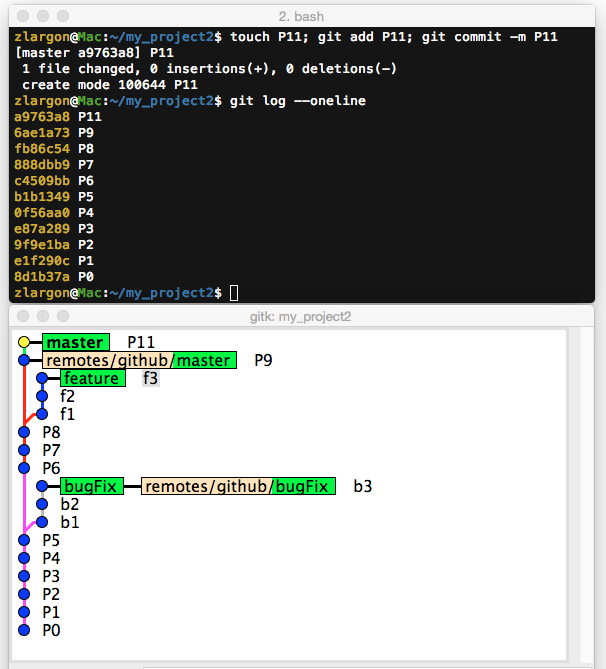
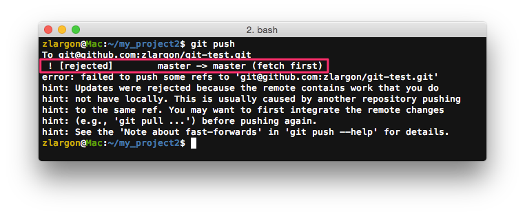
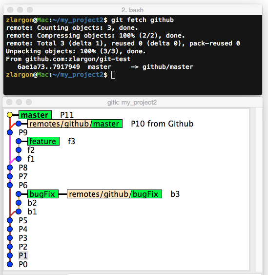
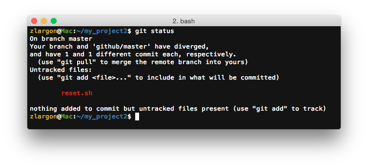
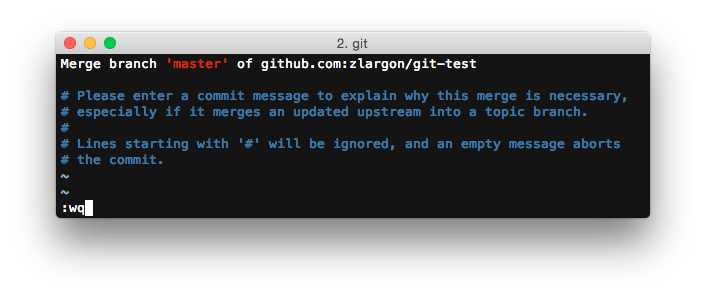
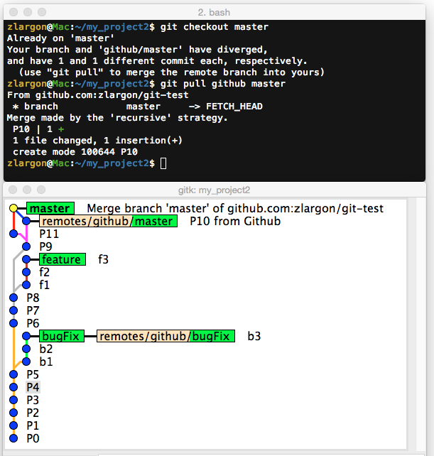
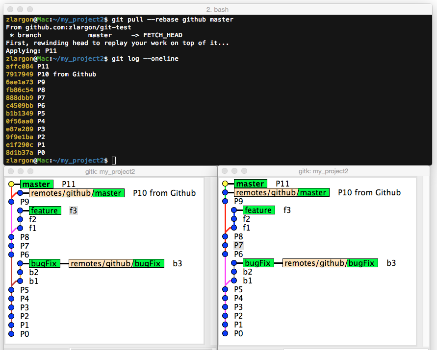
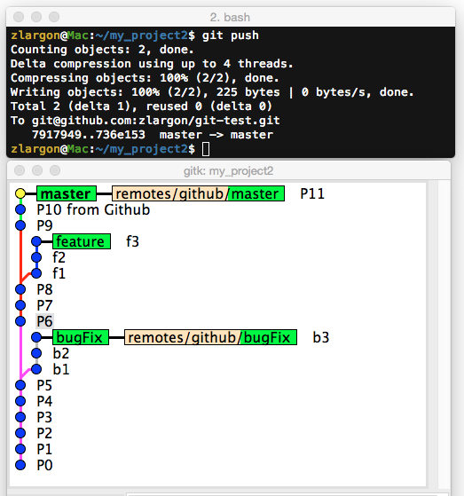

# 同步遠端分支

在我們把 code 放到 server 之後，我們就可以在任何工作地從 Github 下載下來，並且開始進行開發

假設我們同時有 A, B, C 電腦，都 clone 了這個專案

假設我們從電腦 A 上傳了一個 patch 到 server

但對於電腦 B, C 來說，他們 local 端的 repo 會與遠端的不同步

電腦 B, C 甚至自己另外還上了新的 patch 但是還沒有上傳到 server

這時候我們就要來處理同步的問題

 

我們先直接從 Github 上，直接提交一個空白的檔案 P10

接著我們在本機端提交一個 P11 的 patch

這時候 server 上的檔案，就會跟我們現在本機端的不同步

 

假設我們不曉得 server 上的 code 已經更新了，就直接使用 `git push` 就會被 server 拒絕

原因是 `master` 與 `github/master` 已經產生了版本衝突

Git Server 預設的行為是，你上傳的 branch 必須在基於 remote branch 之上，否則就拒絕

 

## 使用 `git fetch <remote name>` 更新 "指定" remote 底下的分支

我們之前有提到，__`remotes/<remote name>/<branch name>`__ 會存放對應 remote branch

因此，首先我們要做的第一件事情，就是更新 remote branch

    $ git fetch github

fetch 會去讀取 remote repo 的內容，並且更新 remote branch 的內容

從 `gitk` 可以看出 `remotes/github/master` 已經更新，但是 `master` 是在 P11 的位置

 

## 使用 `git fetch --all` 更新 "所有" remote 底下的分支

`git fetch <remote name>` 這個指令一次只能更新一個 remote

如果你的專案底下有多個 remote，而且全部都想要更新的話，就可以使用這個指令

`git fetch --all` 指令也等同於以下這個指令

    $ git remote update

 

## 使用 `git pull` 同步分支（Merge）

這時候，如果我們之前有設定 upstream 的話

`git status` 的追蹤訊息有提示我們可以用 `git pull` 來 merge 遠端的分支

<pre style="border: 1px solid grey">
Your branch and 'github/master' have diverged,
and have 1 and 1 different commit each, respectively.
  (use "git pull" to merge the remote branch into yours)
</pre>

    $ git checkout master
    $ git pull              # 如果沒有設定 upstream，就一定要加 <remote name> 跟 <branch name>

由於 git pull 會幫我們做 `merge`，若沒有發生版本衝突，就會直接 Fast-Forward

但若發生了版本衝突的時候，就需要提交 Merge Patch

`git pull` 的作用等同於以下的指令

    $ git fetch github
    $ git merge remotes/github/master

其實在之前 ["Merge 合併分支"](../branch/merge.md) 有討論過 merge 的缺點

這裡的 P10 跟 P11 其實改動很少，使用 merge 會產生多餘且沒意義的 Merge Patch

如果我們不希望他產生 Merge Patch，就要用 `rebase` 的方式來同步

 

## 使用 `git pull --rebase` 同步分支（Rebase）

當 `git pull` 遇到版本衝突的時候，預設會使用 `merge` 來解

加上 `--rebase` 參數的話，git 就會用 `rebase` 來解 conflict

    $ git checkout master
    $ git pull --rebase     # 如果沒有設定 upstream，就一定要加 <remote name> 跟 <branch name>

從 `gitk` 可以看出，他把 P11 重新 rebase 到 P10 後面

這樣分支就會看起來乾淨

`git pull --rebase` 的作用等同於以下的指令

    $ git fetch github
    $ git rebase remotes/github/master

 

在我們 `master` 分支同步成功之後，就可以把 P11 push 出去了

 

## 本章回顧

* 使用 `git fetch <remote name>` 更新 "指定" remote 底下的分支

* 使用 `git fetch --all` 更新 "所有" remote 底下的分支

    > 同 `git remote update`

* 使用 `git pull` 同步分支（Merge）

    > 若沒有設定 upstream，就一定要加 `<remote name>` 跟 `<branch name>`

* 使用 `git pull --rebase` 同步分支（Rebase）

    > 若沒有設定 upstream，就一定要加 `<remote name>` 跟 `<branch name>`

   
