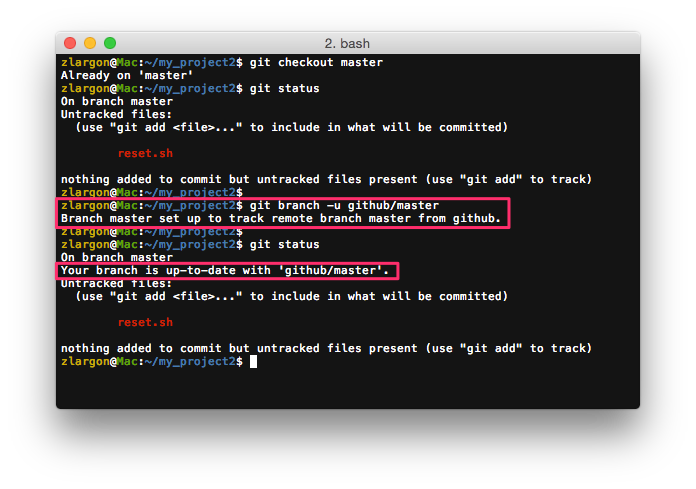
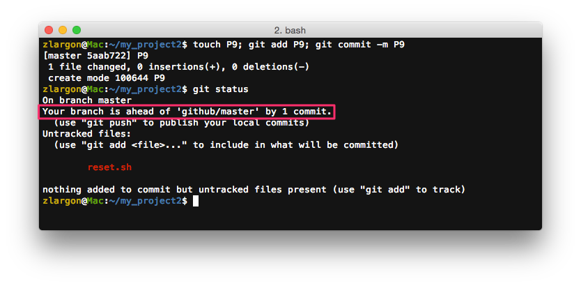
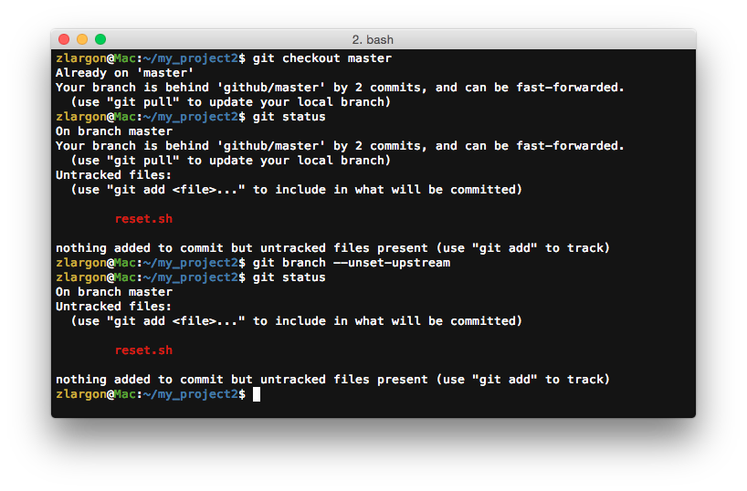

# 設定 Upstream

在 ["建立專案"](new_project.md) 的時候，Github 有提供我們一些指令提示


其中他做 `git push` 的時候，有帶一個參數 `-u`

這是什麼意思呢？

<br>

## 使用 `git push -u <remote name> <branch name>` 上傳分支，並且追蹤遠端的分支

參數 `-u` 等同於 `--set-upstream`，設定 upstream 可以使分支開始追蹤指定的遠端分支

只要做過一次 `git push -u <remote name> <branch name>`，並且成功 push 出去；本機端的 `master` 就會被設定去追蹤遠端的 `<remote name>/<branch name>` 分支

設定好 upstream 後，第二次以後要上傳分支時，就只需要透過 `git push` 就可以了，不必再帶 `<remote name>` 跟 `<branch name>` 等參數

之後我們講到指令 `git pull` 也會用得到

```
$ git push -u github master                 # 第一次上傳
$ git push --set-upstream github master     # 同上

$ ...

$ git checkout master       # 切到 master
$ git push                  # 第二次之後 push 就不用再帶 <remote name> 跟 <branch name>
```

<br>

## 使用 `git branch -u <remote>/<remote branch>` 設定 upstream

`git push -u github master` 指令可以拆解成以下的指令

    $ git push github master
    $ git checkout master
    $ git branch -u github/master

當設定好分支的 upstream 後，使用 `git status` 會顯示追蹤的訊息



<pre style="border: 1px solid grey">
Your branch is up-to-date with 'github/master'.
</pre>

表示目前 `master` 本機端與遠端的內容分支一致

其他他就只是把 `master` 去跟 `remotes/guthub/master` 做比對而已

<br>

我們現在在 `master` 提交新的 patch P9



<pre style="border: 1px solid grey">
Your branch is ahead of 'github/master' by 1 commit.
</pre>

他會顯示目前 `master` 分支的位置領先 `remotes/github/master` 一個 patch

<br>

如果我們倒退回前三個 patch


<pre style="border: 1px solid grey">
Your branch is behind 'github/master' by 2 commits, and can be fast-forwarded.
</pre>

則會看到目前 `master` 的分支落後於 `remotes/github/master` 兩個 patch

<br>

#### 指令代換

    $ git checkout master
    $ git branch -u github/master

以上兩行指令可以合併成一行

    $ git branch -u github/master master        # 可以不用先切到 master

而 `-u` 也可以換成 `--set-upstream-to=<remote>/<branch>`

    $ git branch --set-upstream-to=github/master master

<br>

## 使用 `git branch --unset-upstream` 取消追蹤遠端分支

    $ git checkout master
    $ git branch --unset-upstream



這個指令也可以寫成一行

    $ git branch --unset-upstream master        # 可以不用先切到 master

<br>

## 本章回顧

* 使用 `git push -u <remote name> <branch name>` 上傳分支，並且追蹤遠端的分支

    > 之後只需要透過 `git push` 就可以上傳分支，不必帶 `<remote name>` 跟 `<branch name>`

* 使用 `git branch -u <remote>/<remote branch>` 設定 upstream

* 使用 `git branch --unset-upstream` 取消追蹤遠端分支

<br><br><br>
