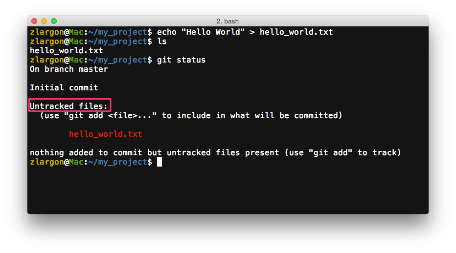
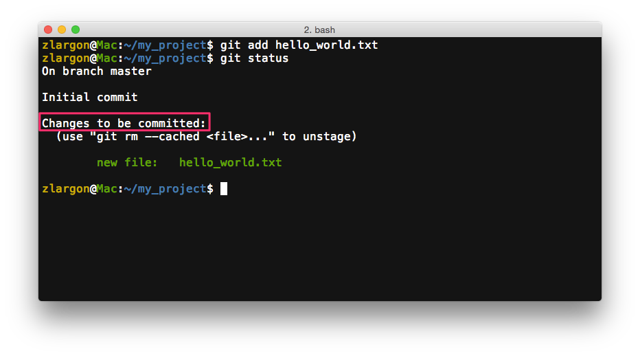
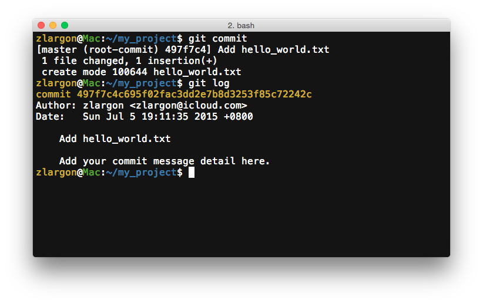

# 提交一個 Patch

首先，我們先新增一個 `hello_world.txt` 的檔案，內容為一行字串 `Hello World`

## 使用 `git status` 來檢視所有檔案的狀態

```
$ git status
```



我們這裡可以看到，目前 `hello_world.txt` 的狀態為 ___Untracked files___

表示這是一個全新的檔案（稍後我們會在 ["檔案狀態"](../file/status.md) 做更詳細的解釋）

<br>

## 使用 `git add <file>` 來告知 git，哪些是我們即將要提交（commit）的檔案

我現在現在打算要提交 `hello_world.txt`

```
$ git add hello_world.txt
$ git status
```

這時我們再用 `git status` 來檢視檔案的狀態



`hello_world.txt` 的狀態改變成綠色的 ___Changes to be committed___

表示這個檔案已經 "準備好" 要被提交（commit）了（稍後我們會在 ["檔案狀態"](../file/status.md) 做更詳細的解釋）

<br>

## 使用 `git commit` 來提交一個 patch

```
$ git commit
```

這時候會進入 `vim` 的文字編輯模式，編輯提交訊息（commit message）


* 第一行為 commit message 的標題（僅限一行）
* 第二行保留空白
* 第三行以後是 commit message 的內容（可略過不寫）

編輯完成後，存檔離開，便可完成這次的提交

<br>

## 使用 `git log` 檢視提交的歷史訊息

使用 `git log` 來檢視之前的提交的歷史訊息，他將會列出所有 patch 的資訊



<pre style="border: 1px solid grey">
<span style="color: #e6b422">commit 497f7c4c695f02fac3dd2e7b8d3253f85c72242c</span>
Author: zlargon &lt;zlargon@icloud.com&gt;
Date:   Sun Jul 5 19:11:35 2015 +0800

    Add hello_world.txt

    Add your commit message detail here.
</pre>

`commit` 是 git 幫我們自動產生的長度 40 字元的 Hash 值，並且保證 commit id 絕對不會重複，用來識別所有不同的 patch

`Author` 即為我們在前幾個章節透過 `git config` 所設定的 username 跟 email

> username 及 email 為 commit 時的必要欄位，因此必須事先設定好

下半部為提交訊息，包含標題及內容

<br>

這時候再做 `git status` 時會顯示

<pre style="border: 1px solid grey">
On branch master
nothing to commit, working directory clean
</pre>

表示目前此目錄下，沒有發生任何的更動

<br>

## 使用 `git show` 檢視 patch 的修改內容

```
$ git show
```

使用 `git show` 來檢視最後一次提交的 patch 所修改的內容


從 `git show` 可以看出，這個 patch 新增了一個 `hello_world.txt` 的檔案，內容為 `Hello World`

<br>

## 本章回顧

* 使用 `git status` 來檢視所有檔案的狀態

* 使用 `git add <file>` 來告知 git，哪些是我們即將要提交（commit）的檔案

* 使用 `git commit` 來提交一個 patch，並且使用 `vim` 編輯提交訊息（包含標題及內容）

* 使用 `git log` 檢視提交的歷史訊息

* 使用 `git show` 檢視最後一次提交的 patch 所修改內容
